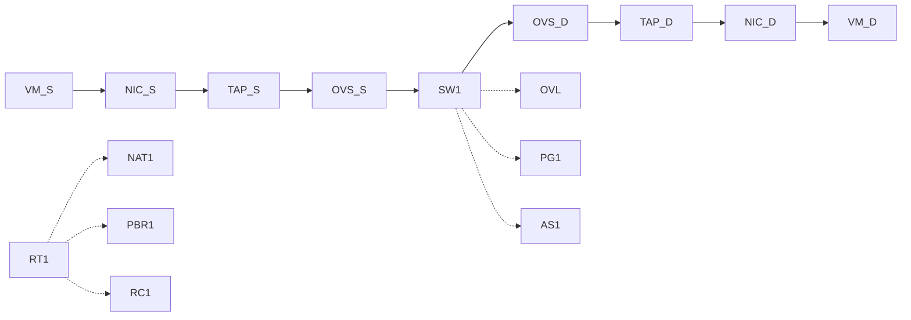

# OVN path edges

Read this **and** `ovn-path-nodes` before drawing. Identity is UUID; names are display.

Do **not** draw `VM → NIC → Switch`. That chain is wrong: TAP and OVS brAtlas are hops.

## Required main chain

Solid `-->` only, left to right, packet order:

```
VM_S --> NIC_S --> TAP_S --> OVS_S --> SW1 --> … --> OVS_D --> TAP_D --> NIC_D --> VM_D
```

Leave src: `VM_S → NIC_S → TAP_S → OVS_S →` first Switch.

Enter dest VIF: last Switch `→ OVS_D → TAP_D → NIC_D → VM_D`.

External dest: `OVS_S → … → EXT`. No dest TAP/OVS.

Same chassis or no Host box: **same arrows**. Host wrapping does not remove TAP/OVS edges.

## Solid vs dashed

| Edge | Style | Allowed |
|---|---|---|
| VM–NIC–TAP–OVS–Switch–Router–… | `-->` | main hops only |
| Router to NAT / PBR / RC | `-.->` | hang off router; **not** in `-->` chain |
| Switch to Overlay Geneve | `-.->` | chassis differ only; Overlay is **not** a hop |
| Switch to port-group / address-set / drop ACL | `-.->` | not hops |

Never put NAT, PBR, RC, Overlay, PG, or address-set on the solid chain unless External **is** the destination (then EXT is a hop).

## Copy this edge block



L2–L3–L2: `OVS_S --> SW1 --> RT1 --> SW2 --> OVS_D`.

Two routers: extra `RT` and transit `SW` (`gw-scale-out-network`) on the solid chain.

Northbound: `OVS_S --> SW_tenant --> RT_tenant --> SW_transit --> RT_gw --> EXT`.

## Topologies (same edge language)

| Kind | Solid walk |
|---|---|
| same L2 | VM_S → NIC_S → TAP_S → OVS_S → SW → OVS_D → TAP_D → NIC_D → VM_D |
| L2–L3–L2 | … → SW → RT → SW → … |
| two routers | extra RT + transit SW |
| northbound | … → RT_gw → EXT |

This dump has **zero** `LRP.peer`. Routers meet on a transit LS.

## Reject

Any `NIC_S --> SW` or `OVS_S` missing from `-->`. Any TAP/OVS only as a dashed hang-off. Redraw; do not send.
