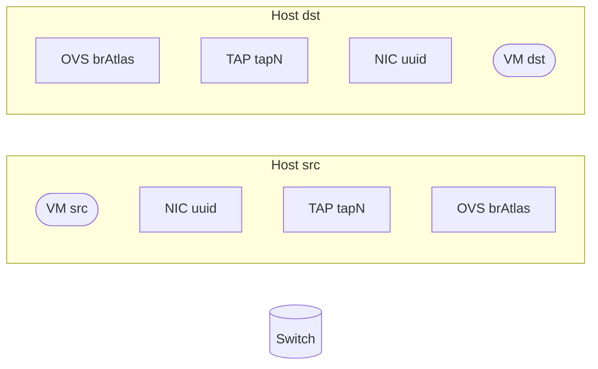

# OVN path nodes

Read this **and** `ovn-path-edges` before drawing. Identity is UUID; names are display.

Do **not** redraw a shorter diagram than the CLI. If you redraw, every VIF still gets TAP + OVS brAtlas.

Wrap the whole direction in `Upstream composite` or `Downstream composite`. Nested subgraphs, in order: `ACL Policy`, `L2 stretch`, `L3 routing / PBR`, `GW`, `External`. Unused L3/GW/External still appear as `N/A`.

## Required IDs (every VIF)

| ID | Class | Shape | Label must include |
|---|---|---|---|
| `VM_S` / `VM_D` | `vm` | stadium | `VM <name>` |
| `NIC_S` / `NIC_D` | `nic` | rectangle | NIC UUID, MAC, IP |
| `TAP_S` / `TAP_D` | `tap` | rectangle | `TAP <tapN or missing>` |
| `OVS_S` / `OVS_D` | `ovs` | rectangle | **`OVS brAtlas`**, ofport, dp_port, iface-id |

Src uses `_S`. Dest VIF uses `_D`. External dest: no `_D` TAP/OVS.

**Never skip TAP or OVS** because Host boxes are off, lookup failed, or the chain “looks long”. Missing dump → still draw the node (`TAP missing`, `OVS brAtlas ofport ?`).

Host subgraph (when chassis differ) wraps **VM+NIC+TAP+OVS**, not VM+NIC only.

## Other nodes (when on path)

| ID prefix | Class | Shape | When |
|---|---|---|---|
| `SW*` | `sw` | cylinder | every LS; label `transit` for gw-scale-out-network |
| `RT*` | `rt` | hexagon | every LR; add `NAT` if NAT exists; add `ext-GW` if external GW |
| `EXT` | `ext` | stadium | northbound dest only |
| `NAT*` | `nat` | dashed rect | hangs off its router; not a hop |
| `PBR*` | `pbr` | dashed rect | hangs off its router |
| `RC*` | `rc` | dashed stadium | HA chassis_name + priority |
| `OVL` | `ovl` | dashed rect | chassis differ; not a Switch substitute |
| `PG*` | `pg` | dashed teal | applied-to; rewrite `@port_group_*` |
| `AS*` | `aset` | dashed gold | dest/src IPs; rewrite `$address_set_*` |

## Copy this node block

Same chassis: drop `subgraph H1`/`H2`, **keep** TAP_* and OVS_*.

## Reject

Mermaid source lacks `TAP_S`, `OVS_S`, and (VIF dest) `TAP_D`, `OVS_D`, or any OVS label omits `brAtlas`. Redraw; do not send.
