# Design: How networking RCA works (with flow diagrams)

**Local only** (not in git):  
`/home/rakeshkumar.r/panacea/design-docs/network-underlay-nodes-edges-design.md`

Mermaid diagrams are **only in this file** — not in SKILL.md.

| Code piece | Path |
|------------|------|
| Master | `network-rca-orchestrator` |
| Scenarios (`scen`) | `_shared/network_symptom_triggers.py` |
| Evidence probes | `_shared/network_evidence_nodes.py` |
| Inventory | `network-underlay-nodes` |
| Planner | `network-underlay-edges` |

---

## Big picture (start here)

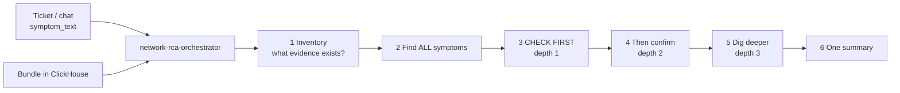

**In plain words**

1. See what data we have in ClickHouse.
2. List every matching smell (from ticket words + latent evidence).
3. **Check first** = run the main skill for each smell.
4. Then confirm.
5. Then dig deeper on the same paths.
6. Write one story. Never stop on the first FAIL.

---

## Master flow (detailed)

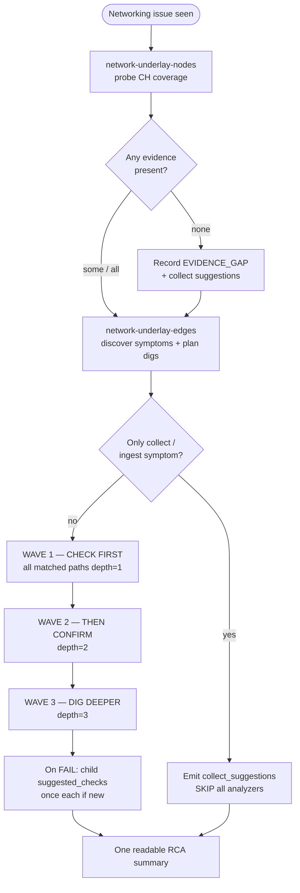

---

## What CHECK FIRST means

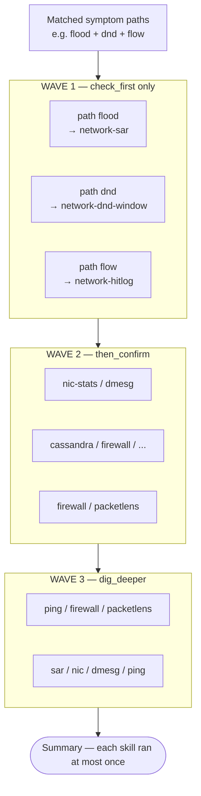

**Rule:** for every path, **check_first runs before** that path's confirm/dig.  
Across paths, **all check_first finish before any then_confirm**.

---

## How a symptom is found

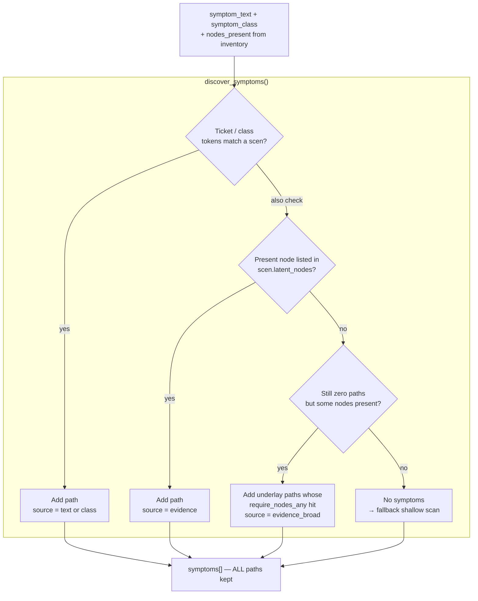

| Input | Symptom(s) found |
|-------|------------------|
| Ticket `CRC on eth0` | `l1_nic` (text) |
| Ticket empty, CH has `dnd_logs` | `dnd` (evidence / latent) |
| Ticket `DND and CRC` | `dnd` + `l1_nic` (both) |
| Ticket `collect logs` | `collect` only → suggestions, no dig |

---

## One path dig (single smell) — CRC example

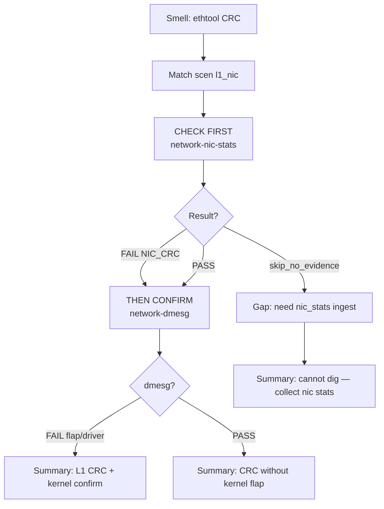

---

## Multi-path merge — DND + CRC

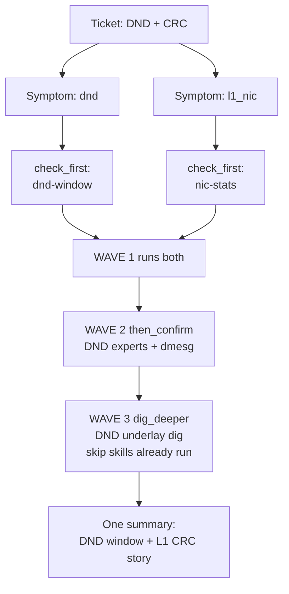

---

## Smell → CHECK FIRST map

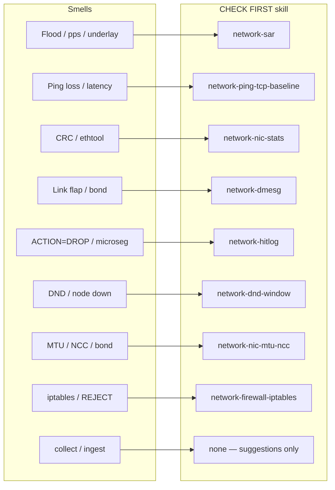

| If you see… | **CHECK FIRST** | Then confirm | Dig deeper |
|-------------|-----------------|--------------|------------|
| Flood / high pps / underlay | **sar** | nic-stats, dmesg | ping-tcp, firewall, packetlens |
| Ping loss / ping latency / unreachable / CQI / packet loss / network latency | **ping-tcp** | sar, nic-stats, dmesg, firewall, nic-mtu, cassandra, ovs | — |
| CRC / FCS / ethtool / soft drop | **nic-stats** | dmesg | — |
| Link flap / bond / soft lockup | **dmesg** | nic-stats | — |
| Flow DROP / microseg | **hitlog** | firewall, packetlens | ping-tcp, sar |
| PacketLens / Geneve / pcap | **packetlens** | hitlog | — |
| DND / degraded node | **dnd-window** | cassandra, firewall, nic-mtu, host, storage, ovs | sar, nic-stats, dmesg, ping-tcp |
| MTU / NCC / LACP / jumbo | **nic-mtu-ncc** | host, upgrade, ovs, nic-stats, dmesg | — |
| Firewall / iptables | **firewall** | hitlog, ping-tcp | — |
| Cassandra / pithos / zeus | **cassandra** | ping-tcp, host | — |
| OVS / upcall | **ovs** | nic-mtu, dmesg | — |
| Host pressure / OOM | **host-pressure** | storage, dmesg | — |
| Storage / stargate slow | **storage-io** | host, ping-tcp | — |
| Upgrade / LCM / config change | **upgrade-config** | nic-mtu, ovs | — |
| Collect / parallel_run | **(none)** | suggestions only | re-run after ingest |

---

## Planner internals

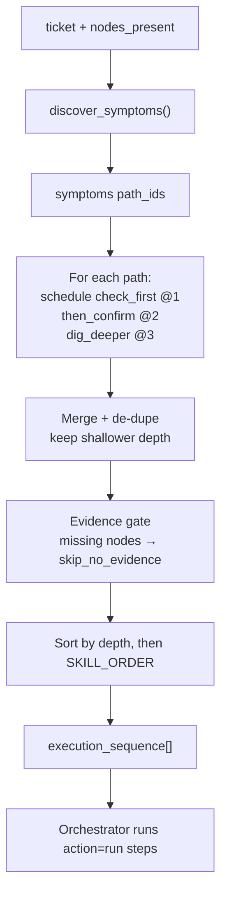

| `action` | Meaning |
|----------|---------|
| `run` | Execute the child skill |
| `skip_no_evidence` | No CH coverage — gap, continue |
| `skip_collect_only` | Collect ticket — suggestions only |

---

## Who calls what

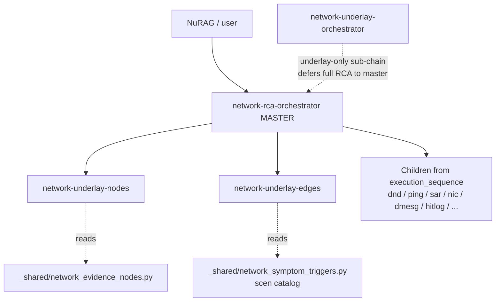

---

# Worked examples with flows

---

## Example 1 — Latency / flood

**Input:** `Cluster latency, packet loss`  
**Evidence:** `sar_metrics`, `ping_metrics`

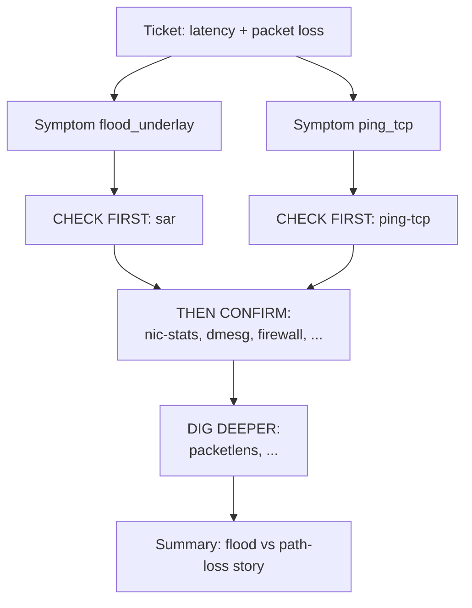

| Depth | Runs |
|------:|------|
| 1 check first | **sar**, **ping-tcp** |
| 2 confirm | nic-stats, dmesg, firewall, nic-mtu, cassandra, ovs |
| 3 dig deeper | packetlens (and any not already run) |

---

## Example 2 — DND after blip

**Input:** `Node went into DND after network blip`  
**Evidence:** `dnd_logs`, `sar_metrics`, `ping_metrics`

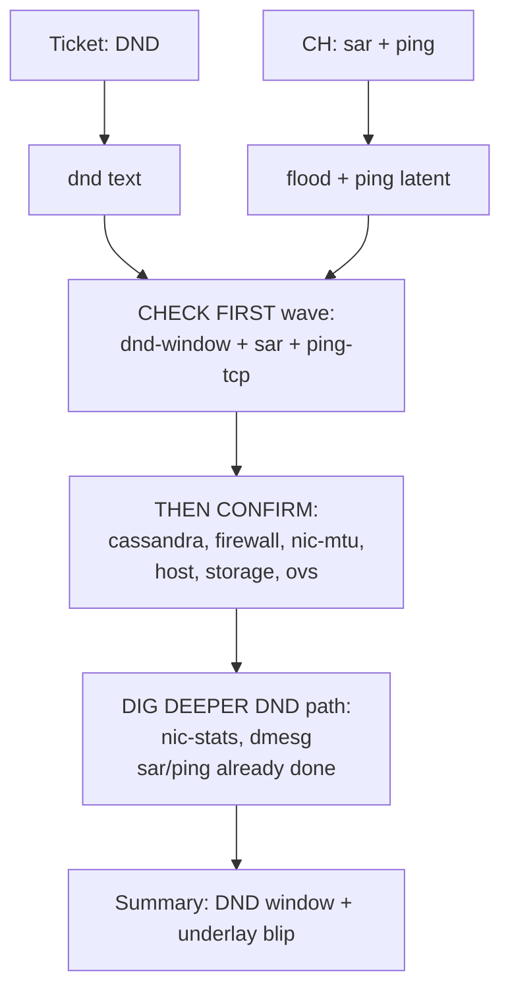

**CHECK FIRST** = `dnd-window` (+ latent sar / ping). Experts wait for wave 2.

---

## Example 3 — CRC climbing

**Input:** `ethtool CRC errors on eth2`  
**Evidence:** `nic_stats_logs`, `dmesg_logs`

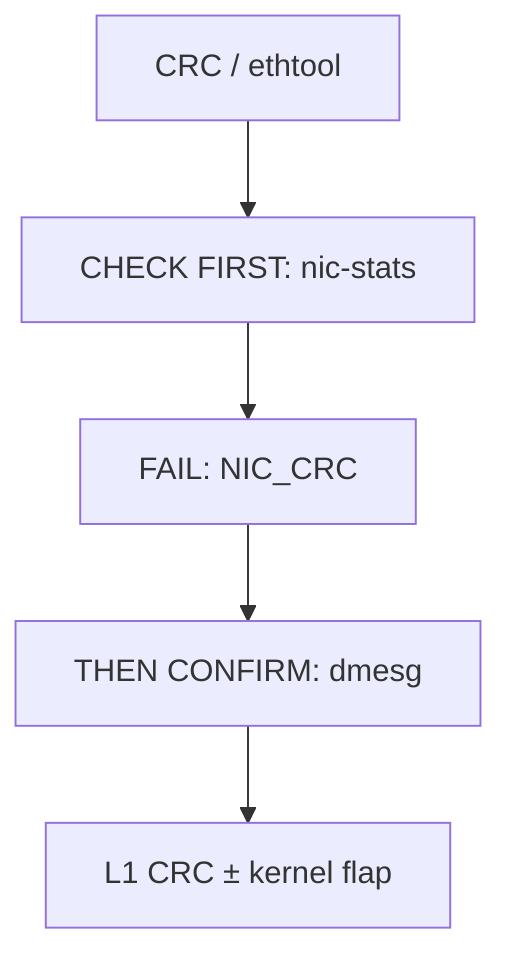

Does **not** open cassandra / upgrade.

---

## Example 4 — Flow ACTION=DROP

**Input:** `ACTION=DROP microseg denied`  
**Evidence:** `hitlog_logs`, `firewall_logs`

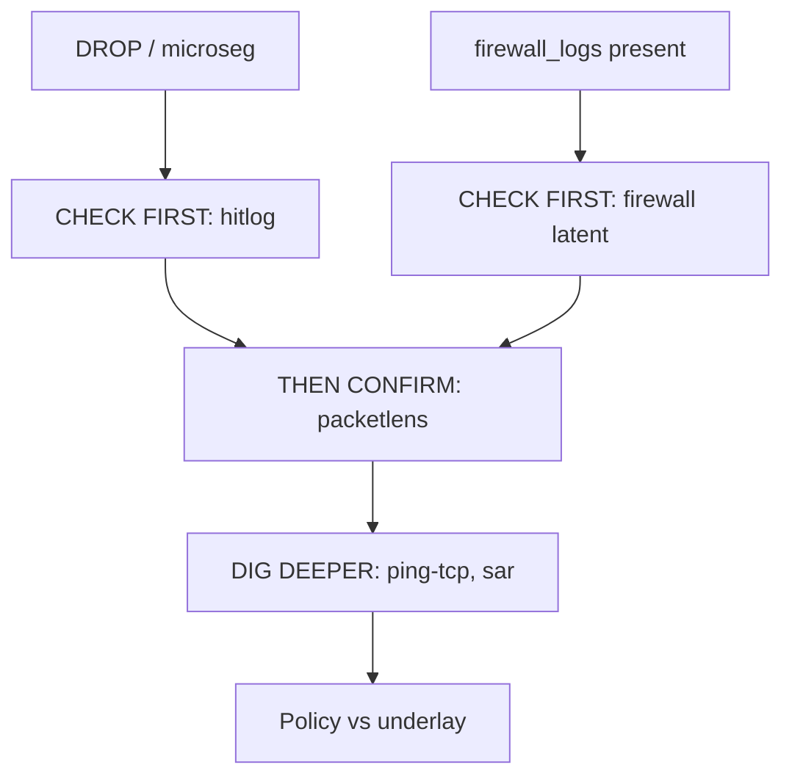

---

## Example 5 — Vague ticket, rich evidence

**Input:** `network broken, not sure why`  
**Evidence:** `sar_metrics`, `dnd_logs`, `hitlog_logs`

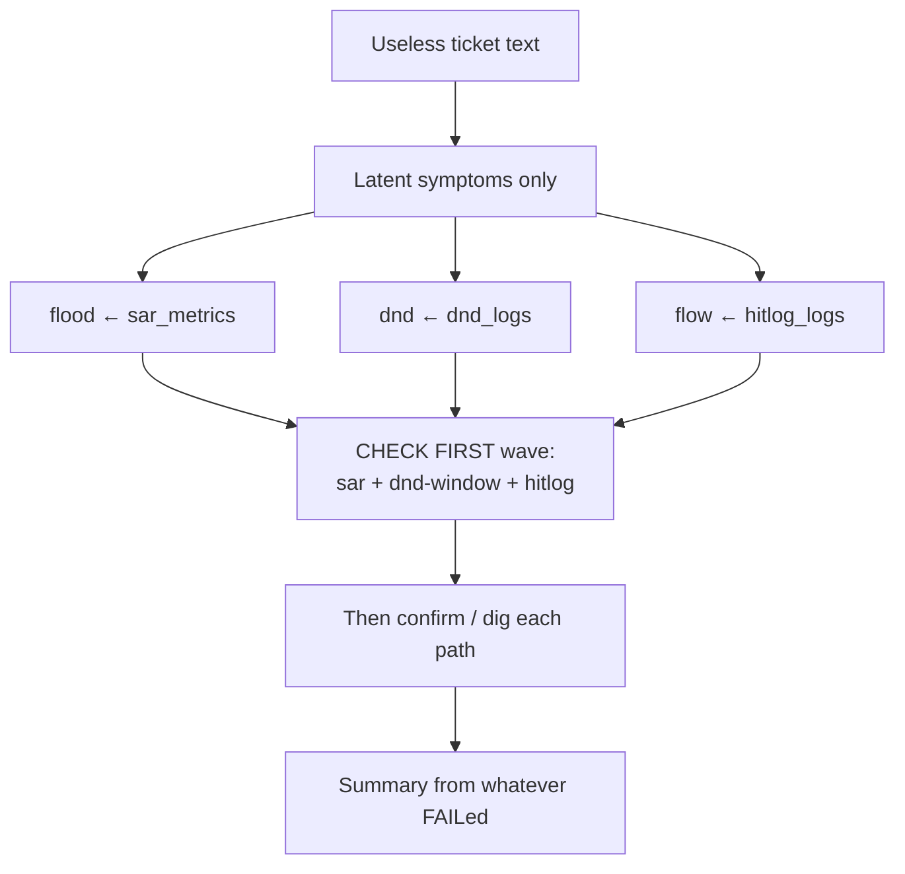

---

## Example 6 — Collect only

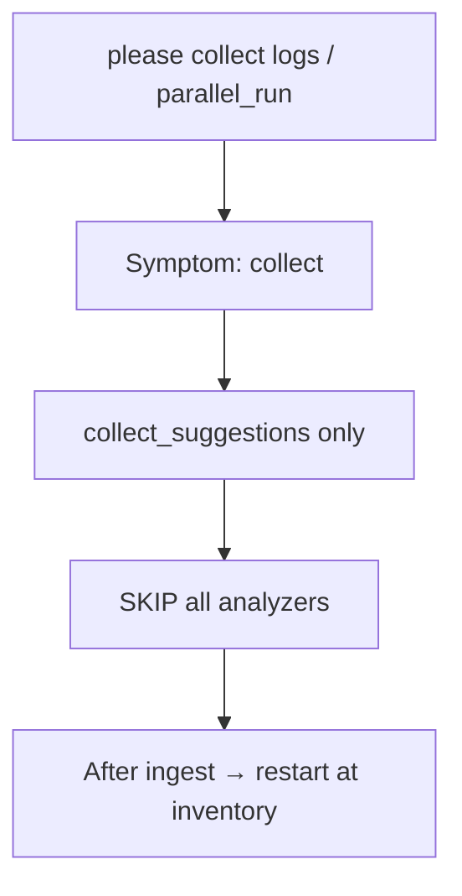

---

## Example 7 — Thin coverage

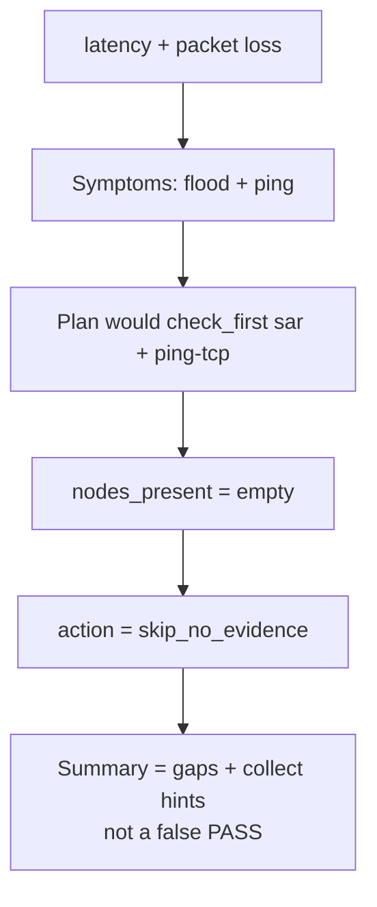

---

## Example 8 — Add a scenario tomorrow

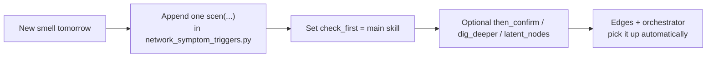

```python
scen(
    "geneve_encap",
    title="Geneve / encap drops",
    match_any=("geneve drop", "encap drop"),
    latent_nodes=("hitlog_logs",),
    check_first=["network-packetlens"],      # CHECK FIRST
    then_confirm=["network-hitlog", "network-ovs-host-evidence"],
    dig_deeper=["network-sar"],
)
```

New **skill name**? Also add a gate in `network_evidence_nodes.py`.

---

## Evidence nodes (what inventory looks for)

| Node | Means | Helps open |
|------|-------|------------|
| `sar_metrics` | SAR pps / drops | sar, latent flood |
| `ping_metrics` | ping / CQI / loss | ping-tcp |
| `tcp_socket_metrics` | retrans / RTT | ping-tcp, packetlens |
| `nic_stats_logs` / `host_nic_metrics` | CRC / ethtool | nic-stats |
| `dmesg_logs` | link / bond / driver | dmesg |
| `hitlog_logs` | Flow ACTION= | hitlog, packetlens |
| `dnd_logs` | degraded node | dnd-window |
| `firewall_logs` | iptables | firewall |
| `ovs_*` | OVS datapath | ovs |
| `cassandra_meta_logs` | cassandra / pithos | cassandra |
| `host_pressure_metrics` | CPU / mem | host-pressure |
| `storage_io_metrics` | stargate / disk | storage-io |

---

## Rules (short)

1. Inventory → find **all** symptoms → **check first** → confirm → dig.
2. Check first = the main skill for that smell.
3. Multiple smells → merge waves; each skill runs **once**.
4. FAIL = finding; continue. Gap ≠ healthy.
5. Collect = suggestions only.
6. New scenario = one `scen(...)` with a clear `check_first`.

---

## Quick quiz

1. CRC ticket — check first? → **nic-stats**
2. DND ticket — check first? → **dnd-window** (experts later)
3. ACTION=DROP — check first? → **hitlog**
4. Flood / high pps — check first? → **sar**
5. Empty ticket + `dnd_logs` — still check dnd first? → **yes (latent)**
6. Collect ticket — check first? → **nothing**
