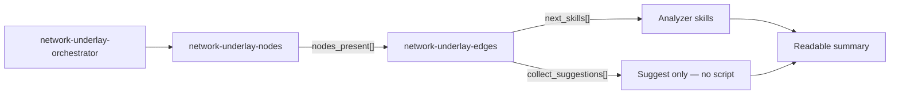
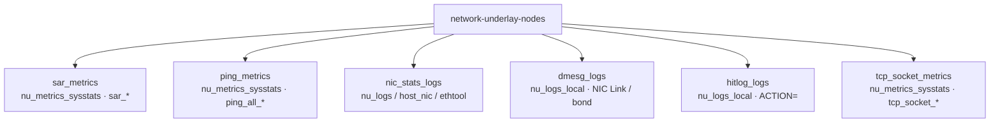
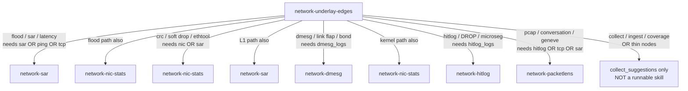
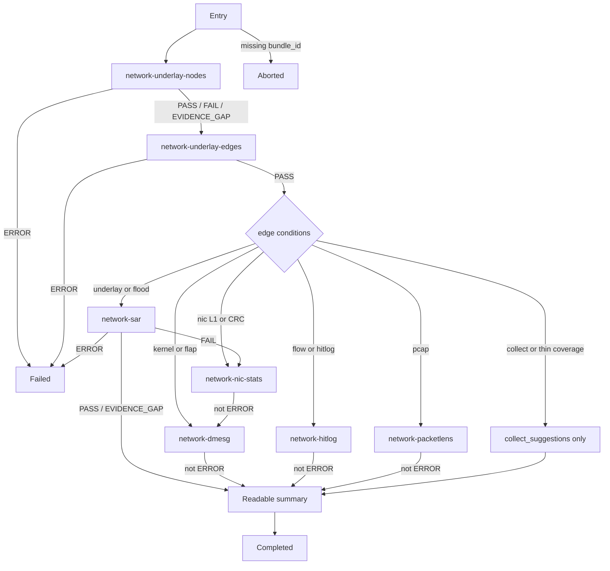

# Design: network underlay nodes & edges

Keep this file for reading. Mermaid lives **only here**, not in SKILL.md files.

---

## Source files (implementation)

| Piece | Path |
|-------|------|
| Orchestrator | `skills/network-services/network-underlay-orchestrator/SKILL.md` |
| Nodes skill | `skills/network-services/network-underlay-nodes/SKILL.md` |
| Nodes script | `skills/network-services/network-underlay-nodes/scripts/check_network_underlay_nodes.py` |
| Edges skill | `skills/network-services/network-underlay-edges/SKILL.md` |
| Edges script (`EDGE_TABLE`) | `skills/network-services/network-underlay-edges/scripts/check_network_underlay_edges.py` |
| DB / ingest map | `docs/skills/network_underlay.md` |
| Summary template | `skills/network-services/network-underlay-orchestrator/prompts/summary.md` |

Read order: **nodes script → edges script → this design → orchestrator SKILL**.

---

## Idea in one line

**Nodes** = which ClickHouse evidence classes exist.  
**Edges** = which analyzer skills to run next (or only what to collect).

---

## Big picture



1. Nodes probe ClickHouse for the bundle window.
2. Edges use `nodes_present` + symptom text.
3. Orchestrator runs only `next_skills`; collect path never runs a script.

---

## Evidence nodes



| Node id | Table | Present when |
|---------|-------|--------------|
| `sar_metrics` | `nu_metrics_sysstats` | `sar_rx_*` / `sar_tx_*` |
| `ping_metrics` | `nu_metrics_sysstats` | `ping_all_*` / lost / unreachable |
| `nic_stats_logs` | `nu_logs_local` (+ metrics) | NIC / CRC / drop lines |
| `dmesg_logs` | `nu_logs_local` | kernel / dmesg needles |
| `hitlog_logs` | `nu_logs_local` | Flow `ACTION=` / `SRC=` / `DST=` |
| `tcp_socket_metrics` | `nu_metrics_sysstats` | tcp / retrans / rtt |

---

## Edges (symptom → next)



| Condition | Symptom tokens | Required nodes (any) | Next |
|-----------|----------------|----------------------|------|
| `symptom_underlay_or_flood` | flood, sar, rx pps, latency, … | `sar_metrics`, `ping_metrics`, `tcp_socket_metrics` | `network-sar`, `network-nic-stats` |
| `symptom_nic_l1` | crc, fcs, soft drop, ethtool, … | `nic_stats_logs`, `sar_metrics` | `network-nic-stats`, `network-sar` |
| `symptom_kernel_link` | dmesg, link flap, bond, soft lockup | `dmesg_logs` | `network-dmesg`, `network-nic-stats` |
| `symptom_flow_acl` | hitlog, microseg, ACTION=DROP | `hitlog_logs` | `network-hitlog` |
| `symptom_pcap` | pcap, packetlens, geneve, … | `hitlog_logs`, `tcp_socket_metrics`, `sar_metrics` | `network-packetlens` |
| `symptom_collect` / thin coverage | collect logs, ingest, coverage, … | *(none)* | **suggestions only** |

If required nodes are missing for a condition, that edge is **skipped**.

---

## Full orchestrator chain



---

## Data handoff

```text
nodes.evaluate(bundle_id, window)
  → present = ["sar_metrics", "dmesg_logs", ...]

edges.evaluate(symptom_text, nodes_present)
  → next_skills = ["network-sar", ...]                 # runnable
  → collect_suggestions = [{artifact, lands_in, ...}]  # advisory
  → suggested_checks = next_skills only

orchestrator runs each next_skill via run_local_script(check_*_v1)
  → fills prompts/summary.md
```
