# OVN path 3468ac71-d670-41a0-93af-0ec34d43f7c3 → 8.8.8.8

## Traffic story / RCA

- Src VM `VPC_California_SJ_Pheonix_Customer_1_subnet_2_139` uuid `989f9355-f15f-45eb-8006-07b9623ddafc` NIC `3468ac71-d670-41a0-93af-0ec34d43f7c3` LSP `915f1338-1aba-4c27-a016-cb9876cdc970` MAC `50:6b:8d:19:78:77` IP `192.168.2.186` VPC `Customer_1`
- Dest `8.8.8.8` (internet / northbound via OVN External)
- Compute Host `zadkiel05-3` chassis `a774c18b-7b6e-44f7-8661-6ac53c4607ca`
- External GW Host `zadkiel04-1` chassis `b594f638-f4a0-439b-91d4-1c513f0c4529` (active RC) router `gw-scale-out-router_nat_fc433064-926d-4fc0-a1a3-7c089ad90343_1` MAC `e0:19:95:9b:58:bb` IP `10.116.246.55/18`
- External GW Host `flashfire01-2` chassis `74e0be63-f78f-482a-b04e-a09ada933f20` (standby scale-out) router `gw-scale-out-router_nat_fc433064-926d-4fc0-a1a3-7c089ad90343_0` MAC `e0:19:95:c0:b3:04` IP `10.116.246.54/18`
- Transit LS `gw-scale-out-network_nat_fc433064-926d-4fc0-a1a3-7c089ad90343` uuid `df8dadd4-7138-4ea7-95da-15fab0b6838c`

### Drop / allow

**dropped upstream** (src NIC → `8.8.8.8`). First match on Switch `network_9472b0d1-09fb-4e7e-a1cf-9536d262b6ef` **from-lport**: pri 1045 **drop** `from-lport` [pg] `inport == @AppType/VPC_California_SJ_Pheonix_Customer_1_App_1 && ip4`. The packet never reaches the tenant router, SNAT, or External. Downstream does not run (no conntrack).

_Verdict: **dropped upstream**. UPSTREAM = src NIC → dest. DOWNSTREAM = dest → src NIC._

### Routing view (L2 → L3 → GW → NAT → External)

Forward (what routing would do if policy allowed):

1. VM `VPC_California_SJ_Pheonix_Customer_1_subnet_2_139` uuid `989f9355-f15f-45eb-8006-07b9623ddafc`
2. NIC `3468ac71-d670-41a0-93af-0ec34d43f7c3` MAC `50:6b:8d:19:78:77` IP `192.168.2.186` LSP `915f1338-1aba-4c27-a016-cb9876cdc970`
3. TAP `tap222`
4. OVS brAtlas ofport `288` on Host `zadkiel05-3` chassis `a774c18b-7b6e-44f7-8661-6ac53c4607ca`
5. Switch `network_9472b0d1-09fb-4e7e-a1cf-9536d262b6ef` uuid `02d0de22-21a5-41f7-befd-75b6cb9c4cc7`
6. Router `router_fc433064-926d-4fc0-a1a3-7c089ad90343` uuid `cb58bbb0-4bdc-429e-9378-838e204b99f1` — connected `192.168.2.1/24`; PBR 3 rows; src PBR pri 100 allow `ip4.dst==0.0.0.0/0 && ip4.src==0.0.0.0/0` nexthop `(empty — continue to connected/static routes)`; LR ↔ transit `lrp-gw-scale-out-router-port_nat_fc433064-926d-4fc0-a1a3-7c089ad90343` MAC `e0:19:95:c9:5b:48` `169.254.2.20/24`; src LS ↔ LR `lrp-router-port_9472b0d1-09fb-4e7e-a1cf-9536d262b6ef` MAC `e0:19:95:08:22:c9` `192.168.2.1/24`; static routes 2 (full table below); default `0.0.0.0/0` nexthop `169.254.2.101`
7. Switch transit `gw-scale-out-network_nat_fc433064-926d-4fc0-a1a3-7c089ad90343` uuid `df8dadd4-7138-4ea7-95da-15fab0b6838c`
8. Router (NAT, ext-GW) `gw-scale-out-router_nat_fc433064-926d-4fc0-a1a3-7c089ad90343_1` uuid `edba0385-d5d3-4d07-8ca5-f9253e4af298` — connected `10.116.246.55/18`, `169.254.2.101/24`; PBR 1 rows; GW ↔ external `lrp-ext_gw_port_2d18744a-e421-4971-910d-e3e120f2d212` MAC `e0:19:95:9b:58:bb` `10.116.246.55/18`; transit ↔ GW `lrp-gw-scale-out-router-port_nat_fc433064-926d-4fc0-a1a3-7c089ad90343_1` MAC `e0:19:95:60:29:5b` `169.254.2.101/24`; static routes 104 (full table below); default `0.0.0.0/0` nexthop `10.116.192.1` — External GW Host `zadkiel04-1` chassis `b594f638-f4a0-439b-91d4-1c513f0c4529` (active RC); External GW MAC `e0:19:95:9b:58:bb` IP `10.116.246.55/18`; SNAT `192.168.2.186` → `10.116.246.55` covering `192.168.2.0/24`; TAP_GW `patch-brAtlas-to-localnet_b65d16d9-ee5c-44c2-aa9c-0ad60cd9c28a` OVS brAtlas ofport `372`
9. External GW Host `flashfire01-2` chassis `74e0be63-f78f-482a-b04e-a09ada933f20` (standby scale-out) router `gw-scale-out-router_nat_fc433064-926d-4fc0-a1a3-7c089ad90343_0` MAC `e0:19:95:c0:b3:04` IP `10.116.246.54/18`
10. External `8.8.8.8`
11. Overlay geneve `10.116.26.235` to `10.116.26.215` (compute host ≠ GW host)

**Return (`8.8.8.8` → NIC):** External `8.8.8.8` → TAP_GW / OVS brAtlas on External GW Host `zadkiel04-1` chassis `b594f638-f4a0-439b-91d4-1c513f0c4529` (un-SNAT: replies to `10.116.246.55` are un-SNATed by conntrack (reverse of `snat` `192.168.2.0/24` → `10.116.246.55`, not a separate DNAT row) back to `192.168.2.186`; External GW MAC `e0:19:95:9b:58:bb` IP `10.116.246.55/18`) → transit → tenant Router `router_fc433064-926d-4fc0-a1a3-7c089ad90343` connected `192.168.2.1/24` → Switch → OVS brAtlas → TAP `tap222` on `zadkiel05-3` → NIC `3468ac71-d670-41a0-93af-0ec34d43f7c3` → VM `VPC_California_SJ_Pheonix_Customer_1_subnet_2_139`. Would-be return is drawn even if upstream ACL dropped.

The packet **dies on hop 5** (first Switch `network_9472b0d1-09fb-4e7e-a1cf-9536d262b6ef`, from-lport); hops 6+ (tenant LR / PBR / SNAT / External) are never reached.

### Policy view (ACL)

- Applied-to (name display, UUID identity): `AppType/VPC_California_SJ_Pheonix_Customer_1_App_1` uuid `4b7148bb-c13c-56be-9e17-95bceba2d71f` (OVN `@port_group_4b7148bb_c13c_56be_9e17_95bceba2d71f`); `AppType/EG_Exclude_Policy1` uuid `85e8b5fc-03c6-53cb-97cb-b2535b556133` (OVN `@port_group_85e8b5fc_03c6_53cb_97cb_b2535b556133`)
- ICMP ping `192.168.2.186` → `8.8.8.8` (proto 1): first hit **from-lport** on `network_9472b0d1-09fb-4e7e-a1cf-9536d262b6ef`: pri 1045 **drop** `from-lport` [pg] `inport == @AppType/VPC_California_SJ_Pheonix_Customer_1_App_1 && ip4`
- TCP :443 / UDP :53 to `8.8.8.8`: same first hit as ICMP (1050 allow-related is dest-set + tcp/udp port ranges, not `8.8.8.8`).
- Downstream first hit (**to-lport**, `8.8.8.8` → NIC) on `network_9472b0d1-09fb-4e7e-a1cf-9536d262b6ef`: pri 1045 **drop** `to-lport` [pg] `ip4 && outport == @AppType/VPC_California_SJ_Pheonix_Customer_1_App_1`
- Walk: pri 31500 DHCP miss; 1060/1052 dest/src isolation miss for this dest; 1050 allow-related miss (wrong dest-set / ports); **1045 IPv4 catch-all drop** wins on the secured group; 1017/1015 on the second group and 500 `tcp || udp || icmp` never run. Full tables under each mermaid (src LS, dest LS, every transit / localnet LS on the walk).

### What exactly happened

The packet left VM `VPC_California_SJ_Pheonix_Customer_1_subnet_2_139` (`989f9355-f15f-45eb-8006-07b9623ddafc`) NIC `3468ac71-d670-41a0-93af-0ec34d43f7c3` IP `192.168.2.186` on `zadkiel05-3` via TAP `tap222` / OVS brAtlas ofport `288` onto Switch `network_9472b0d1-09fb-4e7e-a1cf-9536d262b6ef` (`02d0de22-21a5-41f7-befd-75b6cb9c4cc7`). **from-lport pri 1045 drop** on `AppType/VPC_California_SJ_Pheonix_Customer_1_App_1` uuid `4b7148bb-c13c-56be-9e17-95bceba2d71f` (OVN `@port_group_4b7148bb_c13c_56be_9e17_95bceba2d71f`) matched leftover IPv4 to `8.8.8.8` — higher-pri 1060/1052 dest-isolation and 1050 allow-related dest-sets are east-west, not `8.8.8.8`; pri 1017/1015 and 500 `tcp || udp || icmp` never run. Tenant LR `router_fc433064-926d-4fc0-a1a3-7c089ad90343` / snat `192.168.2.0/24` → `10.116.246.55` (src `192.168.2.186` becomes `10.116.246.55`) never saw the packet. **Dropped upstream.**

_Drop direction: **dropped upstream**. Mermaid: [Mermaid Upstream composite](#mermaid-upstream-composite) and [Mermaid Downstream composite](#mermaid-downstream-composite)._

## Upstream composite
=== Upstream (northbound) ===
src: vm=VPC_California_SJ_Pheonix_Customer_1_subnet_2_139 nic=3468ac71-d670-41a0-93af-0ec34d43f7c3 lsp=port_12a2ce8a-afb5-40e5-b5ff-a7b3f895ffc2 lsp_uuid=915f1338-1aba-4c27-a016-cb9876cdc970 mac=50:6b:8d:19:78:77 ip=192.168.2.186
dst: external/NAT dest=8.8.8.8
  1. VIF vm=VPC_California_SJ_Pheonix_Customer_1_subnet_2_139 nic=3468ac71-d670-41a0-93af-0ec34d43f7c3 lsp=port_12a2ce8a-afb5-40e5-b5ff-a7b3f895ffc2 lsp_uuid=915f1338-1aba-4c27-a016-cb9876cdc970 mac=50:6b:8d:19:78:77 ip=192.168.2.186
  2. LS network_9472b0d1-09fb-4e7e-a1cf-9536d262b6ef uuid=02d0de22-21a5-41f7-befd-75b6cb9c4cc7
       stretch flashfire01-1:geneve:10.116.29.154, flashfire01-2:geneve:10.116.29.155, flashfire01-3:geneve:10.116.29.156, flashfire01-4:geneve:10.116.29.157, flashfire02-1:geneve:10.116.29.172, flashfire02-2:geneve:10.116.29.173, flashfire02-3:geneve:10.116.29.174, flashfire02-4:geneve:10.116.29.175 (+22)
       ACLs from-lport (ingress on this hop): 13 (full list)
         pri=31500 allow-stateless from-lport [ls] (udp.src == 67 && udp.dst == 68) || (udp.src == 68 && udp.dst == 67)
         pri=1060 drop from-lport [pg] inport == @port_group_4b7148bb_c13c_56be_9e17_95bceba2d71f && ip4 && (ip4.dst == $address_set_d8c26aac_c96e_46a2_a07a_a17fcd70313c)
         pri=1052 drop from-lport [pg] inport == @port_group_4b7148bb_c13c_56be_9e17_95bceba2d71f && ip4 && (ip4.dst == $address_set_d8c26aac_c96e_46a2_a07a_a17fcd70313c)
         pri=1050 allow-related from-lport [pg] inport == @port_group_4b7148bb_c13c_56be_9e17_95bceba2d71f && ip4 && (ip4.dst == $address_set_9c194c48_8c96_54a7_837a_81508c40ddae) && ((ip.proto == 6 && ((tcp.dst >= 1416 && tcp.dst <= 1425) || (tcp.dst >= 1429 && tcp.dst <= 1438) || (tcp.dst >= 1441 && tcp.dst <= 1450) || (tcp.dst >= 1455 && tcp.dst <= 1464) || (tcp.dst >= 1469 && tcp.dst <= 1478) || (tcp.dst >= 1483 && tcp.dst <= 1492) || (tcp.dst >= 1498 && tcp.dst <= 1507) || (tcp.dst >= 1511 && tcp.dst <= 1520) || (tcp.dst >= 1524 && tcp.dst <= 1533) || (tcp.dst >= 1539 && tcp.dst <= 1548))) || (ip.proto == 17 && ((udp.dst >= 1416 && udp.dst <= 1425) || (udp.dst >= 1429 && udp.dst <= 1438) || (udp.dst >= 1441 && udp.dst <= 1450) || (udp.dst >= 1455 && udp.dst <= 1464) || (udp.dst >= 1469 && udp.dst <= 1478) || (udp.dst >= 1483 && udp.dst <= 1492) || (udp.dst >= 1498 && udp.dst <= 1507) || (udp.dst >= 1511 && udp.dst <= 1520) || (udp.dst >= 1524 && udp.dst <= 1533) || (udp.dst >= 1539 && udp.dst <= 1548))))
         pri=1050 allow-related from-lport [pg] inport == @port_group_4b7148bb_c13c_56be_9e17_95bceba2d71f && ip4 && (ip4.dst == $address_set_f412ba3b_b736_4b27_a0e6_4eeefc7220a4) && ((ip.proto == 6 && ((tcp.dst >= 1285 && tcp.dst <= 1294) || (tcp.dst >= 1297 && tcp.dst <= 1306) || (tcp.dst >= 1312 && tcp.dst <= 1321) || (tcp.dst >= 1324 && tcp.dst <= 1333) || (tcp.dst >= 1336 && tcp.dst <= 1345) || (tcp.dst >= 1350 && tcp.dst <= 1359) || (tcp.dst >= 1363 && tcp.dst <= 1372) || (tcp.dst >= 1378 && tcp.dst <= 1387) || (tcp.dst >= 1390 && tcp.dst <= 1399) || (tcp.dst >= 1403 && tcp.dst <= 1412))) || (ip.proto == 17 && ((udp.dst >= 1285 && udp.dst <= 1294) || (udp.dst >= 1297 && udp.dst <= 1306) || (udp.dst >= 1312 && udp.dst <= 1321) || (udp.dst >= 1324 && udp.dst <= 1333) || (udp.dst >= 1336 && udp.dst <= 1345) || (udp.dst >= 1350 && udp.dst <= 1359) || (udp.dst >= 1363 && udp.dst <= 1372) || (udp.dst >= 1378 && udp.dst <= 1387) || (udp.dst >= 1390 && udp.dst <= 1399) || (udp.dst >= 1403 && udp.dst <= 1412))))
         pri=1045 drop from-lport [pg] inport == @port_group_4b7148bb_c13c_56be_9e17_95bceba2d71f && ip6
         pri=1045 drop from-lport [pg] inport == @port_group_4b7148bb_c13c_56be_9e17_95bceba2d71f && ip4
         pri=1019 allow-related from-lport [pg] inport == @port_group_85e8b5fc_03c6_53cb_97cb_b2535b556133 && ip4 && (ip4.dst == $address_set_ddb478f9_61bb_484c_aa10_5738fabfe506)
         pri=1018 allow-related from-lport [pg] inport == @port_group_85e8b5fc_03c6_53cb_97cb_b2535b556133 && ip4 && (ip4.dst == $address_set_ddb478f9_61bb_484c_aa10_5738fabfe506)
         pri=1017 allow-related from-lport [pg] inport == @port_group_85e8b5fc_03c6_53cb_97cb_b2535b556133 && ip4
         pri=1015 allow-related from-lport [pg] inport == @port_group_85e8b5fc_03c6_53cb_97cb_b2535b556133 && ip4
         pri=1015 allow-related from-lport [pg] inport == @port_group_85e8b5fc_03c6_53cb_97cb_b2535b556133 && ip6
         pri=500 allow-related from-lport [ls] tcp || udp || icmp
       ACLs to-lport (egress on this hop): 14 (full list)
         pri=31500 allow-stateless to-lport [ls] (udp.src == 67 && udp.dst == 68) || (udp.src == 68 && udp.dst == 67)
         pri=1060 drop to-lport [pg] ip4 && (ip4.src == $address_set_d8c26aac_c96e_46a2_a07a_a17fcd70313c) && outport == @port_group_4b7148bb_c13c_56be_9e17_95bceba2d71f
         pri=1052 drop to-lport [pg] ip4 && (ip4.src == $address_set_d8c26aac_c96e_46a2_a07a_a17fcd70313c) && outport == @port_group_4b7148bb_c13c_56be_9e17_95bceba2d71f
         pri=1050 allow-related to-lport [pg] ip4 && (ip4.src == $address_set_e88c0d4d_73b0_486e_a3fb_d95baaa35ef1) && ((ip.proto == 6 && ((tcp.dst >= 1025 && tcp.dst <= 1034) || (tcp.dst >= 1037 && tcp.dst <= 1046) || (tcp.dst >= 1049 && tcp.dst <= 1058) || (tcp.dst >= 1062 && tcp.dst <= 1071) || (tcp.dst >= 1074 && tcp.dst <= 1083) || (tcp.dst >= 1086 && tcp.dst <= 1095) || (tcp.dst >= 1101 && tcp.dst <= 1110) || (tcp.dst >= 1113 && tcp.dst <= 1122) || (tcp.dst >= 1125 && tcp.dst <= 1134) || (tcp.dst >= 1140 && tcp.dst <= 1149))) || (ip.proto == 17 && ((udp.dst >= 1025 && udp.dst <= 1034) || (udp.dst >= 1037 && udp.dst <= 1046) || (udp.dst >= 1049 && udp.dst <= 1058) || (udp.dst >= 1062 && udp.dst <= 1071) || (udp.dst >= 1074 && udp.dst <= 1083) || (udp.dst >= 1086 && udp.dst <= 1095) || (udp.dst >= 1101 && udp.dst <= 1110) || (udp.dst >= 1113 && udp.dst <= 1122) || (udp.dst >= 1125 && udp.dst <= 1134) || (udp.dst >= 1140 && udp.dst <= 1149)))) && outport == @port_group_4b7148bb_c13c_56be_9e17_95bceba2d71f
         pri=1050 allow-related to-lport [pg] ip4 && (ip4.src == $address_set_ca94bdb8_7cff_5c8c_858e_ca44207c5032) && ((ip.proto == 1 && ((icmp4.type == 8 && icmp4.code == 0))) || (ip.proto == 6 && (tcp.dst == 22 || tcp.dst == 1024 || tcp.dst == 80)) || (ip.proto == 17 && (udp.dst == 22))) && outport == @port_group_4b7148bb_c13c_56be_9e17_95bceba2d71f
         pri=1050 allow-related to-lport [pg] ip4 && (ip4.src == $address_set_09687af3_486d_5381_baff_78f78a00c4b3) && ((ip.proto == 6 && ((tcp.dst >= 1152 && tcp.dst <= 1161) || (tcp.dst >= 1166 && tcp.dst <= 1175) || (tcp.dst >= 1181 && tcp.dst <= 1190) || (tcp.dst >= 1193 && tcp.dst <= 1202) || (tcp.dst >= 1205 && tcp.dst <= 1214) || (tcp.dst >= 1218 && tcp.dst <= 1227) || (tcp.dst >= 1230 && tcp.dst <= 1239) || (tcp.dst >= 1242 && tcp.dst <= 1251) || (tcp.dst >= 1257 && tcp.dst <= 1266) || (tcp.dst >= 1271 && tcp.dst <= 1280))) || (ip.proto == 17 && ((udp.dst >= 1152 && udp.dst <= 1161) || (udp.dst >= 1166 && udp.dst <= 1175) || (udp.dst >= 1181 && udp.dst <= 1190) || (udp.dst >= 1193 && udp.dst <= 1202) || (udp.dst >= 1205 && udp.dst <= 1214) || (udp.dst >= 1218 && udp.dst <= 1227) || (udp.dst >= 1230 && udp.dst <= 1239) || (udp.dst >= 1242 && udp.dst <= 1251) || (udp.dst >= 1257 && udp.dst <= 1266) || (udp.dst >= 1271 && udp.dst <= 1280)))) && outport == @port_group_4b7148bb_c13c_56be_9e17_95bceba2d71f
         pri=1045 drop to-lport [pg] ip4 && outport == @port_group_4b7148bb_c13c_56be_9e17_95bceba2d71f
         pri=1045 drop to-lport [pg] ip6 && outport == @port_group_4b7148bb_c13c_56be_9e17_95bceba2d71f
         pri=1019 allow-related to-lport [pg] ip4 && (ip4.src == $address_set_ddb478f9_61bb_484c_aa10_5738fabfe506) && outport == @port_group_85e8b5fc_03c6_53cb_97cb_b2535b556133
         pri=1018 allow-related to-lport [pg] ip4 && (ip4.src == $address_set_ddb478f9_61bb_484c_aa10_5738fabfe506) && outport == @port_group_85e8b5fc_03c6_53cb_97cb_b2535b556133
         pri=1017 allow-related to-lport [pg] ip4 && (ip4.src == $address_set_25f83796_b668_50c1_a86f_741b6495cafe) && outport == @port_group_85e8b5fc_03c6_53cb_97cb_b2535b556133
         pri=1015 allow-related to-lport [pg] ip4 && outport == @port_group_85e8b5fc_03c6_53cb_97cb_b2535b556133
         pri=1015 allow-related to-lport [pg] ip6 && outport == @port_group_85e8b5fc_03c6_53cb_97cb_b2535b556133
         pri=500 allow-related to-lport [ls] tcp || udp || icmp
  3. LR router_fc433064-926d-4fc0-a1a3-7c089ad90343 uuid=cb58bbb0-4bdc-429e-9378-838e204b99f1 has_nat=0
       LRP lrp-router-port_9472b0d1-09fb-4e7e-a1cf-9536d262b6ef mac=e0:19:95:08:22:c9 nets=['192.168.2.1/24']
       PBR pri=100 allow match=ip4.dst==0.0.0.0/0 && ip4.src==0.0.0.0/0 nexthop=
       PBR pri=10 drop match=ip4.dst==0.0.0.0/0 && ip4.src==0.0.0.0/0 nexthop=
       PBR pri=1 drop match=ip4.dst==0.0.0.0/0 && ip4.src==0.0.0.0/0 nexthop=
  4. LR gw-scale-out-router_nat_fc433064-926d-4fc0-a1a3-7c089ad90343_1 uuid=edba0385-d5d3-4d07-8ca5-f9253e4af298 has_nat=1
       via transit_ls LS gw-scale-out-network_nat_fc433064-926d-4fc0-a1a3-7c089ad90343 uuid=df8dadd4-7138-4ea7-95da-15fab0b6838c
       ACLs from-lport (ingress on this hop): (none)
       ACLs to-lport (egress on this hop): (none)
       PBR pri=1000 reroute match=ip4.src==100.64.1.6/32 nexthop=169.254.2.100
       RC chassis=bb49616e-e5ad-4dd7-9d98-ad529702d2df pri=100
       NAT dnat_and_snat ext=10.116.246.1 log=192.168.254.168 port=
       NAT dnat_and_snat ext=10.116.246.43 log=100.64.1.222 port=
       NAT snat ext=10.116.246.55 log=100.64.1.0/24 port=
       NAT snat ext=10.116.246.55 log=192.168.1.0/24 port=
       NAT snat ext=10.116.246.55 log=192.168.10.0/24 port=
       NAT snat ext=10.116.246.55 log=192.168.100.0/24 port=
       NAT snat ext=10.116.246.55 log=192.168.11.0/24 port=
       NAT snat ext=10.116.246.55 log=192.168.12.0/24 port=
       NAT snat ext=10.116.246.55 log=192.168.13.0/24 port=
       NAT snat ext=10.116.246.55 log=192.168.14.0/24 port=
       NAT snat ext=10.116.246.55 log=192.168.15.0/24 port=
       NAT snat ext=10.116.246.55 log=192.168.16.0/24 port=
       NAT snat ext=10.116.246.55 log=192.168.17.0/24 port=
       NAT snat ext=10.116.246.55 log=192.168.18.0/24 port=
       NAT snat ext=10.116.246.55 log=192.168.19.0/24 port=
       NAT snat ext=10.116.246.55 log=192.168.2.0/24 port=
       NAT snat ext=10.116.246.55 log=192.168.20.0/24 port=
       NAT snat ext=10.116.246.55 log=192.168.21.0/24 port=
       NAT snat ext=10.116.246.55 log=192.168.22.0/24 port=
       NAT snat ext=10.116.246.55 log=192.168.23.0/24 port=
       NAT snat ext=10.116.246.55 log=192.168.24.0/24 port=
       NAT snat ext=10.116.246.55 log=192.168.25.0/24 port=
       NAT snat ext=10.116.246.55 log=192.168.253.0/24 port=
       NAT snat ext=10.116.246.55 log=192.168.254.0/24 port=
       NAT snat ext=10.116.246.55 log=192.168.26.0/24 port=
       NAT snat ext=10.116.246.55 log=192.168.27.0/24 port=
       NAT snat ext=10.116.246.55 log=192.168.28.0/24 port=
       NAT snat ext=10.116.246.55 log=192.168.29.0/24 port=
       NAT snat ext=10.116.246.55 log=192.168.3.0/24 port=
       NAT snat ext=10.116.246.55 log=192.168.30.0/24 port=
       NAT snat ext=10.116.246.55 log=192.168.31.0/24 port=
       NAT snat ext=10.116.246.55 log=192.168.32.0/24 port=
       NAT snat ext=10.116.246.55 log=192.168.33.0/24 port=
       NAT snat ext=10.116.246.55 log=192.168.34.0/24 port=
       NAT snat ext=10.116.246.55 log=192.168.35.0/24 port=
       NAT snat ext=10.116.246.55 log=192.168.36.0/24 port=
       NAT snat ext=10.116.246.55 log=192.168.37.0/24 port=
       NAT snat ext=10.116.246.55 log=192.168.38.0/24 port=
       NAT snat ext=10.116.246.55 log=192.168.39.0/24 port=
       NAT snat ext=10.116.246.55 log=192.168.4.0/24 port=
       NAT snat ext=10.116.246.55 log=192.168.40.0/24 port=
       NAT snat ext=10.116.246.55 log=192.168.41.0/24 port=
       NAT snat ext=10.116.246.55 log=192.168.42.0/24 port=
       NAT snat ext=10.116.246.55 log=192.168.43.0/24 port=
       NAT snat ext=10.116.246.55 log=192.168.44.0/24 port=
       NAT snat ext=10.116.246.55 log=192.168.45.0/24 port=
       NAT snat ext=10.116.246.55 log=192.168.46.0/24 port=
       NAT snat ext=10.116.246.55 log=192.168.47.0/24 port=
       NAT snat ext=10.116.246.55 log=192.168.48.0/24 port=
       NAT snat ext=10.116.246.55 log=192.168.49.0/24 port=
       NAT snat ext=10.116.246.55 log=192.168.5.0/24 port=
       NAT snat ext=10.116.246.55 log=192.168.50.0/24 port=
       NAT snat ext=10.116.246.55 log=192.168.51.0/24 port=
       NAT snat ext=10.116.246.55 log=192.168.52.0/24 port=
       NAT snat ext=10.116.246.55 log=192.168.53.0/24 port=
       NAT snat ext=10.116.246.55 log=192.168.54.0/24 port=
       NAT snat ext=10.116.246.55 log=192.168.55.0/24 port=
       NAT snat ext=10.116.246.55 log=192.168.56.0/24 port=
       NAT snat ext=10.116.246.55 log=192.168.57.0/24 port=
       NAT snat ext=10.116.246.55 log=192.168.58.0/24 port=
       NAT snat ext=10.116.246.55 log=192.168.59.0/24 port=
       NAT snat ext=10.116.246.55 log=192.168.6.0/24 port=
       NAT snat ext=10.116.246.55 log=192.168.60.0/24 port=
       NAT snat ext=10.116.246.55 log=192.168.61.0/24 port=
       NAT snat ext=10.116.246.55 log=192.168.62.0/24 port=
       NAT snat ext=10.116.246.55 log=192.168.63.0/24 port=
       NAT snat ext=10.116.246.55 log=192.168.64.0/24 port=
       NAT snat ext=10.116.246.55 log=192.168.65.0/24 port=
       NAT snat ext=10.116.246.55 log=192.168.66.0/24 port=
       NAT snat ext=10.116.246.55 log=192.168.67.0/24 port=
       NAT snat ext=10.116.246.55 log=192.168.68.0/24 port=
       NAT snat ext=10.116.246.55 log=192.168.69.0/24 port=
       NAT snat ext=10.116.246.55 log=192.168.7.0/24 port=
       NAT snat ext=10.116.246.55 log=192.168.70.0/24 port=
       NAT snat ext=10.116.246.55 log=192.168.71.0/24 port=
       NAT snat ext=10.116.246.55 log=192.168.72.0/24 port=
       NAT snat ext=10.116.246.55 log=192.168.73.0/24 port=
       NAT snat ext=10.116.246.55 log=192.168.74.0/24 port=
       NAT snat ext=10.116.246.55 log=192.168.75.0/24 port=
       NAT snat ext=10.116.246.55 log=192.168.76.0/24 port=
       NAT snat ext=10.116.246.55 log=192.168.77.0/24 port=
       NAT snat ext=10.116.246.55 log=192.168.78.0/24 port=
       NAT snat ext=10.116.246.55 log=192.168.79.0/24 port=
       NAT snat ext=10.116.246.55 log=192.168.8.0/24 port=
       NAT snat ext=10.116.246.55 log=192.168.80.0/24 port=
       NAT snat ext=10.116.246.55 log=192.168.81.0/24 port=
       NAT snat ext=10.116.246.55 log=192.168.82.0/24 port=
       NAT snat ext=10.116.246.55 log=192.168.83.0/24 port=
       NAT snat ext=10.116.246.55 log=192.168.84.0/24 port=
       NAT snat ext=10.116.246.55 log=192.168.85.0/24 port=
       NAT snat ext=10.116.246.55 log=192.168.86.0/24 port=
       NAT snat ext=10.116.246.55 log=192.168.87.0/24 port=
       NAT snat ext=10.116.246.55 log=192.168.88.0/24 port=
       NAT snat ext=10.116.246.55 log=192.168.89.0/24 port=
       NAT snat ext=10.116.246.55 log=192.168.9.0/24 port=
       NAT snat ext=10.116.246.55 log=192.168.90.0/24 port=
       NAT snat ext=10.116.246.55 log=192.168.91.0/24 port=
       NAT snat ext=10.116.246.55 log=192.168.92.0/24 port=
       NAT snat ext=10.116.246.55 log=192.168.93.0/24 port=
       NAT snat ext=10.116.246.55 log=192.168.94.0/24 port=
       NAT snat ext=10.116.246.55 log=192.168.95.0/24 port=
       NAT snat ext=10.116.246.55 log=192.168.96.0/24 port=
       NAT snat ext=10.116.246.55 log=192.168.97.0/24 port=
       NAT snat ext=10.116.246.55 log=192.168.98.0/24 port=
       NAT snat ext=10.116.246.55 log=192.168.99.0/24 port=
  5. EXTERNAL (NAT / ext GW)

## Mermaid Upstream composite
**How to read:** left to right is packet flow. Blue stadium = VM. Rectangle = NIC, then TAP, then OVS port on brAtlas (ofport / datapath port / iface-id). Green cylinder = Switch (LS), orange hexagon = Router (LR) / External GW. Host subgraphs wrap compute VIF hops and every scale-out External GW Host (active RC vs standby). External GW label is MAC + IP/CIDR. Dashed yellow / pink / gray hang off a router = NAT / PBR / RC. Teal dashed = port group (policy applied-to). Gold dashed = address set (policy dest/src IPs). Purple dashed = Geneve when chassis differ. Red dashed = drop ACLs. Identity is UUID; names are display. `@port_group_*` and `$address_set_*` are rewritten to policy category / dest names in the ACL tables.



```mermaid
flowchart LR
  %% required VIF hops: TAP_S OVS_S TAP_D OVS_D (OVS label always brAtlas)
  classDef vm fill:#4C8BF5,stroke:#1a4fa0,color:#fff
  classDef nic fill:#E8F0FE,stroke:#4C8BF5,color:#111
  classDef sw fill:#34A853,stroke:#137333,color:#fff
  classDef rt fill:#FB8C00,stroke:#E65100,color:#111
  classDef nat fill:#FFF59D,stroke:#F9A825,color:#111,stroke-dasharray: 5 5
  classDef pbr fill:#F8BBD0,stroke:#C2185B,color:#111,stroke-dasharray: 5 5
  classDef rc fill:#BDBDBD,stroke:#616161,color:#111,stroke-dasharray: 5 5
  classDef ext fill:#EA4335,stroke:#B31412,color:#fff
  classDef ovl fill:#CE93D8,stroke:#7B1FA2,color:#111,stroke-dasharray: 5 5
  classDef dropacl fill:#FCE8E6,stroke:#C5221F,color:#111,stroke-dasharray: 5 5
  classDef tap fill:#E0F2F1,stroke:#00796B,color:#111
  classDef ovs fill:#ECEFF1,stroke:#37474F,color:#111
  classDef pg fill:#E0F7FA,stroke:#00838F,color:#111,stroke-dasharray: 5 5
  classDef aset fill:#FFF8E1,stroke:#FF8F00,color:#111,stroke-dasharray: 5 5
  subgraph UP["Upstream composite"]
  subgraph L2["L2 stretch"]
  subgraph H1["Host zadkiel05-3<br/>chassis a774c18b-7b6e-44f7-8661-6ac53c4607ca<br/>10.116.26.235<br/>geneve 10.116.26.235"]
  VM_S(["VM VPC_California_SJ_Pheonix_Customer_1_subnet_2_139"])
  NIC_S["NIC 3468ac71-d670-41a0-93af-0ec34d43f7c3<br/>MAC 50:6b:8d:19:78:77<br/>IP 192.168.2.186"]
  TAP_S["TAP tap222"]
  OVS_S["OVS brAtlas<br/>ofport 288 dp_port 242<br/>iface-id port_12a2ce8a-afb5-40e5-b5ff-a7b3f895ffc2"]
  end
  N1[("Switch<br/>network_9472b0d1-09fb-4e7e-a1cf-9536d262b6ef<br/>uuid 02d0de22-21a5-41f7-befd-75b6cb9c4cc7<br/>tunnel_key 10207<br/>datapath bd8492c8-3307-42fa-8a75-d484a87f4db7<br/>lb_vip_mac=e0:19:95:08:22:c9<br/>requested-tnl-key=10207<br/>neutron:network_name=network_9472b0d1-09fb-4e7e-a1cf-9536d262b6ef<br/>LSP vif port_12a2ce8a-afb5-40e5-b5ff-a7b3f895ffc2 MAC 50:6b:8d:19:78:77 IP 192.168.2.186 chassis zadkiel05-3<br/>LSP router router-port_9472b0d1-09fb-4e7e-a1cf-9536d262b6ef chassis 00000000-0000-0000-0000-000000000000")]
  end
  subgraph L3["L3 routing / PBR"]
  N2{{"Router<br/>router_fc433064-926d-4fc0-a1a3-7c089ad90343<br/>uuid cb58bbb0-4bdc-429e-9378-838e204b99f1<br/>tunnel_key 10110<br/>datapath 6ebe35ee-be81-4e57-8439-8fa1f83e557f<br/>always_learn_from_arp_request=false<br/>dynamic_neigh_routers=true<br/>mac_binding_age_threshold=10.116.192.1/32:0;169.254.2.0/24:0;14400<br/>requested-tnl-key=10110<br/>neutron:router_name=router_fc433064-926d-4fc0-a1a3-7c089ad90343<br/>LRP lrp-router-port_9472b0d1-09fb-4e7e-a1cf-9536d262b6ef uuid a962db06-7c7f-4a0b-8ca8-fe5ccfedf145 MAC e0:19:95:08:22:c9 192.168.2.1/24<br/>LRP lrp-gw-scale-out-router-port_nat_fc433064-926d-4fc0-a1a3-7c089ad90343 uuid 42734276-bf85-470b-a2bd-ddfeff3c11f4 MAC e0:19:95:c9:5b:48 169.254.2.20/24<br/>LRPs 104 total (path 2; full Metadata)<br/>routes connected 104 static 2 PBR 3 NAT 0"}}
  N3["PBR 3"]
  N2 -.-> N3
  end
  subgraph L2["L2 stretch"]
  N4[("Switch transit<br/>gw-scale-out-network_nat_fc433064-926d-4fc0-a1a3-7c089ad90343<br/>uuid df8dadd4-7138-4ea7-95da-15fab0b6838c<br/>tunnel_key 13<br/>datapath 8ba15c30-c06f-4057-9b02-17415e5b45cd<br/>neutron:network_name=gw-scale-out-network_nat_fc433064-926d-4fc0-a1a3-7c089ad90343<br/>LSP router gw-scale-out-router-port_nat_fc433064-926d-4fc0-a1a3-7c089ad90343 chassis 00000000-0000-0000-0000-000000000000<br/>LSP router gw-scale-out-router-port_nat_fc433064-926d-4fc0-a1a3-7c089ad90343_1 chassis 00000000-0000-0000-0000-000000000000<br/>LSP router gw-scale-out-router-port_nat_fc433064-926d-4fc0-a1a3-7c089ad90343_0 chassis 00000000-0000-0000-0000-000000000000")]
  end
  subgraph GW["GW"]
  subgraph HGWp0["External GW Host flashfire01-2 (standby scale-out)<br/>chassis 74e0be63-f78f-482a-b04e-a09ada933f20<br/>10.116.29.155<br/>geneve 10.116.29.155"]
  TAP_GWp0["TAP patch-brAtlas-to-localnet_b65d16d9-ee5c-44c2-aa9c-0ad60cd9c28a"]
  OVS_GWp0["OVS brAtlas<br/>ofport 406 dp_port ?<br/>iface-id localnet_b65d16d9-ee5c-44c2-aa9c-0ad60cd9c28a"]
  RT_GW0{{"External GW<br/>gw-scale-out-router_nat_fc433064-926d-4fc0-a1a3-7c089ad90343_0<br/>uuid f75fea9a-563e-474b-bdc0-08683ebd3842<br/>tunnel_key 63<br/>datapath 83526036-f5b1-463f-a72d-2363389bf512<br/>always_learn_from_arp_request=false<br/>dynamic_neigh_routers=true<br/>mac_binding_age_threshold=10.116.192.1/32:0;169.254.2.0/24:0;14400<br/>neutron:router_name=gw-scale-out-router_nat_fc433064-926d-4fc0-a1a3-7c089ad90343_0<br/>LRP lrp-gw-scale-out-router-port_nat_fc433064-926d-4fc0-a1a3-7c089ad90343_0 uuid 02a3eba2-e737-4eb0-85f6-2e7d203b7aaf MAC e0:19:95:8d:49:e8 169.254.2.100/24<br/>LRP lrp-ext_gw_port_89d45665-a752-4622-899e-ff7f2889fa26 uuid f0923e0b-40f2-49f3-bf4e-8dab34f0fb23 MAC e0:19:95:c0:b3:04 10.116.246.54/18 ext-GW<br/>LRPs 2<br/>routes connected 0 static 0 PBR 0 NAT 0<br/>IP 10.116.246.54/18 MAC e0:19:95:c0:b3:04<br/>HA flashfire01-2 pri=100<br/>standby scale-out"}}
  N5(["RC standby scale-out<br/>flashfire01-2<br/>chassis 74e0be63-f78f-482a-b04e-a09ada933f20 pri=100"])
  RT_GW0 -.-> N5
  end
  subgraph HGW["External GW Host zadkiel04-1 (active RC)<br/>chassis b594f638-f4a0-439b-91d4-1c513f0c4529<br/>10.116.26.215<br/>geneve 10.116.26.215"]
  TAP_GW["TAP patch-brAtlas-to-localnet_b65d16d9-ee5c-44c2-aa9c-0ad60cd9c28a"]
  OVS_GW["OVS brAtlas<br/>ofport 372 dp_port ?<br/>iface-id localnet_b65d16d9-ee5c-44c2-aa9c-0ad60cd9c28a"]
  N6{{"External GW<br/>gw-scale-out-router_nat_fc433064-926d-4fc0-a1a3-7c089ad90343_1<br/>uuid edba0385-d5d3-4d07-8ca5-f9253e4af298<br/>tunnel_key 33<br/>datapath 471c4d36-6dbb-49ed-8ff4-c4552d7a57a0<br/>always_learn_from_arp_request=false<br/>dynamic_neigh_routers=true<br/>mac_binding_age_threshold=10.116.192.1/32:0;169.254.2.0/24:0;14400<br/>neutron:router_name=gw-scale-out-router_nat_fc433064-926d-4fc0-a1a3-7c089ad90343_1<br/>LRP lrp-ext_gw_port_2d18744a-e421-4971-910d-e3e120f2d212 uuid b3f1099a-b8ad-4bbe-962f-05cc5b4a3511 MAC e0:19:95:9b:58:bb 10.116.246.55/18 ext-GW<br/>LRP lrp-gw-scale-out-router-port_nat_fc433064-926d-4fc0-a1a3-7c089ad90343_1 uuid 5d3e7d2c-6a4f-4f15-ac5d-f698ccb2162d MAC e0:19:95:60:29:5b 169.254.2.101/24<br/>LRPs 2<br/>routes connected 2 static 104 PBR 1 NAT 105<br/>IP 10.116.246.55/18 MAC e0:19:95:9b:58:bb<br/>NAT<br/>HA zadkiel04-1 pri=100<br/>active RC"}}
  N7["NAT 105"]
  N6 -.-> N7
  N8["PBR 1"]
  N6 -.-> N8
  N9(["RC active RC<br/>zadkiel04-1<br/>chassis b594f638-f4a0-439b-91d4-1c513f0c4529 pri=100"])
  N6 -.-> N9
  end
  N6 -.-> RT_GW0
  end
  subgraph EXT["External"]
  N10(["External / NAT GW<br/>8.8.8.8"])
  end
  subgraph L2["L2 stretch"]
  N11["Overlay geneve<br/>10.116.26.235 to 10.116.26.215"]
  N1 -.-> N11
  end
  subgraph ACL["ACL Policy"]
  N12["Port group<br/>category AppType<br/>policy VPC_California_SJ_Pheonix_Customer_1_App_1 (secured)<br/>2000 NICs<br/>OVN @port_group_4b7148bb_c13c_56be_9e17_95bceba2d71f"]
  N1 -.-> N12
  N13["Port group<br/>category AppType<br/>policy EG_Exclude_Policy1 (secured)<br/>2000 NICs<br/>OVN @port_group_85e8b5fc_03c6_53cb_97cb_b2535b556133"]
  N1 -.-> N13
  N14["Address set<br/>AppType EG_Exclude_Policy1 secured<br/>2000 IPs: 192.168.1.10, 192.168.1.100, 192.168.1.101, 192.168.1.103 +1996<br/>OVN $address_set_d8c26aac_c96e_46a2_a07a_a17fcd70313c"]
  N1 -.-> N14
  N15["Address set<br/>10 IPs: 192.168.254.11/32, 192.168.254.122/32, 192.168.254.149/32, 192.168.254.154/32 +6<br/>OVN $address_set_9c194c48_8c96_54a7_837a_81508c40ddae"]
  N1 -.-> N15
  N16["Address set<br/>outbound VPC_California_SJ_Pheonix_Customer_1_App_1 dest<br/>10 IPs: 192.168.254.127, 192.168.254.152, 192.168.254.18, 192.168.254.212 +6<br/>OVN $address_set_f412ba3b_b736_4b27_a0e6_4eeefc7220a4"]
  N1 -.-> N16
  N17["Address set<br/>AppType EG_Exclude_Policy1 secured<br/>2000 IPs: 192.168.1.10, 192.168.1.100, 192.168.1.101, 192.168.1.103 +1996<br/>OVN $address_set_ddb478f9_61bb_484c_aa10_5738fabfe506"]
  N1 -.-> N17
  N18["Address set<br/>inbound VPC_California_SJ_Pheonix_Customer_1_App_1 src<br/>10 IPs: 192.168.254.102, 192.168.254.103, 192.168.254.144, 192.168.254.238 +6<br/>OVN $address_set_e88c0d4d_73b0_486e_a3fb_d95baaa35ef1"]
  N1 -.-> N18
  N19["Address set<br/>2 IPs: 192.168.254.168/32, 192.168.254.89/32<br/>OVN $address_set_ca94bdb8_7cff_5c8c_858e_ca44207c5032"]
  N1 -.-> N19
  N20["Address set<br/>10 IPs: 192.168.254.129/32, 192.168.254.132/32, 192.168.254.151/32, 192.168.254.159/32 +6<br/>OVN $address_set_09687af3_486d_5381_baff_78f78a00c4b3"]
  N1 -.-> N20
  N21["Address set<br/>17 IPs: 0.0.0.0/1, 128.0.0.0/2, 192.0.0.0/9, 192.128.0.0/11 +13<br/>OVN $address_set_25f83796_b668_50c1_a86f_741b6495cafe"]
  N1 -.-> N21
  N22["ACL drop pri=1060<br/>from-lport 4 / to-lport 4"]
  N1 -.-> N22
  end
  end
  VM_S --> NIC_S
  NIC_S --> TAP_S
  TAP_S --> OVS_S
  OVS_S --> N1
  N1 --> N2
  N2 --> N4
  N4 --> TAP_GW
  TAP_GW --> OVS_GW
  OVS_GW --> N6
  N6 --> N10
  class VM_S vm
  class NIC_S nic
  class TAP_S tap
  class OVS_S ovs
  class N1 sw
  class N2 rt
  class N3 pbr
  class N4 sw
  class TAP_GWp0 tap
  class OVS_GWp0 ovs
  class RT_GW0 rt
  class N5 rc
  class TAP_GW tap
  class OVS_GW ovs
  class N6 rt
  class N7 nat
  class N8 pbr
  class N9 rc
  class N10 ext
  class N11 ovl
  class N12 pg
  class N13 pg
  class N14 aset
  class N15 aset
  class N16 aset
  class N17 aset
  class N18 aset
  class N19 aset
  class N20 aset
  class N21 aset
  class N22 dropacl
```

_Upstream `northbound`. Host boxes wrap VM+NIC+TAP+OVS brAtlas when chassis differ. Scale-out draws every External GW Host (active RC vs standby), with TAP_GW / OVS brAtlas when dataplane has them. External GW node is MAC + IP/CIDR._

#### Upstream — Metadata (LS / LR from flow_ovn)

##### Switch `network_9472b0d1-09fb-4e7e-a1cf-9536d262b6ef` uuid `02d0de22-21a5-41f7-befd-75b6cb9c4cc7`

```json
{
  "ls_uuid": "02d0de22-21a5-41f7-befd-75b6cb9c4cc7",
  "name": "network_9472b0d1-09fb-4e7e-a1cf-9536d262b6ef",
  "transit": false,
  "localnet": false,
  "datapath_uuid": "bd8492c8-3307-42fa-8a75-d484a87f4db7",
  "tunnel_key": 10207,
  "other_config": {
    "lb_vip_mac": "e0:19:95:08:22:c9",
    "requested-tnl-key": "10207"
  },
  "external_ids": {
    "neutron:network_name": "network_9472b0d1-09fb-4e7e-a1cf-9536d262b6ef"
  },
  "ports": [
    {
      "lsp_uuid": "915f1338-1aba-4c27-a016-cb9876cdc970",
      "name": "port_12a2ce8a-afb5-40e5-b5ff-a7b3f895ffc2",
      "type": "vif",
      "mac": "50:6b:8d:19:78:77",
      "ip": "192.168.2.186",
      "addresses": [
        "50:6b:8d:19:78:77 192.168.2.186"
      ],
      "options_router_port": "",
      "peer": "",
      "chassis_uuid": "a774c18b-7b6e-44f7-8661-6ac53c4607ca",
      "hostname": "zadkiel05-3",
      "pb_tunnel_key": 160
    },
    {
      "lsp_uuid": "aa4764a1-7aca-4ccb-b52b-c97072e274ae",
      "name": "router-port_9472b0d1-09fb-4e7e-a1cf-9536d262b6ef",
      "type": "router",
      "mac": "",
      "ip": "",
      "addresses": [
        "router"
      ],
      "options_router_port": "lrp-router-port_9472b0d1-09fb-4e7e-a1cf-9536d262b6ef",
      "peer": "",
      "chassis_uuid": "00000000-0000-0000-0000-000000000000",
      "hostname": "",
      "pb_tunnel_key": 1
    }
  ]
}
```

Path LSPs — 2 rows
| # | type | lsp | uuid | mac | ip | chassis |
|---|------|-----|------|-----|----|---------|
| 1 | vif | `port_12a2ce8a-afb5-40e5-b5ff-a7b3f895ffc2` | `915f1338-1aba-4c27-a016-cb9876cdc970` | `50:6b:8d:19:78:77` | `192.168.2.186` | `zadkiel05-3` |
| 2 | router | `router-port_9472b0d1-09fb-4e7e-a1cf-9536d262b6ef` | `aa4764a1-7aca-4ccb-b52b-c97072e274ae` | `` | `` | `00000000-0000-0000-0000-000000000000` |

##### Router `router_fc433064-926d-4fc0-a1a3-7c089ad90343` uuid `cb58bbb0-4bdc-429e-9378-838e204b99f1`

```json
{
  "lr_uuid": "cb58bbb0-4bdc-429e-9378-838e204b99f1",
  "name": "router_fc433064-926d-4fc0-a1a3-7c089ad90343",
  "has_nat": false,
  "datapath_uuid": "6ebe35ee-be81-4e57-8439-8fa1f83e557f",
  "tunnel_key": 10110,
  "options": {
    "always_learn_from_arp_request": "false",
    "dynamic_neigh_routers": "true",
    "mac_binding_age_threshold": "10.116.192.1/32:0;169.254.2.0/24:0;14400",
    "requested-tnl-key": "10110"
  },
  "external_ids": {
    "neutron:router_name": "router_fc433064-926d-4fc0-a1a3-7c089ad90343"
  },
  "lrp_count": 104
}
```

Every LRP — 104 rows
| # | lrp | uuid | mac | cidr | peer | ext_gw | ha_group |
|---|-----|------|-----|------|------|--------|----------|
| 1 | `lrp-router-port_8ca6f7a0-3f82-4de7-911b-f1e92b5ec140` | `64233e11-9c0b-4555-80ef-22cf6b6f4814` | `e0:19:95:56:6a:af` | `192.168.93.1/24` | `` |  | `00000000-0000-0000-0000-000000000000` |
| 2 | `lrp-router-port_e03534c4-e36c-4067-9f9d-459ce653637d` | `a5b8e793-495b-4d7c-8116-6cf2bac22b97` | `e0:19:95:8b:c8:83` | `192.168.34.1/24` | `` |  | `00000000-0000-0000-0000-000000000000` |
| 3 | `lrp-router-port_b4685b3f-31a1-4c96-9b30-a68ae1b0a272` | `694c9dc4-ea30-479d-812b-1487bd5ca7c3` | `e0:19:95:3e:c2:5f` | `192.168.61.1/24` | `` |  | `00000000-0000-0000-0000-000000000000` |
| 4 | `lrp-router-port_d110f476-68a9-4d94-9911-5fc864464b43` | `fd790747-13c3-42c3-820d-0158b6a313a4` | `e0:19:95:9e:df:8d` | `192.168.72.1/24` | `` |  | `00000000-0000-0000-0000-000000000000` |
| 5 | `lrp-router-port_bfbc4008-67c9-476c-966a-cf8465a909e3` | `1e86a625-ecbb-48bb-8219-f43de8bd052d` | `e0:19:95:ff:37:99` | `192.168.45.1/24` | `` |  | `00000000-0000-0000-0000-000000000000` |
| 6 | `lrp-router-port_a7799f72-bad9-482e-9466-cbcdd59d7625` | `3672efca-9d87-491b-8466-9aaac1b523fe` | `e0:19:95:25:67:61` | `192.168.98.1/24` | `` |  | `00000000-0000-0000-0000-000000000000` |
| 7 | `lrp-router-port_d4df28ac-20e5-40fe-b659-368c0d4f9698` | `437374f4-d008-42c2-847c-eaae13a01c4d` | `e0:19:95:fe:19:81` | `192.168.70.1/24` | `` |  | `00000000-0000-0000-0000-000000000000` |
| 8 | `lrp-router-port_0c904e1b-e631-4f18-8acb-e3051368d3f9` | `897fc7b4-f272-4dc0-84e2-029be59f8df5` | `e0:19:95:14:82:0e` | `192.168.81.1/24` | `` |  | `00000000-0000-0000-0000-000000000000` |
| 9 | `lrp-router-port_807ed90e-1fda-497f-9098-7958ef0d4990` | `dd0e4979-a149-49c1-8560-8773271ce258` | `e0:19:95:88:7d:95` | `192.168.4.1/24` | `` |  | `00000000-0000-0000-0000-000000000000` |
| 10 | `lrp-router-port_c8d975d9-60b0-419c-b56d-f28f9200504f` | `55136155-be12-4a98-8563-21d12185c179` | `e0:19:95:d0:e5:4f` | `192.168.9.1/24` | `` |  | `00000000-0000-0000-0000-000000000000` |
| 11 | `lrp-router-port_4bceacc5-ac6e-4008-8e70-97cfd30e5430` | `0cbf3173-108d-492f-85a2-4d0239a2a7d7` | `e0:19:95:ca:65:c1` | `192.168.32.1/24` | `` |  | `00000000-0000-0000-0000-000000000000` |
| 12 | `lrp-router-port_8f8336aa-42da-43b7-8757-3997a975a07d` | `9b0ca561-7935-4667-85ed-68bb78a1fa84` | `e0:19:95:77:a4:ba` | `192.168.68.1/24` | `` |  | `00000000-0000-0000-0000-000000000000` |
| 13 | `lrp-router-port_8dcafab3-5338-4114-9eef-0e6fa19605df` | `c5d49730-2e9f-41a0-8632-dc03b4108af0` | `e0:19:95:93:ab:9b` | `192.168.99.1/24` | `` |  | `00000000-0000-0000-0000-000000000000` |
| 14 | `lrp-router-port_9dd293d7-0450-478d-980b-8b5bd08a89cb` | `cf63cbce-f5d2-413a-8673-13fe67460180` | `e0:19:95:6f:90:f9` | `192.168.87.1/24` | `` |  | `00000000-0000-0000-0000-000000000000` |
| 15 | `lrp-router-port_4ea3c785-c4a9-498c-80f3-ed2aa55c29d9` | `03f7e95b-82fa-4672-881e-57b1d0056991` | `e0:19:95:b9:0c:9d` | `192.168.11.1/24` | `` |  | `00000000-0000-0000-0000-000000000000` |
| 16 | `lrp-router-port_c307271a-0a3d-4325-8071-71b873bc3768` | `8646d92c-5c81-4cc6-8882-799442c809bd` | `e0:19:95:18:d4:6b` | `192.168.100.1/24` | `` |  | `00000000-0000-0000-0000-000000000000` |
| 17 | `lrp-router-port_fa0c4784-a17e-4b1f-b4ff-220bca5b4cce` | `31e722c0-ec9e-4e24-899f-83ef276c6802` | `e0:19:95:e2:19:b8` | `192.168.14.1/24` | `` |  | `00000000-0000-0000-0000-000000000000` |
| 18 | `lrp-router-port_e141bb39-f661-4c6f-95cd-63773a7db69d` | `1f01d52b-1db8-406e-8c37-1c57bea23203` | `e0:19:95:68:c7:41` | `192.168.48.1/24` | `` |  | `00000000-0000-0000-0000-000000000000` |
| 19 | `lrp-router-port_9472b0d1-09fb-4e7e-a1cf-9536d262b6ef` | `a962db06-7c7f-4a0b-8ca8-fe5ccfedf145` | `e0:19:95:08:22:c9` | `192.168.2.1/24` | `` |  | `00000000-0000-0000-0000-000000000000` |
| 20 | `lrp-router-port_032fedb1-1e88-4849-bc5d-ad7f358ea600` | `ad13ede1-97ad-4037-8ce2-1e12ca1382f0` | `e0:19:95:cb:87:d1` | `192.168.73.1/24` | `` |  | `00000000-0000-0000-0000-000000000000` |
| 21 | `lrp-router-port_2c1b4c9d-8fd5-4354-8205-62ef2d28cef8` | `f68c0d67-c7c5-46e0-8ce3-57440cb1db36` | `e0:19:95:56:0b:15` | `192.168.60.1/24` | `` |  | `00000000-0000-0000-0000-000000000000` |
| 22 | `lrp-router-port_2dc24931-94e9-439b-986f-7a62a7bf92a1` | `539ecc8b-3c07-492c-8d4b-6210dec56a46` | `e0:19:95:28:39:6d` | `192.168.55.1/24` | `` |  | `00000000-0000-0000-0000-000000000000` |
| 23 | `lrp-router-port_0743c6fc-5073-425e-9770-ead8c56c42e9` | `5423818c-753e-4123-8de0-67236f85704b` | `e0:19:95:5c:82:51` | `192.168.78.1/24` | `` |  | `00000000-0000-0000-0000-000000000000` |
| 24 | `lrp-router-port_830e914f-389c-4171-a7be-8e0d1f94c96b` | `056cfc0f-d9db-494b-8e26-e1ad2a6d1be9` | `e0:19:95:90:d1:bf` | `192.168.33.1/24` | `` |  | `00000000-0000-0000-0000-000000000000` |
| 25 | `lrp-router-port_d25f3dea-d19d-4c4c-a487-41613ce2eb61` | `c291e650-cabc-4738-8e9e-6c7457201f65` | `e0:19:95:31:ca:12` | `192.168.67.1/24` | `` |  | `00000000-0000-0000-0000-000000000000` |
| 26 | `lrp-router-port_71d41765-890f-4b8d-895b-e82505096413` | `14262dba-7024-407b-8fb6-87aa8397da05` | `e0:19:95:dd:34:b6` | `192.168.46.1/24` | `` |  | `00000000-0000-0000-0000-000000000000` |
| 27 | `lrp-router-port_675f2734-4826-467a-b43e-00698627a259` | `943232a2-0da1-4f2e-9089-93b0f878dab7` | `e0:19:95:80:ac:36` | `192.168.40.1/24` | `` |  | `00000000-0000-0000-0000-000000000000` |
| 28 | `lrp-router-port_42ecfffe-0e34-4d14-85f7-5301de17cf69` | `ef431a7c-025b-483d-9105-c9ca3663d10e` | `e0:19:95:76:5c:04` | `192.168.90.1/24` | `` |  | `00000000-0000-0000-0000-000000000000` |
| 29 | `lrp-router-port_fa896d0f-b0d0-4fa3-b688-331e9edc2a39` | `161655fa-d6ab-43e5-9139-c0999ec180c4` | `e0:19:95:6c:e3:fd` | `192.168.20.1/24` | `` |  | `00000000-0000-0000-0000-000000000000` |
| 30 | `lrp-router-port_0ba9c57a-57c7-4ef9-8c24-4786c8f54d47` | `33155985-fe1d-4f89-916f-f816da6612ef` | `e0:19:95:20:df:2e` | `192.168.31.1/24` | `` |  | `00000000-0000-0000-0000-000000000000` |
| 31 | `lrp-router-port_174db21e-8ba1-48eb-beb6-aa4ab68a2305` | `9651f6ea-731d-4ab4-9175-053456e3fd2b` | `e0:19:95:9c:97:00` | `192.168.76.1/24` | `` |  | `00000000-0000-0000-0000-000000000000` |
| 32 | `lrp-router-port_4bdb92dc-d31e-46fb-89e9-88a99f403c29` | `3a37d6c9-bec2-47d1-91f1-fae7fe2792e2` | `e0:19:95:46:1a:15` | `192.168.57.1/24` | `` |  | `00000000-0000-0000-0000-000000000000` |
| 33 | `lrp-router-port_ca086587-3fdb-41e7-8571-d01547cece9f` | `3aa8a711-0114-4ac4-9204-f3d709c8a166` | `e0:19:95:ac:cf:7e` | `192.168.17.1/24` | `` |  | `00000000-0000-0000-0000-000000000000` |
| 34 | `lrp-router-port_2dac78de-9721-4a5b-8086-4c965dd6c619` | `f04df7ad-7eef-4e1f-932c-5ee1d2861ba4` | `e0:19:95:2b:aa:74` | `192.168.27.1/24` | `` |  | `00000000-0000-0000-0000-000000000000` |
| 35 | `lrp-router-port_dae15e78-0138-406f-9c44-5931c2433eae` | `bb143bbf-1dd5-4758-939e-9693a95474b0` | `e0:19:95:99:e6:0d` | `192.168.253.1/24` | `` |  | `00000000-0000-0000-0000-000000000000` |
| 36 | `lrp-router-port_f78566a0-d032-4d39-b160-26a846193005` | `e171de44-3da5-49e6-9510-263948c34e89` | `e0:19:95:c5:63:33` | `192.168.6.1/24` | `` |  | `00000000-0000-0000-0000-000000000000` |
| 37 | `lrp-router-port_81097727-e648-454a-81df-ae0520caca2c` | `3bbbc8a4-9afa-478d-9551-07da22c5da2c` | `e0:19:95:6a:b4:16` | `192.168.74.1/24` | `` |  | `00000000-0000-0000-0000-000000000000` |
| 38 | `lrp-router-port_1358d80d-13be-42f7-ac61-82d076a18135` | `51a681b0-c999-47a2-9564-dc5827ad9b08` | `e0:19:95:34:81:33` | `192.168.96.1/24` | `` |  | `00000000-0000-0000-0000-000000000000` |
| 39 | `lrp-router-port_30c8fe9c-b42a-4e3e-a38a-cc11cb73d1e6` | `5fb293cb-4aaa-4c9d-9570-0f9c7a3820d5` | `e0:19:95:c7:1e:be` | `192.168.16.1/24` | `` |  | `00000000-0000-0000-0000-000000000000` |
| 40 | `lrp-router-port_8b6751f8-979a-42f0-b64d-d71fea87beee` | `b7eb6b2c-877c-43f8-95ce-b5c5342bbc97` | `e0:19:95:a0:be:92` | `192.168.19.1/24` | `` |  | `00000000-0000-0000-0000-000000000000` |
| 41 | `lrp-router-port_2f065e5c-a736-43f7-a8f9-ad969e733b13` | `d808dcb7-4bfc-43ac-95d7-590b1242bacc` | `e0:19:95:a7:19:d9` | `192.168.8.1/24` | `` |  | `00000000-0000-0000-0000-000000000000` |
| 42 | `lrp-router-port_0f1f3f44-0fa0-45c4-918d-ac99e0d75e0d` | `66ed755b-200a-425d-9723-87881189eb5b` | `e0:19:95:c7:e4:05` | `192.168.95.1/24` | `` |  | `00000000-0000-0000-0000-000000000000` |
| 43 | `lrp-router-port_e09f8b78-d094-4bdd-9f6d-18b0d14e50bf` | `68158f91-4874-4acd-973e-9f5c334ff84b` | `e0:19:95:e2:cb:26` | `192.168.63.1/24` | `` |  | `00000000-0000-0000-0000-000000000000` |
| 44 | `lrp-router-port_80e90459-8298-4d6c-95bf-9deecc8c48fb` | `a2090153-8094-4b16-98a1-283a7a36cac3` | `e0:19:95:e3:3f:66` | `192.168.29.1/24` | `` |  | `00000000-0000-0000-0000-000000000000` |
| 45 | `lrp-router-port_073a0cb1-e7cc-4b24-92f2-9c07ff0ab096` | `fdfb64dd-55e6-4c6d-98b3-599a934d791b` | `e0:19:95:a0:0f:1a` | `192.168.41.1/24` | `` |  | `00000000-0000-0000-0000-000000000000` |
| 46 | `lrp-router-port_37fb764e-d0fa-457b-a216-43d9b11b3aed` | `f3f7daab-3a78-4bcb-98b9-744fa87dc752` | `e0:19:95:fa:ba:a0` | `192.168.65.1/24` | `` |  | `00000000-0000-0000-0000-000000000000` |
| 47 | `lrp-router-port_b69e06e1-b184-4390-8cd6-f22044118b16` | `c22e6517-9139-4df6-990e-feba9f218988` | `e0:19:95:82:51:dc` | `100.64.1.1/24` | `` |  | `00000000-0000-0000-0000-000000000000` |
| 48 | `lrp-router-port_75e16325-7223-4e38-a44c-a04509f4f777` | `27386bc2-49b8-4f66-9960-21aeac1f0407` | `e0:19:95:9d:2e:87` | `192.168.44.1/24` | `` |  | `00000000-0000-0000-0000-000000000000` |
| 49 | `lrp-router-port_c0e67438-6eae-42c9-b6f2-6f6e470d4db8` | `e90cc4c6-2008-4f4f-9968-d28d5cae43ba` | `e0:19:95:6d:3a:78` | `192.168.89.1/24` | `` |  | `00000000-0000-0000-0000-000000000000` |
| 50 | `lrp-router-port_de80667d-6f56-4481-ba8f-14be08b4a8fc` | `07da41d5-6b8e-4514-9ad1-9a680f47990a` | `e0:19:95:25:71:58` | `192.168.42.1/24` | `` |  | `00000000-0000-0000-0000-000000000000` |
| 51 | `lrp-router-port_e8a882dc-a636-4b57-ab53-813694611e92` | `21d3bc09-a435-413b-9ad6-54248ecd643b` | `e0:19:95:2f:45:38` | `192.168.26.1/24` | `` |  | `00000000-0000-0000-0000-000000000000` |
| 52 | `lrp-router-port_620e1ab8-b44e-4051-97b4-b3e73728664d` | `2c909093-c8ec-4818-9b5a-1446ce094ccc` | `e0:19:95:27:93:33` | `192.168.30.1/24` | `` |  | `00000000-0000-0000-0000-000000000000` |
| 53 | `lrp-router-port_6e1383c1-5e63-46ea-b513-416115448c8e` | `da1703ff-d6bc-42da-9ba6-de6bfd61aacd` | `e0:19:95:02:91:54` | `192.168.80.1/24` | `` |  | `00000000-0000-0000-0000-000000000000` |
| 54 | `lrp-router-port_195bf1a1-d7ab-44a9-987b-4e595a4c34e0` | `c3e621ce-c10f-4f2f-9cd7-75edbbda6e74` | `e0:19:95:51:42:af` | `192.168.58.1/24` | `` |  | `00000000-0000-0000-0000-000000000000` |
| 55 | `lrp-router-port_e800940d-51e7-42e1-a338-647494e919db` | `f6d53175-5856-45d8-a043-a9aea6645785` | `e0:19:95:35:75:0e` | `192.168.47.1/24` | `` |  | `00000000-0000-0000-0000-000000000000` |
| 56 | `lrp-router-port_e0002237-57a9-433f-9e82-938599b90a98` | `dab6f27c-3eb7-4332-a05d-166723f03a8e` | `e0:19:95:b0:f3:f9` | `192.168.83.1/24` | `` |  | `00000000-0000-0000-0000-000000000000` |
| 57 | `lrp-router-port_48ef8369-ed7d-400a-b84c-c74e67a54347` | `79fba623-a2c0-4ab8-a19f-af56eb1e6e5a` | `e0:19:95:f1:59:a8` | `192.168.88.1/24` | `` |  | `00000000-0000-0000-0000-000000000000` |
| 58 | `lrp-router-port_c275c897-fea0-434c-a9ab-fa02a5af893a` | `4fcb480b-2d45-4691-a1e7-31cb4ef035d7` | `e0:19:95:8c:48:8e` | `192.168.69.1/24` | `` |  | `00000000-0000-0000-0000-000000000000` |
| 59 | `lrp-router-port_fe749a87-cf4d-42e1-b165-e5551acdb3c3` | `c2b65616-59ee-4206-a24c-5d689a1058b0` | `e0:19:95:4c:aa:79` | `192.168.21.1/24` | `` |  | `00000000-0000-0000-0000-000000000000` |
| 60 | `lrp-gw-scale-out-router-port_nat_fc433064-926d-4fc0-a1a3-7c089ad90343` | `42734276-bf85-470b-a2bd-ddfeff3c11f4` | `e0:19:95:c9:5b:48` | `169.254.2.20/24` | `` |  | `00000000-0000-0000-0000-000000000000` |
| 61 | `lrp-router-port_da0d1e4f-cd5e-4d70-b6cb-76c26d3268ef` | `c00fb43f-5ad9-499c-a3c5-8798396a4207` | `e0:19:95:e8:bd:5e` | `192.168.36.1/24` | `` |  | `00000000-0000-0000-0000-000000000000` |
| 62 | `lrp-router-port_a42276da-b029-4099-bc9d-c81a6c5c229d` | `a717f6de-4dba-488d-a3ed-35f40a0af6b3` | `e0:19:95:a9:61:71` | `192.168.56.1/24` | `` |  | `00000000-0000-0000-0000-000000000000` |
| 63 | `lrp-router-port_baf0d081-ea93-4077-899d-f7e6dc63f539` | `bf84ed6b-a702-4a76-a438-d3b6ee9f3a6d` | `e0:19:95:f7:eb:9c` | `192.168.59.1/24` | `` |  | `00000000-0000-0000-0000-000000000000` |
| 64 | `lrp-router-port_ebf08da2-c15c-473b-a1bd-8f5f871ad07a` | `55f2a571-2f98-4f84-a442-223d6e39dfa2` | `e0:19:95:90:3c:3f` | `192.168.71.1/24` | `` |  | `00000000-0000-0000-0000-000000000000` |
| 65 | `lrp-router-port_c5422e1c-4aae-4e5f-9520-936bc881921d` | `47b50377-d52f-4a1b-a4c7-65c7c1ea04f1` | `e0:19:95:5e:f5:f1` | `192.168.28.1/24` | `` |  | `00000000-0000-0000-0000-000000000000` |
| 66 | `lrp-router-port_b53ef258-faec-4995-b4e7-d2d4a061ddf2` | `a53c75c6-c3b1-4a93-a507-3592b164beed` | `e0:19:95:69:61:ea` | `192.168.18.1/24` | `` |  | `00000000-0000-0000-0000-000000000000` |
| 67 | `lrp-router-port_d5d2d617-49ca-49a7-9665-f89f5ff8d0f2` | `fdc608a4-8603-4024-a53a-c90b431a02c1` | `e0:19:95:e3:14:7a` | `192.168.22.1/24` | `` |  | `00000000-0000-0000-0000-000000000000` |
| 68 | `lrp-router-port_782ca68a-04b1-4fdc-a822-9d58215f7765` | `0d85ffb0-14c7-42de-a6bf-3660b7c80574` | `e0:19:95:bb:f4:cf` | `192.168.86.1/24` | `` |  | `00000000-0000-0000-0000-000000000000` |
| 69 | `lrp-router-port_dbf060f4-6528-4cd8-8a68-f32313bb409a` | `93439c46-da3d-417b-a70d-be08c1001858` | `e0:19:95:b1:79:98` | `192.168.92.1/24` | `` |  | `00000000-0000-0000-0000-000000000000` |
| 70 | `lrp-router-port_d1624e61-07ee-47a2-9816-691b67ad9a9b` | `17ae7a43-e7cd-435d-a76e-a418cd3d162b` | `e0:19:95:b0:94:7d` | `192.168.77.1/24` | `` |  | `00000000-0000-0000-0000-000000000000` |
| 71 | `lrp-router-port_3ea92dc1-e13d-4e44-adad-e2adb944fd31` | `b6b01066-e41d-4ae9-a791-c74fbf0f00d2` | `e0:19:95:7f:30:ff` | `192.168.24.1/24` | `` |  | `00000000-0000-0000-0000-000000000000` |
| 72 | `lrp-router-port_6c8f9dd7-4e03-4c2c-9fe5-da7eac887606` | `afcfcbe5-a1c8-4a46-a7ee-1c9b6e7e982c` | `e0:19:95:7c:02:0c` | `192.168.66.1/24` | `` |  | `00000000-0000-0000-0000-000000000000` |
| 73 | `lrp-router-port_4124a4e2-3461-47f4-8612-377639eaaf87` | `3273c602-7eec-4752-aa44-d7569020eeb9` | `e0:19:95:e5:cb:45` | `192.168.64.1/24` | `` |  | `00000000-0000-0000-0000-000000000000` |
| 74 | `lrp-router-port_3299d3a7-124a-4c43-9ae9-0f798040eae1` | `767d5a44-7559-4aa7-aa86-27200c5d0335` | `e0:19:95:98:b8:cc` | `192.168.49.1/24` | `` |  | `00000000-0000-0000-0000-000000000000` |
| 75 | `lrp-router-port_93837b6a-1c71-47fe-a427-7b818c6874d7` | `4d71d847-edb0-4280-aaac-25d75a5810ce` | `e0:19:95:9a:19:81` | `192.168.43.1/24` | `` |  | `00000000-0000-0000-0000-000000000000` |
| 76 | `lrp-router-port_9ec643a3-96ce-4ad1-b80d-708e8149f79d` | `5f9c5aa7-c8b6-43a2-abac-ae4483b20d9d` | `e0:19:95:c6:34:74` | `192.168.15.1/24` | `` |  | `00000000-0000-0000-0000-000000000000` |
| 77 | `lrp-router-port_3d07fc33-53d7-4f9a-b853-449ef50a2eea` | `cdd687af-d3f6-42a8-ae63-f15be86f2cbc` | `e0:19:95:27:1e:73` | `192.168.94.1/24` | `` |  | `00000000-0000-0000-0000-000000000000` |
| 78 | `lrp-router-port_6fef40cb-9010-4464-af83-fa6e75ec0b6d` | `2a05c567-dfe9-48e3-aeaf-869b44116993` | `e0:19:95:dd:bf:9c` | `192.168.7.1/24` | `` |  | `00000000-0000-0000-0000-000000000000` |
| 79 | `lrp-router-port_5fd6becb-db5b-4c6f-bcdd-35e95888cc20` | `783bfc2a-8236-4d1d-b093-532163105e24` | `e0:19:95:66:94:35` | `192.168.254.1/24` | `` |  | `00000000-0000-0000-0000-000000000000` |
| 80 | `lrp-router-port_455bebd3-3c1b-4e18-be7b-343d7350e90f` | `efde5afd-2364-42b7-b0c2-230394485c34` | `e0:19:95:52:ac:b4` | `192.168.39.1/24` | `` |  | `00000000-0000-0000-0000-000000000000` |
| 81 | `lrp-router-port_a5627ef6-0b96-4e84-867a-3f257ea3dbf3` | `d7cff9d2-08f2-4c79-b0f8-9d3c59d0e80a` | `e0:19:95:a2:b1:49` | `192.168.97.1/24` | `` |  | `00000000-0000-0000-0000-000000000000` |
| 82 | `lrp-router-port_88c50715-b1a5-4281-bee9-11dc6671f8ad` | `d739568b-b227-4f23-b2c9-bf8ebd0bfdc9` | `e0:19:95:21:8e:11` | `192.168.84.1/24` | `` |  | `00000000-0000-0000-0000-000000000000` |
| 83 | `lrp-router-port_96d3605c-fe95-455b-83a6-dd2d3e52373a` | `92538731-a957-45a1-b2e3-673a1540c556` | `e0:19:95:30:5d:5d` | `192.168.52.1/24` | `` |  | `00000000-0000-0000-0000-000000000000` |
| 84 | `lrp-router-port_ca6a8331-7e2a-4573-987c-4ef24353ee07` | `4479b60f-0384-4350-b336-09805472978b` | `e0:19:95:6b:43:45` | `192.168.13.1/24` | `` |  | `00000000-0000-0000-0000-000000000000` |
| 85 | `lrp-router-port_865e3efc-d7dc-4861-93d5-68bf71423c8b` | `ad58477d-08a5-40b1-b36a-0417ec785185` | `e0:19:95:98:eb:88` | `192.168.53.1/24` | `` |  | `00000000-0000-0000-0000-000000000000` |
| 86 | `lrp-router-port_39569c73-80df-40ac-ad18-7423d9cfb292` | `74fe2778-f060-4418-b371-8a6e6199ae71` | `e0:19:95:0a:05:d1` | `192.168.51.1/24` | `` |  | `00000000-0000-0000-0000-000000000000` |
| 87 | `lrp-router-port_80f5715e-6fd6-4de3-9899-17770493824a` | `e25a3ec5-ca19-485d-b470-bb433fd33839` | `e0:19:95:f9:a3:97` | `192.168.91.1/24` | `` |  | `00000000-0000-0000-0000-000000000000` |
| 88 | `lrp-router-port_6d7bd89d-5a0f-431e-84a4-309187eb3f7b` | `e78d4932-9bda-4ca8-b4cc-cc18cd794874` | `e0:19:95:1a:ca:99` | `192.168.38.1/24` | `` |  | `00000000-0000-0000-0000-000000000000` |
| 89 | `lrp-router-port_dfc48fc2-f9a8-4586-bfec-4cd162977bfd` | `f320ef75-25f1-4be0-b536-8f908aac2ca7` | `e0:19:95:9c:71:23` | `192.168.62.1/24` | `` |  | `00000000-0000-0000-0000-000000000000` |
| 90 | `lrp-router-port_52c2face-3b8d-477b-8b84-fa721e061794` | `2f0936bd-85b6-4aaf-b5f5-f83ddb39ed6f` | `e0:19:95:e9:10:ae` | `192.168.37.1/24` | `` |  | `00000000-0000-0000-0000-000000000000` |
| 91 | `lrp-router-port_f472f5ad-5429-4b29-8044-19347c60d356` | `62c1baba-d3f6-4530-b641-5eb139002dcb` | `e0:19:95:aa:f8:6e` | `192.168.10.1/24` | `` |  | `00000000-0000-0000-0000-000000000000` |
| 92 | `lrp-router-port_262750bb-7def-46a5-acd0-cd35df02f331` | `ea3d5522-6198-46eb-b726-65399892d456` | `e0:19:95:d6:98:39` | `192.168.82.1/24` | `` |  | `00000000-0000-0000-0000-000000000000` |
| 93 | `lrp-router-port_cf479cc5-632e-4c40-ae45-4c316472ab1e` | `e546c7b3-705c-41ee-b74b-144bb62fcaa9` | `e0:19:95:19:f3:7f` | `192.168.79.1/24` | `` |  | `00000000-0000-0000-0000-000000000000` |
| 94 | `lrp-router-port_fcd16e74-c7c6-4617-91f8-9d0bbc6aec9c` | `5e7e50b5-37df-4fdd-b750-5c3d337ecf41` | `e0:19:95:87:91:8d` | `192.168.85.1/24` | `` |  | `00000000-0000-0000-0000-000000000000` |
| 95 | `lrp-router-port_133a16f9-8bc5-4d93-b4c3-b904e5104e8b` | `d41b831a-7dcf-418c-b823-b073717cf637` | `e0:19:95:2b:ee:2c` | `192.168.5.1/24` | `` |  | `00000000-0000-0000-0000-000000000000` |
| 96 | `lrp-router-port_e89aafa4-4e4a-4f4e-a6c9-e41f1c13093d` | `5b641834-09cb-4f95-b832-4aac462a0c06` | `e0:19:95:60:b8:6f` | `192.168.50.1/24` | `` |  | `00000000-0000-0000-0000-000000000000` |
| 97 | `lrp-router-port_e1e88e81-2f03-4004-b335-7db74953710d` | `b5500489-42ba-486d-b8cf-ef4360c6ad48` | `e0:19:95:46:16:b8` | `192.168.25.1/24` | `` |  | `00000000-0000-0000-0000-000000000000` |
| 98 | `lrp-router-port_45329ac7-c80e-4968-9e81-1e8cc9e08d1b` | `6c0e10d5-cb00-4de2-b8e8-5ab4b2e4c4da` | `e0:19:95:06:43:d8` | `192.168.12.1/24` | `` |  | `00000000-0000-0000-0000-000000000000` |
| 99 | `lrp-router-port_389a4d77-cf3f-48eb-98e2-ab825f6f637d` | `e85f8874-aef6-43d6-b989-e5fcb2c2dbdd` | `e0:19:95:87:cf:c0` | `192.168.35.1/24` | `` |  | `00000000-0000-0000-0000-000000000000` |
| 100 | `lrp-router-port_450b41f1-6e7d-460d-a4fa-08aaa5673156` | `e373c0ab-453a-4c25-ba30-bf13c39471bf` | `e0:19:95:8e:3c:88` | `192.168.54.1/24` | `` |  | `00000000-0000-0000-0000-000000000000` |
| 101 | `lrp-router-port_36add0c8-c730-4664-9aad-2da692db4a87` | `58760282-7056-40c7-bbbf-d94c6ced3dab` | `e0:19:95:0c:11:e7` | `192.168.23.1/24` | `` |  | `00000000-0000-0000-0000-000000000000` |
| 102 | `lrp-router-port_bd6f114b-6dcd-4aae-8d1f-6c3a3058eeec` | `6a925c33-f0e9-4483-bdee-0a7fc9d3430a` | `e0:19:95:ef:4e:1c` | `192.168.1.1/24` | `` |  | `00000000-0000-0000-0000-000000000000` |
| 103 | `lrp-router-port_fcf0b04e-dc57-4d88-accc-baf335985908` | `59e1f0f8-5c0e-4f15-bf9a-536db8005224` | `e0:19:95:b4:28:df` | `192.168.3.1/24` | `` |  | `00000000-0000-0000-0000-000000000000` |
| 104 | `lrp-router-port_dc090365-4e0b-40cb-8b74-1f2c7fd6928b` | `744cff50-e538-4410-bfe1-308f13a52642` | `e0:19:95:78:cb:43` | `192.168.75.1/24` | `` |  | `00000000-0000-0000-0000-000000000000` |

##### Switch `gw-scale-out-network_nat_fc433064-926d-4fc0-a1a3-7c089ad90343` uuid `df8dadd4-7138-4ea7-95da-15fab0b6838c`

```json
{
  "ls_uuid": "df8dadd4-7138-4ea7-95da-15fab0b6838c",
  "name": "gw-scale-out-network_nat_fc433064-926d-4fc0-a1a3-7c089ad90343",
  "transit": true,
  "localnet": false,
  "datapath_uuid": "8ba15c30-c06f-4057-9b02-17415e5b45cd",
  "tunnel_key": 13,
  "other_config": {},
  "external_ids": {
    "neutron:network_name": "gw-scale-out-network_nat_fc433064-926d-4fc0-a1a3-7c089ad90343"
  },
  "ports": [
    {
      "lsp_uuid": "2e5f3f25-7a44-4e2d-8837-ec9ee315a26b",
      "name": "gw-scale-out-router-port_nat_fc433064-926d-4fc0-a1a3-7c089ad90343",
      "type": "router",
      "mac": "",
      "ip": "",
      "addresses": [
        "router"
      ],
      "options_router_port": "lrp-gw-scale-out-router-port_nat_fc433064-926d-4fc0-a1a3-7c089ad90343",
      "peer": "",
      "chassis_uuid": "00000000-0000-0000-0000-000000000000",
      "hostname": "",
      "pb_tunnel_key": 1
    },
    {
      "lsp_uuid": "4d5e629c-a83e-49b6-a2df-e672399326b1",
      "name": "gw-scale-out-router-port_nat_fc433064-926d-4fc0-a1a3-7c089ad90343_1",
      "type": "router",
      "mac": "",
      "ip": "",
      "addresses": [
        "router"
      ],
      "options_router_port": "lrp-gw-scale-out-router-port_nat_fc433064-926d-4fc0-a1a3-7c089ad90343_1",
      "peer": "",
      "chassis_uuid": "00000000-0000-0000-0000-000000000000",
      "hostname": "",
      "pb_tunnel_key": 2
    },
    {
      "lsp_uuid": "51e2887a-f678-466c-bee8-7a80e658e3d2",
      "name": "gw-scale-out-router-port_nat_fc433064-926d-4fc0-a1a3-7c089ad90343_0",
      "type": "router",
      "mac": "",
      "ip": "",
      "addresses": [
        "router"
      ],
      "options_router_port": "lrp-gw-scale-out-router-port_nat_fc433064-926d-4fc0-a1a3-7c089ad90343_0",
      "peer": "",
      "chassis_uuid": "00000000-0000-0000-0000-000000000000",
      "hostname": "",
      "pb_tunnel_key": 3
    }
  ]
}
```

Path LSPs — 3 rows
| # | type | lsp | uuid | mac | ip | chassis |
|---|------|-----|------|-----|----|---------|
| 1 | router | `gw-scale-out-router-port_nat_fc433064-926d-4fc0-a1a3-7c089ad90343` | `2e5f3f25-7a44-4e2d-8837-ec9ee315a26b` | `` | `` | `00000000-0000-0000-0000-000000000000` |
| 2 | router | `gw-scale-out-router-port_nat_fc433064-926d-4fc0-a1a3-7c089ad90343_1` | `4d5e629c-a83e-49b6-a2df-e672399326b1` | `` | `` | `00000000-0000-0000-0000-000000000000` |
| 3 | router | `gw-scale-out-router-port_nat_fc433064-926d-4fc0-a1a3-7c089ad90343_0` | `51e2887a-f678-466c-bee8-7a80e658e3d2` | `` | `` | `00000000-0000-0000-0000-000000000000` |

##### Router `gw-scale-out-router_nat_fc433064-926d-4fc0-a1a3-7c089ad90343_1` uuid `edba0385-d5d3-4d07-8ca5-f9253e4af298`

```json
{
  "lr_uuid": "edba0385-d5d3-4d07-8ca5-f9253e4af298",
  "name": "gw-scale-out-router_nat_fc433064-926d-4fc0-a1a3-7c089ad90343_1",
  "has_nat": true,
  "datapath_uuid": "471c4d36-6dbb-49ed-8ff4-c4552d7a57a0",
  "tunnel_key": 33,
  "options": {
    "always_learn_from_arp_request": "false",
    "dynamic_neigh_routers": "true",
    "mac_binding_age_threshold": "10.116.192.1/32:0;169.254.2.0/24:0;14400"
  },
  "external_ids": {
    "neutron:router_name": "gw-scale-out-router_nat_fc433064-926d-4fc0-a1a3-7c089ad90343_1"
  },
  "lrp_count": 2
}
```

Every LRP — 2 rows
| # | lrp | uuid | mac | cidr | peer | ext_gw | ha_group |
|---|-----|------|-----|------|------|--------|----------|
| 1 | `lrp-ext_gw_port_2d18744a-e421-4971-910d-e3e120f2d212` | `b3f1099a-b8ad-4bbe-962f-05cc5b4a3511` | `e0:19:95:9b:58:bb` | `10.116.246.55/18` | `` | yes | `4ed92972-5ec0-4c25-893d-6d5ef42551c7` |
| 2 | `lrp-gw-scale-out-router-port_nat_fc433064-926d-4fc0-a1a3-7c089ad90343_1` | `5d3e7d2c-6a4f-4f15-ac5d-f698ccb2162d` | `e0:19:95:60:29:5b` | `169.254.2.101/24` | `` |  | `00000000-0000-0000-0000-000000000000` |

##### Router (standby scale-out) `gw-scale-out-router_nat_fc433064-926d-4fc0-a1a3-7c089ad90343_0` uuid `f75fea9a-563e-474b-bdc0-08683ebd3842`

```json
{
  "lr_uuid": "f75fea9a-563e-474b-bdc0-08683ebd3842",
  "name": "gw-scale-out-router_nat_fc433064-926d-4fc0-a1a3-7c089ad90343_0",
  "datapath_uuid": "83526036-f5b1-463f-a72d-2363389bf512",
  "tunnel_key": 63,
  "options": {
    "always_learn_from_arp_request": "false",
    "dynamic_neigh_routers": "true",
    "mac_binding_age_threshold": "10.116.192.1/32:0;169.254.2.0/24:0;14400"
  },
  "external_ids": {
    "neutron:router_name": "gw-scale-out-router_nat_fc433064-926d-4fc0-a1a3-7c089ad90343_0"
  },
  "ext_mac": "e0:19:95:c0:b3:04",
  "ext_cidr": "10.116.246.54/18",
  "lrp_count": 2
}
```

Every LRP — 2 rows
| # | lrp | uuid | mac | cidr | peer | ext_gw | ha_group |
|---|-----|------|-----|------|------|--------|----------|
| 1 | `lrp-gw-scale-out-router-port_nat_fc433064-926d-4fc0-a1a3-7c089ad90343_0` | `02a3eba2-e737-4eb0-85f6-2e7d203b7aaf` | `e0:19:95:8d:49:e8` | `169.254.2.100/24` | `` |  | `00000000-0000-0000-0000-000000000000` |
| 2 | `lrp-ext_gw_port_89d45665-a752-4622-899e-ff7f2889fa26` | `f0923e0b-40f2-49f3-bf4e-8dab34f0fb23` | `e0:19:95:c0:b3:04` | `10.116.246.54/18` | `` | yes | `86d08eb2-d621-441e-bf3b-2cfb6e6d7595` |


#### Upstream — full from-lport ACL list (leave source NIC) — 13 rules
| # | pri | action | direction | attach | match |
|---|-----|--------|-----------|--------|-------|
| 1 | 31500 | allow-stateless | from-lport | ls | `(udp.src == 67 && udp.dst == 68) \|\| (udp.src == 68 && udp.dst == 67)` |
| 2 | 1060 | **drop** | from-lport | pg | `inport == @AppType/VPC_California_SJ_Pheonix_Customer_1_App_1 && ip4 && (ip4.dst == $AppType_EG_Exclude_Policy1_secured)` |
| 3 | 1052 | **drop** | from-lport | pg | `inport == @AppType/VPC_California_SJ_Pheonix_Customer_1_App_1 && ip4 && (ip4.dst == $AppType_EG_Exclude_Policy1_secured)` |
| 4 | 1050 | allow-related | from-lport | pg | `inport == @AppType/VPC_California_SJ_Pheonix_Customer_1_App_1 && ip4 && (ip4.dst == $IPs(192.168.254.11/32,192.168.254.122/32,192.168.254.149/32+7)) && ((ip.proto == 6 && ((tcp.dst >= 1416 && tcp.dst <= 1425) \|\| (tcp.dst >= 1429 && tcp.dst <= 1438) \|\| (tcp.dst >= 1441 && tcp.dst <= 1450) \|\| (tcp.dst >= 1455 && tcp.dst <= 1464) \|\| (tcp.dst >= 1469 && tcp.dst <= 1478) \|\| (tcp.dst >= 1483 && tcp.dst <= 1492) \|\| (tcp.dst >= 1498 && tcp.dst <= 1507) \|\| (tcp.dst >= 1511 && tcp.dst <= 1520) \|\| (tcp.dst >= 1524 && tcp.dst <= 1533) \|\| (tcp.dst >= 1539 && tcp.dst <= 1548))) \|\| (ip.proto == 17 && ((udp.dst >= 1416 && udp.dst <= 1425) \|\| (udp.dst >= 1429 && udp.dst <= 1438) \|\| (udp.dst >= 1441 && udp.dst <= 1450) \|\| (udp.dst >= 1455 && udp.dst <= 1464) \|\| (udp.dst >= 1469 && udp.dst <= 1478) \|\| (udp.dst >= 1483 && udp.dst <= 1492) \|\| (udp.dst >= 1498 && udp.dst <= 1507) \|\| (udp.dst >= 1511 && udp.dst <= 1520) \|\| (udp.dst >= 1524 && udp.dst <= 1533) \|\| (udp.dst >= 1539 && udp.dst <= 1548))))` |
| 5 | 1050 | allow-related | from-lport | pg | `inport == @AppType/VPC_California_SJ_Pheonix_Customer_1_App_1 && ip4 && (ip4.dst == $outbound_VPC_California_SJ_Pheonix_Customer_1_App_1_dest) && ((ip.proto == 6 && ((tcp.dst >= 1285 && tcp.dst <= 1294) \|\| (tcp.dst >= 1297 && tcp.dst <= 1306) \|\| (tcp.dst >= 1312 && tcp.dst <= 1321) \|\| (tcp.dst >= 1324 && tcp.dst <= 1333) \|\| (tcp.dst >= 1336 && tcp.dst <= 1345) \|\| (tcp.dst >= 1350 && tcp.dst <= 1359) \|\| (tcp.dst >= 1363 && tcp.dst <= 1372) \|\| (tcp.dst >= 1378 && tcp.dst <= 1387) \|\| (tcp.dst >= 1390 && tcp.dst <= 1399) \|\| (tcp.dst >= 1403 && tcp.dst <= 1412))) \|\| (ip.proto == 17 && ((udp.dst >= 1285 && udp.dst <= 1294) \|\| (udp.dst >= 1297 && udp.dst <= 1306) \|\| (udp.dst >= 1312 && udp.dst <= 1321) \|\| (udp.dst >= 1324 && udp.dst <= 1333) \|\| (udp.dst >= 1336 && udp.dst <= 1345) \|\| (udp.dst >= 1350 && udp.dst <= 1359) \|\| (udp.dst >= 1363 && udp.dst <= 1372) \|\| (udp.dst >= 1378 && udp.dst <= 1387) \|\| (udp.dst >= 1390 && udp.dst <= 1399) \|\| (udp.dst >= 1403 && udp.dst <= 1412))))` |
| 6 | 1045 | **drop** | from-lport | pg | `inport == @AppType/VPC_California_SJ_Pheonix_Customer_1_App_1 && ip6` |
| 7 | 1045 | **drop** | from-lport | pg | `inport == @AppType/VPC_California_SJ_Pheonix_Customer_1_App_1 && ip4` |
| 8 | 1019 | allow-related | from-lport | pg | `inport == @AppType/EG_Exclude_Policy1 && ip4 && (ip4.dst == $AppType_EG_Exclude_Policy1_secured)` |
| 9 | 1018 | allow-related | from-lport | pg | `inport == @AppType/EG_Exclude_Policy1 && ip4 && (ip4.dst == $AppType_EG_Exclude_Policy1_secured)` |
| 10 | 1017 | allow-related | from-lport | pg | `inport == @AppType/EG_Exclude_Policy1 && ip4` |
| 11 | 1015 | allow-related | from-lport | pg | `inport == @AppType/EG_Exclude_Policy1 && ip4` |
| 12 | 1015 | allow-related | from-lport | pg | `inport == @AppType/EG_Exclude_Policy1 && ip6` |
| 13 | 500 | allow-related | from-lport | ls | `tcp \|\| udp \|\| icmp` |

#### Upstream — full to-lport ACL list (enter dest NIC) — 14 rules
| # | pri | action | direction | attach | match |
|---|-----|--------|-----------|--------|-------|
| 1 | 31500 | allow-stateless | to-lport | ls | `(udp.src == 67 && udp.dst == 68) \|\| (udp.src == 68 && udp.dst == 67)` |
| 2 | 1060 | **drop** | to-lport | pg | `ip4 && (ip4.src == $AppType_EG_Exclude_Policy1_secured) && outport == @AppType/VPC_California_SJ_Pheonix_Customer_1_App_1` |
| 3 | 1052 | **drop** | to-lport | pg | `ip4 && (ip4.src == $AppType_EG_Exclude_Policy1_secured) && outport == @AppType/VPC_California_SJ_Pheonix_Customer_1_App_1` |
| 4 | 1050 | allow-related | to-lport | pg | `ip4 && (ip4.src == $inbound_VPC_California_SJ_Pheonix_Customer_1_App_1_src) && ((ip.proto == 6 && ((tcp.dst >= 1025 && tcp.dst <= 1034) \|\| (tcp.dst >= 1037 && tcp.dst <= 1046) \|\| (tcp.dst >= 1049 && tcp.dst <= 1058) \|\| (tcp.dst >= 1062 && tcp.dst <= 1071) \|\| (tcp.dst >= 1074 && tcp.dst <= 1083) \|\| (tcp.dst >= 1086 && tcp.dst <= 1095) \|\| (tcp.dst >= 1101 && tcp.dst <= 1110) \|\| (tcp.dst >= 1113 && tcp.dst <= 1122) \|\| (tcp.dst >= 1125 && tcp.dst <= 1134) \|\| (tcp.dst >= 1140 && tcp.dst <= 1149))) \|\| (ip.proto == 17 && ((udp.dst >= 1025 && udp.dst <= 1034) \|\| (udp.dst >= 1037 && udp.dst <= 1046) \|\| (udp.dst >= 1049 && udp.dst <= 1058) \|\| (udp.dst >= 1062 && udp.dst <= 1071) \|\| (udp.dst >= 1074 && udp.dst <= 1083) \|\| (udp.dst >= 1086 && udp.dst <= 1095) \|\| (udp.dst >= 1101 && udp.dst <= 1110) \|\| (udp.dst >= 1113 && udp.dst <= 1122) \|\| (udp.dst >= 1125 && udp.dst <= 1134) \|\| (udp.dst >= 1140 && udp.dst <= 1149)))) && outport == @AppType/VPC_California_SJ_Pheonix_Customer_1_App_1` |
| 5 | 1050 | allow-related | to-lport | pg | `ip4 && (ip4.src == $IPs(192.168.254.168/32,192.168.254.89/32)) && ((ip.proto == 1 && ((icmp4.type == 8 && icmp4.code == 0))) \|\| (ip.proto == 6 && (tcp.dst == 22 \|\| tcp.dst == 1024 \|\| tcp.dst == 80)) \|\| (ip.proto == 17 && (udp.dst == 22))) && outport == @AppType/VPC_California_SJ_Pheonix_Customer_1_App_1` |
| 6 | 1050 | allow-related | to-lport | pg | `ip4 && (ip4.src == $IPs(192.168.254.129/32,192.168.254.132/32,192.168.254.151/32+7)) && ((ip.proto == 6 && ((tcp.dst >= 1152 && tcp.dst <= 1161) \|\| (tcp.dst >= 1166 && tcp.dst <= 1175) \|\| (tcp.dst >= 1181 && tcp.dst <= 1190) \|\| (tcp.dst >= 1193 && tcp.dst <= 1202) \|\| (tcp.dst >= 1205 && tcp.dst <= 1214) \|\| (tcp.dst >= 1218 && tcp.dst <= 1227) \|\| (tcp.dst >= 1230 && tcp.dst <= 1239) \|\| (tcp.dst >= 1242 && tcp.dst <= 1251) \|\| (tcp.dst >= 1257 && tcp.dst <= 1266) \|\| (tcp.dst >= 1271 && tcp.dst <= 1280))) \|\| (ip.proto == 17 && ((udp.dst >= 1152 && udp.dst <= 1161) \|\| (udp.dst >= 1166 && udp.dst <= 1175) \|\| (udp.dst >= 1181 && udp.dst <= 1190) \|\| (udp.dst >= 1193 && udp.dst <= 1202) \|\| (udp.dst >= 1205 && udp.dst <= 1214) \|\| (udp.dst >= 1218 && udp.dst <= 1227) \|\| (udp.dst >= 1230 && udp.dst <= 1239) \|\| (udp.dst >= 1242 && udp.dst <= 1251) \|\| (udp.dst >= 1257 && udp.dst <= 1266) \|\| (udp.dst >= 1271 && udp.dst <= 1280)))) && outport == @AppType/VPC_California_SJ_Pheonix_Customer_1_App_1` |
| 7 | 1045 | **drop** | to-lport | pg | `ip4 && outport == @AppType/VPC_California_SJ_Pheonix_Customer_1_App_1` |
| 8 | 1045 | **drop** | to-lport | pg | `ip6 && outport == @AppType/VPC_California_SJ_Pheonix_Customer_1_App_1` |
| 9 | 1019 | allow-related | to-lport | pg | `ip4 && (ip4.src == $AppType_EG_Exclude_Policy1_secured) && outport == @AppType/EG_Exclude_Policy1` |
| 10 | 1018 | allow-related | to-lport | pg | `ip4 && (ip4.src == $AppType_EG_Exclude_Policy1_secured) && outport == @AppType/EG_Exclude_Policy1` |
| 11 | 1017 | allow-related | to-lport | pg | `ip4 && (ip4.src == $IPs(0.0.0.0/1,128.0.0.0/2,192.0.0.0/9+14)) && outport == @AppType/EG_Exclude_Policy1` |
| 12 | 1015 | allow-related | to-lport | pg | `ip4 && outport == @AppType/EG_Exclude_Policy1` |
| 13 | 1015 | allow-related | to-lport | pg | `ip6 && outport == @AppType/EG_Exclude_Policy1` |
| 14 | 500 | allow-related | to-lport | ls | `tcp \|\| udp \|\| icmp` |

#### Upstream — switch `network_9472b0d1-09fb-4e7e-a1cf-9536d262b6ef` from-lport (full) — 13 rules
| # | pri | action | direction | attach | match |
|---|-----|--------|-----------|--------|-------|
| 1 | 31500 | allow-stateless | from-lport | ls | `(udp.src == 67 && udp.dst == 68) \|\| (udp.src == 68 && udp.dst == 67)` |
| 2 | 1060 | **drop** | from-lport | pg | `inport == @AppType/VPC_California_SJ_Pheonix_Customer_1_App_1 && ip4 && (ip4.dst == $AppType_EG_Exclude_Policy1_secured)` |
| 3 | 1052 | **drop** | from-lport | pg | `inport == @AppType/VPC_California_SJ_Pheonix_Customer_1_App_1 && ip4 && (ip4.dst == $AppType_EG_Exclude_Policy1_secured)` |
| 4 | 1050 | allow-related | from-lport | pg | `inport == @AppType/VPC_California_SJ_Pheonix_Customer_1_App_1 && ip4 && (ip4.dst == $IPs(192.168.254.11/32,192.168.254.122/32,192.168.254.149/32+7)) && ((ip.proto == 6 && ((tcp.dst >= 1416 && tcp.dst <= 1425) \|\| (tcp.dst >= 1429 && tcp.dst <= 1438) \|\| (tcp.dst >= 1441 && tcp.dst <= 1450) \|\| (tcp.dst >= 1455 && tcp.dst <= 1464) \|\| (tcp.dst >= 1469 && tcp.dst <= 1478) \|\| (tcp.dst >= 1483 && tcp.dst <= 1492) \|\| (tcp.dst >= 1498 && tcp.dst <= 1507) \|\| (tcp.dst >= 1511 && tcp.dst <= 1520) \|\| (tcp.dst >= 1524 && tcp.dst <= 1533) \|\| (tcp.dst >= 1539 && tcp.dst <= 1548))) \|\| (ip.proto == 17 && ((udp.dst >= 1416 && udp.dst <= 1425) \|\| (udp.dst >= 1429 && udp.dst <= 1438) \|\| (udp.dst >= 1441 && udp.dst <= 1450) \|\| (udp.dst >= 1455 && udp.dst <= 1464) \|\| (udp.dst >= 1469 && udp.dst <= 1478) \|\| (udp.dst >= 1483 && udp.dst <= 1492) \|\| (udp.dst >= 1498 && udp.dst <= 1507) \|\| (udp.dst >= 1511 && udp.dst <= 1520) \|\| (udp.dst >= 1524 && udp.dst <= 1533) \|\| (udp.dst >= 1539 && udp.dst <= 1548))))` |
| 5 | 1050 | allow-related | from-lport | pg | `inport == @AppType/VPC_California_SJ_Pheonix_Customer_1_App_1 && ip4 && (ip4.dst == $outbound_VPC_California_SJ_Pheonix_Customer_1_App_1_dest) && ((ip.proto == 6 && ((tcp.dst >= 1285 && tcp.dst <= 1294) \|\| (tcp.dst >= 1297 && tcp.dst <= 1306) \|\| (tcp.dst >= 1312 && tcp.dst <= 1321) \|\| (tcp.dst >= 1324 && tcp.dst <= 1333) \|\| (tcp.dst >= 1336 && tcp.dst <= 1345) \|\| (tcp.dst >= 1350 && tcp.dst <= 1359) \|\| (tcp.dst >= 1363 && tcp.dst <= 1372) \|\| (tcp.dst >= 1378 && tcp.dst <= 1387) \|\| (tcp.dst >= 1390 && tcp.dst <= 1399) \|\| (tcp.dst >= 1403 && tcp.dst <= 1412))) \|\| (ip.proto == 17 && ((udp.dst >= 1285 && udp.dst <= 1294) \|\| (udp.dst >= 1297 && udp.dst <= 1306) \|\| (udp.dst >= 1312 && udp.dst <= 1321) \|\| (udp.dst >= 1324 && udp.dst <= 1333) \|\| (udp.dst >= 1336 && udp.dst <= 1345) \|\| (udp.dst >= 1350 && udp.dst <= 1359) \|\| (udp.dst >= 1363 && udp.dst <= 1372) \|\| (udp.dst >= 1378 && udp.dst <= 1387) \|\| (udp.dst >= 1390 && udp.dst <= 1399) \|\| (udp.dst >= 1403 && udp.dst <= 1412))))` |
| 6 | 1045 | **drop** | from-lport | pg | `inport == @AppType/VPC_California_SJ_Pheonix_Customer_1_App_1 && ip6` |
| 7 | 1045 | **drop** | from-lport | pg | `inport == @AppType/VPC_California_SJ_Pheonix_Customer_1_App_1 && ip4` |
| 8 | 1019 | allow-related | from-lport | pg | `inport == @AppType/EG_Exclude_Policy1 && ip4 && (ip4.dst == $AppType_EG_Exclude_Policy1_secured)` |
| 9 | 1018 | allow-related | from-lport | pg | `inport == @AppType/EG_Exclude_Policy1 && ip4 && (ip4.dst == $AppType_EG_Exclude_Policy1_secured)` |
| 10 | 1017 | allow-related | from-lport | pg | `inport == @AppType/EG_Exclude_Policy1 && ip4` |
| 11 | 1015 | allow-related | from-lport | pg | `inport == @AppType/EG_Exclude_Policy1 && ip4` |
| 12 | 1015 | allow-related | from-lport | pg | `inport == @AppType/EG_Exclude_Policy1 && ip6` |
| 13 | 500 | allow-related | from-lport | ls | `tcp \|\| udp \|\| icmp` |

#### Upstream — switch `network_9472b0d1-09fb-4e7e-a1cf-9536d262b6ef` to-lport (full) — 14 rules
| # | pri | action | direction | attach | match |
|---|-----|--------|-----------|--------|-------|
| 1 | 31500 | allow-stateless | to-lport | ls | `(udp.src == 67 && udp.dst == 68) \|\| (udp.src == 68 && udp.dst == 67)` |
| 2 | 1060 | **drop** | to-lport | pg | `ip4 && (ip4.src == $AppType_EG_Exclude_Policy1_secured) && outport == @AppType/VPC_California_SJ_Pheonix_Customer_1_App_1` |
| 3 | 1052 | **drop** | to-lport | pg | `ip4 && (ip4.src == $AppType_EG_Exclude_Policy1_secured) && outport == @AppType/VPC_California_SJ_Pheonix_Customer_1_App_1` |
| 4 | 1050 | allow-related | to-lport | pg | `ip4 && (ip4.src == $inbound_VPC_California_SJ_Pheonix_Customer_1_App_1_src) && ((ip.proto == 6 && ((tcp.dst >= 1025 && tcp.dst <= 1034) \|\| (tcp.dst >= 1037 && tcp.dst <= 1046) \|\| (tcp.dst >= 1049 && tcp.dst <= 1058) \|\| (tcp.dst >= 1062 && tcp.dst <= 1071) \|\| (tcp.dst >= 1074 && tcp.dst <= 1083) \|\| (tcp.dst >= 1086 && tcp.dst <= 1095) \|\| (tcp.dst >= 1101 && tcp.dst <= 1110) \|\| (tcp.dst >= 1113 && tcp.dst <= 1122) \|\| (tcp.dst >= 1125 && tcp.dst <= 1134) \|\| (tcp.dst >= 1140 && tcp.dst <= 1149))) \|\| (ip.proto == 17 && ((udp.dst >= 1025 && udp.dst <= 1034) \|\| (udp.dst >= 1037 && udp.dst <= 1046) \|\| (udp.dst >= 1049 && udp.dst <= 1058) \|\| (udp.dst >= 1062 && udp.dst <= 1071) \|\| (udp.dst >= 1074 && udp.dst <= 1083) \|\| (udp.dst >= 1086 && udp.dst <= 1095) \|\| (udp.dst >= 1101 && udp.dst <= 1110) \|\| (udp.dst >= 1113 && udp.dst <= 1122) \|\| (udp.dst >= 1125 && udp.dst <= 1134) \|\| (udp.dst >= 1140 && udp.dst <= 1149)))) && outport == @AppType/VPC_California_SJ_Pheonix_Customer_1_App_1` |
| 5 | 1050 | allow-related | to-lport | pg | `ip4 && (ip4.src == $IPs(192.168.254.168/32,192.168.254.89/32)) && ((ip.proto == 1 && ((icmp4.type == 8 && icmp4.code == 0))) \|\| (ip.proto == 6 && (tcp.dst == 22 \|\| tcp.dst == 1024 \|\| tcp.dst == 80)) \|\| (ip.proto == 17 && (udp.dst == 22))) && outport == @AppType/VPC_California_SJ_Pheonix_Customer_1_App_1` |
| 6 | 1050 | allow-related | to-lport | pg | `ip4 && (ip4.src == $IPs(192.168.254.129/32,192.168.254.132/32,192.168.254.151/32+7)) && ((ip.proto == 6 && ((tcp.dst >= 1152 && tcp.dst <= 1161) \|\| (tcp.dst >= 1166 && tcp.dst <= 1175) \|\| (tcp.dst >= 1181 && tcp.dst <= 1190) \|\| (tcp.dst >= 1193 && tcp.dst <= 1202) \|\| (tcp.dst >= 1205 && tcp.dst <= 1214) \|\| (tcp.dst >= 1218 && tcp.dst <= 1227) \|\| (tcp.dst >= 1230 && tcp.dst <= 1239) \|\| (tcp.dst >= 1242 && tcp.dst <= 1251) \|\| (tcp.dst >= 1257 && tcp.dst <= 1266) \|\| (tcp.dst >= 1271 && tcp.dst <= 1280))) \|\| (ip.proto == 17 && ((udp.dst >= 1152 && udp.dst <= 1161) \|\| (udp.dst >= 1166 && udp.dst <= 1175) \|\| (udp.dst >= 1181 && udp.dst <= 1190) \|\| (udp.dst >= 1193 && udp.dst <= 1202) \|\| (udp.dst >= 1205 && udp.dst <= 1214) \|\| (udp.dst >= 1218 && udp.dst <= 1227) \|\| (udp.dst >= 1230 && udp.dst <= 1239) \|\| (udp.dst >= 1242 && udp.dst <= 1251) \|\| (udp.dst >= 1257 && udp.dst <= 1266) \|\| (udp.dst >= 1271 && udp.dst <= 1280)))) && outport == @AppType/VPC_California_SJ_Pheonix_Customer_1_App_1` |
| 7 | 1045 | **drop** | to-lport | pg | `ip4 && outport == @AppType/VPC_California_SJ_Pheonix_Customer_1_App_1` |
| 8 | 1045 | **drop** | to-lport | pg | `ip6 && outport == @AppType/VPC_California_SJ_Pheonix_Customer_1_App_1` |
| 9 | 1019 | allow-related | to-lport | pg | `ip4 && (ip4.src == $AppType_EG_Exclude_Policy1_secured) && outport == @AppType/EG_Exclude_Policy1` |
| 10 | 1018 | allow-related | to-lport | pg | `ip4 && (ip4.src == $AppType_EG_Exclude_Policy1_secured) && outport == @AppType/EG_Exclude_Policy1` |
| 11 | 1017 | allow-related | to-lport | pg | `ip4 && (ip4.src == $IPs(0.0.0.0/1,128.0.0.0/2,192.0.0.0/9+14)) && outport == @AppType/EG_Exclude_Policy1` |
| 12 | 1015 | allow-related | to-lport | pg | `ip4 && outport == @AppType/EG_Exclude_Policy1` |
| 13 | 1015 | allow-related | to-lport | pg | `ip6 && outport == @AppType/EG_Exclude_Policy1` |
| 14 | 500 | allow-related | to-lport | ls | `tcp \|\| udp \|\| icmp` |

#### Upstream — router `router_fc433064-926d-4fc0-a1a3-7c089ad90343`

#### Upstream — NAT on router `router_fc433064-926d-4fc0-a1a3-7c089ad90343` (full) — 0 rows
(none)

#### Upstream — PBR on router `router_fc433064-926d-4fc0-a1a3-7c089ad90343` (full) — 3 rows
| # | pri | action | match | nexthop |
|---|-----|--------|-------|---------|
| 1 | 100 | allow | `ip4.dst==0.0.0.0/0 && ip4.src==0.0.0.0/0` | `` |
| 2 | 10 | drop | `ip4.dst==0.0.0.0/0 && ip4.src==0.0.0.0/0` | `` |
| 3 | 1 | drop | `ip4.dst==0.0.0.0/0 && ip4.src==0.0.0.0/0` | `` |

#### Upstream — connected routes on router `router_fc433064-926d-4fc0-a1a3-7c089ad90343` (full) — 104 rows
| # | lrp | cidr | ext_gw |
|---|-----|------|--------|
| 1 | `lrp-router-port_8ca6f7a0-3f82-4de7-911b-f1e92b5ec140` | `192.168.93.1/24` |  |
| 2 | `lrp-router-port_e03534c4-e36c-4067-9f9d-459ce653637d` | `192.168.34.1/24` |  |
| 3 | `lrp-router-port_b4685b3f-31a1-4c96-9b30-a68ae1b0a272` | `192.168.61.1/24` |  |
| 4 | `lrp-router-port_d110f476-68a9-4d94-9911-5fc864464b43` | `192.168.72.1/24` |  |
| 5 | `lrp-router-port_bfbc4008-67c9-476c-966a-cf8465a909e3` | `192.168.45.1/24` |  |
| 6 | `lrp-router-port_a7799f72-bad9-482e-9466-cbcdd59d7625` | `192.168.98.1/24` |  |
| 7 | `lrp-router-port_d4df28ac-20e5-40fe-b659-368c0d4f9698` | `192.168.70.1/24` |  |
| 8 | `lrp-router-port_0c904e1b-e631-4f18-8acb-e3051368d3f9` | `192.168.81.1/24` |  |
| 9 | `lrp-router-port_807ed90e-1fda-497f-9098-7958ef0d4990` | `192.168.4.1/24` |  |
| 10 | `lrp-router-port_c8d975d9-60b0-419c-b56d-f28f9200504f` | `192.168.9.1/24` |  |
| 11 | `lrp-router-port_4bceacc5-ac6e-4008-8e70-97cfd30e5430` | `192.168.32.1/24` |  |
| 12 | `lrp-router-port_8f8336aa-42da-43b7-8757-3997a975a07d` | `192.168.68.1/24` |  |
| 13 | `lrp-router-port_8dcafab3-5338-4114-9eef-0e6fa19605df` | `192.168.99.1/24` |  |
| 14 | `lrp-router-port_9dd293d7-0450-478d-980b-8b5bd08a89cb` | `192.168.87.1/24` |  |
| 15 | `lrp-router-port_4ea3c785-c4a9-498c-80f3-ed2aa55c29d9` | `192.168.11.1/24` |  |
| 16 | `lrp-router-port_c307271a-0a3d-4325-8071-71b873bc3768` | `192.168.100.1/24` |  |
| 17 | `lrp-router-port_fa0c4784-a17e-4b1f-b4ff-220bca5b4cce` | `192.168.14.1/24` |  |
| 18 | `lrp-router-port_e141bb39-f661-4c6f-95cd-63773a7db69d` | `192.168.48.1/24` |  |
| 19 | `lrp-router-port_9472b0d1-09fb-4e7e-a1cf-9536d262b6ef` | `192.168.2.1/24` |  |
| 20 | `lrp-router-port_032fedb1-1e88-4849-bc5d-ad7f358ea600` | `192.168.73.1/24` |  |
| 21 | `lrp-router-port_2c1b4c9d-8fd5-4354-8205-62ef2d28cef8` | `192.168.60.1/24` |  |
| 22 | `lrp-router-port_2dc24931-94e9-439b-986f-7a62a7bf92a1` | `192.168.55.1/24` |  |
| 23 | `lrp-router-port_0743c6fc-5073-425e-9770-ead8c56c42e9` | `192.168.78.1/24` |  |
| 24 | `lrp-router-port_830e914f-389c-4171-a7be-8e0d1f94c96b` | `192.168.33.1/24` |  |
| 25 | `lrp-router-port_d25f3dea-d19d-4c4c-a487-41613ce2eb61` | `192.168.67.1/24` |  |
| 26 | `lrp-router-port_71d41765-890f-4b8d-895b-e82505096413` | `192.168.46.1/24` |  |
| 27 | `lrp-router-port_675f2734-4826-467a-b43e-00698627a259` | `192.168.40.1/24` |  |
| 28 | `lrp-router-port_42ecfffe-0e34-4d14-85f7-5301de17cf69` | `192.168.90.1/24` |  |
| 29 | `lrp-router-port_fa896d0f-b0d0-4fa3-b688-331e9edc2a39` | `192.168.20.1/24` |  |
| 30 | `lrp-router-port_0ba9c57a-57c7-4ef9-8c24-4786c8f54d47` | `192.168.31.1/24` |  |
| 31 | `lrp-router-port_174db21e-8ba1-48eb-beb6-aa4ab68a2305` | `192.168.76.1/24` |  |
| 32 | `lrp-router-port_4bdb92dc-d31e-46fb-89e9-88a99f403c29` | `192.168.57.1/24` |  |
| 33 | `lrp-router-port_ca086587-3fdb-41e7-8571-d01547cece9f` | `192.168.17.1/24` |  |
| 34 | `lrp-router-port_2dac78de-9721-4a5b-8086-4c965dd6c619` | `192.168.27.1/24` |  |
| 35 | `lrp-router-port_dae15e78-0138-406f-9c44-5931c2433eae` | `192.168.253.1/24` |  |
| 36 | `lrp-router-port_f78566a0-d032-4d39-b160-26a846193005` | `192.168.6.1/24` |  |
| 37 | `lrp-router-port_81097727-e648-454a-81df-ae0520caca2c` | `192.168.74.1/24` |  |
| 38 | `lrp-router-port_1358d80d-13be-42f7-ac61-82d076a18135` | `192.168.96.1/24` |  |
| 39 | `lrp-router-port_30c8fe9c-b42a-4e3e-a38a-cc11cb73d1e6` | `192.168.16.1/24` |  |
| 40 | `lrp-router-port_8b6751f8-979a-42f0-b64d-d71fea87beee` | `192.168.19.1/24` |  |
| 41 | `lrp-router-port_2f065e5c-a736-43f7-a8f9-ad969e733b13` | `192.168.8.1/24` |  |
| 42 | `lrp-router-port_0f1f3f44-0fa0-45c4-918d-ac99e0d75e0d` | `192.168.95.1/24` |  |
| 43 | `lrp-router-port_e09f8b78-d094-4bdd-9f6d-18b0d14e50bf` | `192.168.63.1/24` |  |
| 44 | `lrp-router-port_80e90459-8298-4d6c-95bf-9deecc8c48fb` | `192.168.29.1/24` |  |
| 45 | `lrp-router-port_073a0cb1-e7cc-4b24-92f2-9c07ff0ab096` | `192.168.41.1/24` |  |
| 46 | `lrp-router-port_37fb764e-d0fa-457b-a216-43d9b11b3aed` | `192.168.65.1/24` |  |
| 47 | `lrp-router-port_b69e06e1-b184-4390-8cd6-f22044118b16` | `100.64.1.1/24` |  |
| 48 | `lrp-router-port_75e16325-7223-4e38-a44c-a04509f4f777` | `192.168.44.1/24` |  |
| 49 | `lrp-router-port_c0e67438-6eae-42c9-b6f2-6f6e470d4db8` | `192.168.89.1/24` |  |
| 50 | `lrp-router-port_de80667d-6f56-4481-ba8f-14be08b4a8fc` | `192.168.42.1/24` |  |
| 51 | `lrp-router-port_e8a882dc-a636-4b57-ab53-813694611e92` | `192.168.26.1/24` |  |
| 52 | `lrp-router-port_620e1ab8-b44e-4051-97b4-b3e73728664d` | `192.168.30.1/24` |  |
| 53 | `lrp-router-port_6e1383c1-5e63-46ea-b513-416115448c8e` | `192.168.80.1/24` |  |
| 54 | `lrp-router-port_195bf1a1-d7ab-44a9-987b-4e595a4c34e0` | `192.168.58.1/24` |  |
| 55 | `lrp-router-port_e800940d-51e7-42e1-a338-647494e919db` | `192.168.47.1/24` |  |
| 56 | `lrp-router-port_e0002237-57a9-433f-9e82-938599b90a98` | `192.168.83.1/24` |  |
| 57 | `lrp-router-port_48ef8369-ed7d-400a-b84c-c74e67a54347` | `192.168.88.1/24` |  |
| 58 | `lrp-router-port_c275c897-fea0-434c-a9ab-fa02a5af893a` | `192.168.69.1/24` |  |
| 59 | `lrp-router-port_fe749a87-cf4d-42e1-b165-e5551acdb3c3` | `192.168.21.1/24` |  |
| 60 | `lrp-gw-scale-out-router-port_nat_fc433064-926d-4fc0-a1a3-7c089ad90343` | `169.254.2.20/24` |  |
| 61 | `lrp-router-port_da0d1e4f-cd5e-4d70-b6cb-76c26d3268ef` | `192.168.36.1/24` |  |
| 62 | `lrp-router-port_a42276da-b029-4099-bc9d-c81a6c5c229d` | `192.168.56.1/24` |  |
| 63 | `lrp-router-port_baf0d081-ea93-4077-899d-f7e6dc63f539` | `192.168.59.1/24` |  |
| 64 | `lrp-router-port_ebf08da2-c15c-473b-a1bd-8f5f871ad07a` | `192.168.71.1/24` |  |
| 65 | `lrp-router-port_c5422e1c-4aae-4e5f-9520-936bc881921d` | `192.168.28.1/24` |  |
| 66 | `lrp-router-port_b53ef258-faec-4995-b4e7-d2d4a061ddf2` | `192.168.18.1/24` |  |
| 67 | `lrp-router-port_d5d2d617-49ca-49a7-9665-f89f5ff8d0f2` | `192.168.22.1/24` |  |
| 68 | `lrp-router-port_782ca68a-04b1-4fdc-a822-9d58215f7765` | `192.168.86.1/24` |  |
| 69 | `lrp-router-port_dbf060f4-6528-4cd8-8a68-f32313bb409a` | `192.168.92.1/24` |  |
| 70 | `lrp-router-port_d1624e61-07ee-47a2-9816-691b67ad9a9b` | `192.168.77.1/24` |  |
| 71 | `lrp-router-port_3ea92dc1-e13d-4e44-adad-e2adb944fd31` | `192.168.24.1/24` |  |
| 72 | `lrp-router-port_6c8f9dd7-4e03-4c2c-9fe5-da7eac887606` | `192.168.66.1/24` |  |
| 73 | `lrp-router-port_4124a4e2-3461-47f4-8612-377639eaaf87` | `192.168.64.1/24` |  |
| 74 | `lrp-router-port_3299d3a7-124a-4c43-9ae9-0f798040eae1` | `192.168.49.1/24` |  |
| 75 | `lrp-router-port_93837b6a-1c71-47fe-a427-7b818c6874d7` | `192.168.43.1/24` |  |
| 76 | `lrp-router-port_9ec643a3-96ce-4ad1-b80d-708e8149f79d` | `192.168.15.1/24` |  |
| 77 | `lrp-router-port_3d07fc33-53d7-4f9a-b853-449ef50a2eea` | `192.168.94.1/24` |  |
| 78 | `lrp-router-port_6fef40cb-9010-4464-af83-fa6e75ec0b6d` | `192.168.7.1/24` |  |
| 79 | `lrp-router-port_5fd6becb-db5b-4c6f-bcdd-35e95888cc20` | `192.168.254.1/24` |  |
| 80 | `lrp-router-port_455bebd3-3c1b-4e18-be7b-343d7350e90f` | `192.168.39.1/24` |  |
| 81 | `lrp-router-port_a5627ef6-0b96-4e84-867a-3f257ea3dbf3` | `192.168.97.1/24` |  |
| 82 | `lrp-router-port_88c50715-b1a5-4281-bee9-11dc6671f8ad` | `192.168.84.1/24` |  |
| 83 | `lrp-router-port_96d3605c-fe95-455b-83a6-dd2d3e52373a` | `192.168.52.1/24` |  |
| 84 | `lrp-router-port_ca6a8331-7e2a-4573-987c-4ef24353ee07` | `192.168.13.1/24` |  |
| 85 | `lrp-router-port_865e3efc-d7dc-4861-93d5-68bf71423c8b` | `192.168.53.1/24` |  |
| 86 | `lrp-router-port_39569c73-80df-40ac-ad18-7423d9cfb292` | `192.168.51.1/24` |  |
| 87 | `lrp-router-port_80f5715e-6fd6-4de3-9899-17770493824a` | `192.168.91.1/24` |  |
| 88 | `lrp-router-port_6d7bd89d-5a0f-431e-84a4-309187eb3f7b` | `192.168.38.1/24` |  |
| 89 | `lrp-router-port_dfc48fc2-f9a8-4586-bfec-4cd162977bfd` | `192.168.62.1/24` |  |
| 90 | `lrp-router-port_52c2face-3b8d-477b-8b84-fa721e061794` | `192.168.37.1/24` |  |
| 91 | `lrp-router-port_f472f5ad-5429-4b29-8044-19347c60d356` | `192.168.10.1/24` |  |
| 92 | `lrp-router-port_262750bb-7def-46a5-acd0-cd35df02f331` | `192.168.82.1/24` |  |
| 93 | `lrp-router-port_cf479cc5-632e-4c40-ae45-4c316472ab1e` | `192.168.79.1/24` |  |
| 94 | `lrp-router-port_fcd16e74-c7c6-4617-91f8-9d0bbc6aec9c` | `192.168.85.1/24` |  |
| 95 | `lrp-router-port_133a16f9-8bc5-4d93-b4c3-b904e5104e8b` | `192.168.5.1/24` |  |
| 96 | `lrp-router-port_e89aafa4-4e4a-4f4e-a6c9-e41f1c13093d` | `192.168.50.1/24` |  |
| 97 | `lrp-router-port_e1e88e81-2f03-4004-b335-7db74953710d` | `192.168.25.1/24` |  |
| 98 | `lrp-router-port_45329ac7-c80e-4968-9e81-1e8cc9e08d1b` | `192.168.12.1/24` |  |
| 99 | `lrp-router-port_389a4d77-cf3f-48eb-98e2-ab825f6f637d` | `192.168.35.1/24` |  |
| 100 | `lrp-router-port_450b41f1-6e7d-460d-a4fa-08aaa5673156` | `192.168.54.1/24` |  |
| 101 | `lrp-router-port_36add0c8-c730-4664-9aad-2da692db4a87` | `192.168.23.1/24` |  |
| 102 | `lrp-router-port_bd6f114b-6dcd-4aae-8d1f-6c3a3058eeec` | `192.168.1.1/24` |  |
| 103 | `lrp-router-port_fcf0b04e-dc57-4d88-accc-baf335985908` | `192.168.3.1/24` |  |
| 104 | `lrp-router-port_dc090365-4e0b-40cb-8b74-1f2c7fd6928b` | `192.168.75.1/24` |  |

#### Upstream — static routes on router `router_fc433064-926d-4fc0-a1a3-7c089ad90343` (full) — 2 rows
| # | prefix | nexthop | policy | output_port |
|---|--------|---------|--------|-------------|
| 1 | `0.0.0.0/0` | `169.254.2.101` | `dst-ip` | `` |
| 2 | `0.0.0.0/0` | `169.254.2.100` | `dst-ip` | `` |

#### Upstream — GW chassis (RC) on router `router_fc433064-926d-4fc0-a1a3-7c089ad90343` (full) — 0 rows
(none)

#### Upstream — path LRPs on router `router_fc433064-926d-4fc0-a1a3-7c089ad90343` (full) — 2 rows
| # | role | lrp | mac | cidr | ext_gw |
|---|------|-----|-----|------|--------|
| 1 | LR ↔ transit | `lrp-gw-scale-out-router-port_nat_fc433064-926d-4fc0-a1a3-7c089ad90343` | `e0:19:95:c9:5b:48` | `169.254.2.20/24` |  |
| 2 | src LS ↔ LR | `lrp-router-port_9472b0d1-09fb-4e7e-a1cf-9536d262b6ef` | `e0:19:95:08:22:c9` | `192.168.2.1/24` |  |

#### Upstream — router `gw-scale-out-router_nat_fc433064-926d-4fc0-a1a3-7c089ad90343_1` ext-GW

#### Upstream — NAT on router `gw-scale-out-router_nat_fc433064-926d-4fc0-a1a3-7c089ad90343_1` (full) — 105 rows
| # | type | external_ip | logical_ip | logical_port |
|---|------|-------------|------------|--------------|
| 1 | dnat_and_snat | `10.116.246.1` | `192.168.254.168` | `` |
| 2 | dnat_and_snat | `10.116.246.43` | `100.64.1.222` | `` |
| 3 | snat | `10.116.246.55` | `100.64.1.0/24` | `` |
| 4 | snat | `10.116.246.55` | `192.168.1.0/24` | `` |
| 5 | snat | `10.116.246.55` | `192.168.10.0/24` | `` |
| 6 | snat | `10.116.246.55` | `192.168.100.0/24` | `` |
| 7 | snat | `10.116.246.55` | `192.168.11.0/24` | `` |
| 8 | snat | `10.116.246.55` | `192.168.12.0/24` | `` |
| 9 | snat | `10.116.246.55` | `192.168.13.0/24` | `` |
| 10 | snat | `10.116.246.55` | `192.168.14.0/24` | `` |
| 11 | snat | `10.116.246.55` | `192.168.15.0/24` | `` |
| 12 | snat | `10.116.246.55` | `192.168.16.0/24` | `` |
| 13 | snat | `10.116.246.55` | `192.168.17.0/24` | `` |
| 14 | snat | `10.116.246.55` | `192.168.18.0/24` | `` |
| 15 | snat | `10.116.246.55` | `192.168.19.0/24` | `` |
| 16 | snat | `10.116.246.55` | `192.168.2.0/24` | `` |
| 17 | snat | `10.116.246.55` | `192.168.20.0/24` | `` |
| 18 | snat | `10.116.246.55` | `192.168.21.0/24` | `` |
| 19 | snat | `10.116.246.55` | `192.168.22.0/24` | `` |
| 20 | snat | `10.116.246.55` | `192.168.23.0/24` | `` |
| 21 | snat | `10.116.246.55` | `192.168.24.0/24` | `` |
| 22 | snat | `10.116.246.55` | `192.168.25.0/24` | `` |
| 23 | snat | `10.116.246.55` | `192.168.253.0/24` | `` |
| 24 | snat | `10.116.246.55` | `192.168.254.0/24` | `` |
| 25 | snat | `10.116.246.55` | `192.168.26.0/24` | `` |
| 26 | snat | `10.116.246.55` | `192.168.27.0/24` | `` |
| 27 | snat | `10.116.246.55` | `192.168.28.0/24` | `` |
| 28 | snat | `10.116.246.55` | `192.168.29.0/24` | `` |
| 29 | snat | `10.116.246.55` | `192.168.3.0/24` | `` |
| 30 | snat | `10.116.246.55` | `192.168.30.0/24` | `` |
| 31 | snat | `10.116.246.55` | `192.168.31.0/24` | `` |
| 32 | snat | `10.116.246.55` | `192.168.32.0/24` | `` |
| 33 | snat | `10.116.246.55` | `192.168.33.0/24` | `` |
| 34 | snat | `10.116.246.55` | `192.168.34.0/24` | `` |
| 35 | snat | `10.116.246.55` | `192.168.35.0/24` | `` |
| 36 | snat | `10.116.246.55` | `192.168.36.0/24` | `` |
| 37 | snat | `10.116.246.55` | `192.168.37.0/24` | `` |
| 38 | snat | `10.116.246.55` | `192.168.38.0/24` | `` |
| 39 | snat | `10.116.246.55` | `192.168.39.0/24` | `` |
| 40 | snat | `10.116.246.55` | `192.168.4.0/24` | `` |
| 41 | snat | `10.116.246.55` | `192.168.40.0/24` | `` |
| 42 | snat | `10.116.246.55` | `192.168.41.0/24` | `` |
| 43 | snat | `10.116.246.55` | `192.168.42.0/24` | `` |
| 44 | snat | `10.116.246.55` | `192.168.43.0/24` | `` |
| 45 | snat | `10.116.246.55` | `192.168.44.0/24` | `` |
| 46 | snat | `10.116.246.55` | `192.168.45.0/24` | `` |
| 47 | snat | `10.116.246.55` | `192.168.46.0/24` | `` |
| 48 | snat | `10.116.246.55` | `192.168.47.0/24` | `` |
| 49 | snat | `10.116.246.55` | `192.168.48.0/24` | `` |
| 50 | snat | `10.116.246.55` | `192.168.49.0/24` | `` |
| 51 | snat | `10.116.246.55` | `192.168.5.0/24` | `` |
| 52 | snat | `10.116.246.55` | `192.168.50.0/24` | `` |
| 53 | snat | `10.116.246.55` | `192.168.51.0/24` | `` |
| 54 | snat | `10.116.246.55` | `192.168.52.0/24` | `` |
| 55 | snat | `10.116.246.55` | `192.168.53.0/24` | `` |
| 56 | snat | `10.116.246.55` | `192.168.54.0/24` | `` |
| 57 | snat | `10.116.246.55` | `192.168.55.0/24` | `` |
| 58 | snat | `10.116.246.55` | `192.168.56.0/24` | `` |
| 59 | snat | `10.116.246.55` | `192.168.57.0/24` | `` |
| 60 | snat | `10.116.246.55` | `192.168.58.0/24` | `` |
| 61 | snat | `10.116.246.55` | `192.168.59.0/24` | `` |
| 62 | snat | `10.116.246.55` | `192.168.6.0/24` | `` |
| 63 | snat | `10.116.246.55` | `192.168.60.0/24` | `` |
| 64 | snat | `10.116.246.55` | `192.168.61.0/24` | `` |
| 65 | snat | `10.116.246.55` | `192.168.62.0/24` | `` |
| 66 | snat | `10.116.246.55` | `192.168.63.0/24` | `` |
| 67 | snat | `10.116.246.55` | `192.168.64.0/24` | `` |
| 68 | snat | `10.116.246.55` | `192.168.65.0/24` | `` |
| 69 | snat | `10.116.246.55` | `192.168.66.0/24` | `` |
| 70 | snat | `10.116.246.55` | `192.168.67.0/24` | `` |
| 71 | snat | `10.116.246.55` | `192.168.68.0/24` | `` |
| 72 | snat | `10.116.246.55` | `192.168.69.0/24` | `` |
| 73 | snat | `10.116.246.55` | `192.168.7.0/24` | `` |
| 74 | snat | `10.116.246.55` | `192.168.70.0/24` | `` |
| 75 | snat | `10.116.246.55` | `192.168.71.0/24` | `` |
| 76 | snat | `10.116.246.55` | `192.168.72.0/24` | `` |
| 77 | snat | `10.116.246.55` | `192.168.73.0/24` | `` |
| 78 | snat | `10.116.246.55` | `192.168.74.0/24` | `` |
| 79 | snat | `10.116.246.55` | `192.168.75.0/24` | `` |
| 80 | snat | `10.116.246.55` | `192.168.76.0/24` | `` |
| 81 | snat | `10.116.246.55` | `192.168.77.0/24` | `` |
| 82 | snat | `10.116.246.55` | `192.168.78.0/24` | `` |
| 83 | snat | `10.116.246.55` | `192.168.79.0/24` | `` |
| 84 | snat | `10.116.246.55` | `192.168.8.0/24` | `` |
| 85 | snat | `10.116.246.55` | `192.168.80.0/24` | `` |
| 86 | snat | `10.116.246.55` | `192.168.81.0/24` | `` |
| 87 | snat | `10.116.246.55` | `192.168.82.0/24` | `` |
| 88 | snat | `10.116.246.55` | `192.168.83.0/24` | `` |
| 89 | snat | `10.116.246.55` | `192.168.84.0/24` | `` |
| 90 | snat | `10.116.246.55` | `192.168.85.0/24` | `` |
| 91 | snat | `10.116.246.55` | `192.168.86.0/24` | `` |
| 92 | snat | `10.116.246.55` | `192.168.87.0/24` | `` |
| 93 | snat | `10.116.246.55` | `192.168.88.0/24` | `` |
| 94 | snat | `10.116.246.55` | `192.168.89.0/24` | `` |
| 95 | snat | `10.116.246.55` | `192.168.9.0/24` | `` |
| 96 | snat | `10.116.246.55` | `192.168.90.0/24` | `` |
| 97 | snat | `10.116.246.55` | `192.168.91.0/24` | `` |
| 98 | snat | `10.116.246.55` | `192.168.92.0/24` | `` |
| 99 | snat | `10.116.246.55` | `192.168.93.0/24` | `` |
| 100 | snat | `10.116.246.55` | `192.168.94.0/24` | `` |
| 101 | snat | `10.116.246.55` | `192.168.95.0/24` | `` |
| 102 | snat | `10.116.246.55` | `192.168.96.0/24` | `` |
| 103 | snat | `10.116.246.55` | `192.168.97.0/24` | `` |
| 104 | snat | `10.116.246.55` | `192.168.98.0/24` | `` |
| 105 | snat | `10.116.246.55` | `192.168.99.0/24` | `` |

#### Upstream — PBR on router `gw-scale-out-router_nat_fc433064-926d-4fc0-a1a3-7c089ad90343_1` (full) — 1 rows
| # | pri | action | match | nexthop |
|---|-----|--------|-------|---------|
| 1 | 1000 | reroute | `ip4.src==100.64.1.6/32` | `169.254.2.100` |

#### Upstream — connected routes on router `gw-scale-out-router_nat_fc433064-926d-4fc0-a1a3-7c089ad90343_1` (full) — 2 rows
| # | lrp | cidr | ext_gw |
|---|-----|------|--------|
| 1 | `lrp-ext_gw_port_2d18744a-e421-4971-910d-e3e120f2d212` | `10.116.246.55/18` | yes |
| 2 | `lrp-gw-scale-out-router-port_nat_fc433064-926d-4fc0-a1a3-7c089ad90343_1` | `169.254.2.101/24` |  |

#### Upstream — static routes on router `gw-scale-out-router_nat_fc433064-926d-4fc0-a1a3-7c089ad90343_1` (full) — 104 rows
| # | prefix | nexthop | policy | output_port |
|---|--------|---------|--------|-------------|
| 1 | `192.168.49.0/24` | `169.254.2.20` | `dst-ip` | `` |
| 2 | `192.168.65.0/24` | `169.254.2.20` | `dst-ip` | `` |
| 3 | `192.168.4.0/24` | `169.254.2.20` | `dst-ip` | `` |
| 4 | `192.168.59.0/24` | `169.254.2.20` | `dst-ip` | `` |
| 5 | `192.168.78.0/24` | `169.254.2.20` | `dst-ip` | `` |
| 6 | `192.168.254.0/24` | `169.254.2.20` | `dst-ip` | `` |
| 7 | `192.168.98.0/24` | `169.254.2.20` | `dst-ip` | `` |
| 8 | `192.168.28.0/24` | `169.254.2.20` | `dst-ip` | `` |
| 9 | `192.168.16.0/24` | `169.254.2.20` | `dst-ip` | `` |
| 10 | `192.168.84.0/24` | `169.254.2.20` | `dst-ip` | `` |
| 11 | `192.168.25.0/24` | `169.254.2.20` | `dst-ip` | `` |
| 12 | `192.168.39.0/24` | `169.254.2.20` | `dst-ip` | `` |
| 13 | `192.168.12.0/24` | `169.254.2.20` | `dst-ip` | `` |
| 14 | `192.168.81.0/24` | `169.254.2.20` | `dst-ip` | `` |
| 15 | `192.168.91.0/24` | `169.254.2.20` | `dst-ip` | `` |
| 16 | `192.168.43.0/24` | `169.254.2.20` | `dst-ip` | `` |
| 17 | `192.168.42.0/24` | `169.254.2.20` | `dst-ip` | `` |
| 18 | `192.168.40.0/24` | `169.254.2.20` | `dst-ip` | `` |
| 19 | `192.168.86.0/24` | `169.254.2.20` | `dst-ip` | `` |
| 20 | `192.168.64.0/24` | `169.254.2.20` | `dst-ip` | `` |
| 21 | `192.168.67.0/24` | `169.254.2.20` | `dst-ip` | `` |
| 22 | `192.168.13.0/24` | `169.254.2.20` | `dst-ip` | `` |
| 23 | `0.0.0.0/0` | `10.116.192.1` | `dst-ip` | `` |
| 24 | `192.168.8.0/24` | `169.254.2.20` | `dst-ip` | `` |
| 25 | `192.168.46.0/24` | `169.254.2.20` | `dst-ip` | `` |
| 26 | `192.168.253.0/24` | `169.254.2.20` | `dst-ip` | `` |
| 27 | `192.168.44.0/24` | `169.254.2.20` | `dst-ip` | `` |
| 28 | `192.168.21.0/24` | `169.254.2.20` | `dst-ip` | `` |
| 29 | `192.168.100.0/24` | `169.254.2.20` | `dst-ip` | `` |
| 30 | `192.168.1.0/24` | `169.254.2.20` | `dst-ip` | `` |
| 31 | `192.168.18.0/24` | `169.254.2.20` | `dst-ip` | `` |
| 32 | `192.168.20.0/24` | `169.254.2.20` | `dst-ip` | `` |
| 33 | `192.168.47.0/24` | `169.254.2.20` | `dst-ip` | `` |
| 34 | `100.64.1.0/24` | `169.254.2.20` | `dst-ip` | `` |
| 35 | `192.168.19.0/24` | `169.254.2.20` | `dst-ip` | `` |
| 36 | `192.168.6.0/24` | `169.254.2.20` | `dst-ip` | `` |
| 37 | `192.168.95.0/24` | `169.254.2.20` | `dst-ip` | `` |
| 38 | `192.168.85.0/24` | `169.254.2.20` | `dst-ip` | `` |
| 39 | `192.168.60.0/24` | `169.254.2.20` | `dst-ip` | `` |
| 40 | `192.168.7.0/24` | `169.254.2.20` | `dst-ip` | `` |
| 41 | `192.168.30.0/24` | `169.254.2.20` | `dst-ip` | `` |
| 42 | `192.168.80.0/24` | `169.254.2.20` | `dst-ip` | `` |
| 43 | `192.168.57.0/24` | `169.254.2.20` | `dst-ip` | `` |
| 44 | `192.168.75.0/24` | `169.254.2.20` | `dst-ip` | `` |
| 45 | `192.168.68.0/24` | `169.254.2.20` | `dst-ip` | `` |
| 46 | `192.168.10.0/24` | `169.254.2.20` | `dst-ip` | `` |
| 47 | `192.168.27.0/24` | `169.254.2.20` | `dst-ip` | `` |
| 48 | `192.168.61.0/24` | `169.254.2.20` | `dst-ip` | `` |
| 49 | `192.168.22.0/24` | `169.254.2.20` | `dst-ip` | `` |
| 50 | `192.168.70.0/24` | `169.254.2.20` | `dst-ip` | `` |
| 51 | `192.168.94.0/24` | `169.254.2.20` | `dst-ip` | `` |
| 52 | `192.168.66.0/24` | `169.254.2.20` | `dst-ip` | `` |
| 53 | `192.168.17.0/24` | `169.254.2.20` | `dst-ip` | `` |
| 54 | `192.168.38.0/24` | `169.254.2.20` | `dst-ip` | `` |
| 55 | `192.168.2.0/24` | `169.254.2.20` | `dst-ip` | `` |
| 56 | `192.168.96.0/24` | `169.254.2.20` | `dst-ip` | `` |
| 57 | `192.168.82.0/24` | `169.254.2.20` | `dst-ip` | `` |
| 58 | `192.168.3.0/24` | `169.254.2.20` | `dst-ip` | `` |
| 59 | `192.168.36.0/24` | `169.254.2.20` | `dst-ip` | `` |
| 60 | `192.168.31.0/24` | `169.254.2.20` | `dst-ip` | `` |
| 61 | `192.168.92.0/24` | `169.254.2.20` | `dst-ip` | `` |
| 62 | `192.168.90.0/24` | `169.254.2.20` | `dst-ip` | `` |
| 63 | `192.168.33.0/24` | `169.254.2.20` | `dst-ip` | `` |
| 64 | `192.168.50.0/24` | `169.254.2.20` | `dst-ip` | `` |
| 65 | `192.168.48.0/24` | `169.254.2.20` | `dst-ip` | `` |
| 66 | `192.168.62.0/24` | `169.254.2.20` | `dst-ip` | `` |
| 67 | `192.168.14.0/24` | `169.254.2.20` | `dst-ip` | `` |
| 68 | `192.168.37.0/24` | `169.254.2.20` | `dst-ip` | `` |
| 69 | `192.168.29.0/24` | `169.254.2.20` | `dst-ip` | `` |
| 70 | `192.168.41.0/24` | `169.254.2.20` | `dst-ip` | `` |
| 71 | `192.168.63.0/24` | `169.254.2.20` | `dst-ip` | `` |
| 72 | `192.168.88.0/24` | `169.254.2.20` | `dst-ip` | `` |
| 73 | `192.168.51.0/24` | `169.254.2.20` | `dst-ip` | `` |
| 74 | `192.168.34.0/24` | `169.254.2.20` | `dst-ip` | `` |
| 75 | `192.168.23.0/24` | `169.254.2.20` | `dst-ip` | `` |
| 76 | `192.168.56.0/24` | `169.254.2.20` | `dst-ip` | `` |
| 77 | `192.168.99.0/24` | `169.254.2.20` | `dst-ip` | `` |
| 78 | `192.168.71.0/24` | `169.254.2.20` | `dst-ip` | `` |
| 79 | `192.168.72.0/24` | `169.254.2.20` | `dst-ip` | `` |
| 80 | `192.168.93.0/24` | `169.254.2.20` | `dst-ip` | `` |
| 81 | `192.168.15.0/24` | `169.254.2.20` | `dst-ip` | `` |
| 82 | `192.168.89.0/24` | `169.254.2.20` | `dst-ip` | `` |
| 83 | `192.168.5.0/24` | `169.254.2.20` | `dst-ip` | `` |
| 84 | `192.168.69.0/24` | `169.254.2.20` | `dst-ip` | `` |
| 85 | `192.168.76.0/24` | `169.254.2.20` | `dst-ip` | `` |
| 86 | `192.168.73.0/24` | `169.254.2.20` | `dst-ip` | `` |
| 87 | `192.168.45.0/24` | `169.254.2.20` | `dst-ip` | `` |
| 88 | `192.168.11.0/24` | `169.254.2.20` | `dst-ip` | `` |
| 89 | `192.168.54.0/24` | `169.254.2.20` | `dst-ip` | `` |
| 90 | `192.168.97.0/24` | `169.254.2.20` | `dst-ip` | `` |
| 91 | `192.168.26.0/24` | `169.254.2.20` | `dst-ip` | `` |
| 92 | `192.168.83.0/24` | `169.254.2.20` | `dst-ip` | `` |
| 93 | `192.168.32.0/24` | `169.254.2.20` | `dst-ip` | `` |
| 94 | `192.168.55.0/24` | `169.254.2.20` | `dst-ip` | `` |
| 95 | `192.168.9.0/24` | `169.254.2.20` | `dst-ip` | `` |
| 96 | `192.168.53.0/24` | `169.254.2.20` | `dst-ip` | `` |
| 97 | `192.168.52.0/24` | `169.254.2.20` | `dst-ip` | `` |
| 98 | `192.168.77.0/24` | `169.254.2.20` | `dst-ip` | `` |
| 99 | `192.168.87.0/24` | `169.254.2.20` | `dst-ip` | `` |
| 100 | `192.168.79.0/24` | `169.254.2.20` | `dst-ip` | `` |
| 101 | `192.168.24.0/24` | `169.254.2.20` | `dst-ip` | `` |
| 102 | `192.168.74.0/24` | `169.254.2.20` | `dst-ip` | `` |
| 103 | `192.168.35.0/24` | `169.254.2.20` | `dst-ip` | `` |
| 104 | `192.168.58.0/24` | `169.254.2.20` | `dst-ip` | `` |

#### Upstream — GW chassis (RC) on router `gw-scale-out-router_nat_fc433064-926d-4fc0-a1a3-7c089ad90343_1` (full) — 1 rows
| # | role | hostname | chassis_uuid | chassis_name | priority |
|---|------|----------|--------------|--------------|----------|
| 1 | active RC | `zadkiel04-1` | `b594f638-f4a0-439b-91d4-1c513f0c4529` | `bb49616e-e5ad-4dd7-9d98-ad529702d2df` | 100 |

#### Upstream — path LRPs on router `gw-scale-out-router_nat_fc433064-926d-4fc0-a1a3-7c089ad90343_1` (full) — 2 rows
| # | role | lrp | mac | cidr | ext_gw |
|---|------|-----|-----|------|--------|
| 1 | GW ↔ external | `lrp-ext_gw_port_2d18744a-e421-4971-910d-e3e120f2d212` | `e0:19:95:9b:58:bb` | `10.116.246.55/18` | yes |
| 2 | transit ↔ GW | `lrp-gw-scale-out-router-port_nat_fc433064-926d-4fc0-a1a3-7c089ad90343_1` | `e0:19:95:60:29:5b` | `169.254.2.101/24` |  |

#### Upstream — External GW MAC/IP on `gw-scale-out-router_nat_fc433064-926d-4fc0-a1a3-7c089ad90343_1`

- LRP `lrp-ext_gw_port_2d18744a-e421-4971-910d-e3e120f2d212` MAC `e0:19:95:9b:58:bb` IP `10.116.246.55/18`

#### Upstream — scale-out peer `gw-scale-out-router_nat_fc433064-926d-4fc0-a1a3-7c089ad90343_0` (standby) host `flashfire01-2` chassis `74e0be63-f78f-482a-b04e-a09ada933f20`

- External GW MAC `e0:19:95:c0:b3:04` IP `10.116.246.54/18`
| # | role | hostname | chassis_uuid | chassis_name | priority |
|---|------|----------|--------------|--------------|----------|
| 1 | standby scale-out | `flashfire01-2` | `74e0be63-f78f-482a-b04e-a09ada933f20` | `ef355d92-dc3b-4dc4-aaf4-7c559db792d7` | 100 |
## Downstream composite
=== Downstream (northbound) ===
src: external/NAT dest=8.8.8.8
dst: vm=VPC_California_SJ_Pheonix_Customer_1_subnet_2_139 nic=3468ac71-d670-41a0-93af-0ec34d43f7c3 lsp=port_12a2ce8a-afb5-40e5-b5ff-a7b3f895ffc2 lsp_uuid=915f1338-1aba-4c27-a016-cb9876cdc970 mac=50:6b:8d:19:78:77 ip=192.168.2.186
  1. EXTERNAL (NAT / ext GW)
  2. LR gw-scale-out-router_nat_fc433064-926d-4fc0-a1a3-7c089ad90343_1 uuid=edba0385-d5d3-4d07-8ca5-f9253e4af298 has_nat=1
       via transit_ls LS gw-scale-out-network_nat_fc433064-926d-4fc0-a1a3-7c089ad90343 uuid=df8dadd4-7138-4ea7-95da-15fab0b6838c
       ACLs from-lport (ingress on this hop): (none)
       ACLs to-lport (egress on this hop): (none)
       PBR pri=1000 reroute match=ip4.src==100.64.1.6/32 nexthop=169.254.2.100
       RC chassis=bb49616e-e5ad-4dd7-9d98-ad529702d2df pri=100
       NAT dnat_and_snat ext=10.116.246.1 log=192.168.254.168 port=
       NAT dnat_and_snat ext=10.116.246.43 log=100.64.1.222 port=
       NAT snat ext=10.116.246.55 log=100.64.1.0/24 port=
       NAT snat ext=10.116.246.55 log=192.168.1.0/24 port=
       NAT snat ext=10.116.246.55 log=192.168.10.0/24 port=
       NAT snat ext=10.116.246.55 log=192.168.100.0/24 port=
       NAT snat ext=10.116.246.55 log=192.168.11.0/24 port=
       NAT snat ext=10.116.246.55 log=192.168.12.0/24 port=
       NAT snat ext=10.116.246.55 log=192.168.13.0/24 port=
       NAT snat ext=10.116.246.55 log=192.168.14.0/24 port=
       NAT snat ext=10.116.246.55 log=192.168.15.0/24 port=
       NAT snat ext=10.116.246.55 log=192.168.16.0/24 port=
       NAT snat ext=10.116.246.55 log=192.168.17.0/24 port=
       NAT snat ext=10.116.246.55 log=192.168.18.0/24 port=
       NAT snat ext=10.116.246.55 log=192.168.19.0/24 port=
       NAT snat ext=10.116.246.55 log=192.168.2.0/24 port=
       NAT snat ext=10.116.246.55 log=192.168.20.0/24 port=
       NAT snat ext=10.116.246.55 log=192.168.21.0/24 port=
       NAT snat ext=10.116.246.55 log=192.168.22.0/24 port=
       NAT snat ext=10.116.246.55 log=192.168.23.0/24 port=
       NAT snat ext=10.116.246.55 log=192.168.24.0/24 port=
       NAT snat ext=10.116.246.55 log=192.168.25.0/24 port=
       NAT snat ext=10.116.246.55 log=192.168.253.0/24 port=
       NAT snat ext=10.116.246.55 log=192.168.254.0/24 port=
       NAT snat ext=10.116.246.55 log=192.168.26.0/24 port=
       NAT snat ext=10.116.246.55 log=192.168.27.0/24 port=
       NAT snat ext=10.116.246.55 log=192.168.28.0/24 port=
       NAT snat ext=10.116.246.55 log=192.168.29.0/24 port=
       NAT snat ext=10.116.246.55 log=192.168.3.0/24 port=
       NAT snat ext=10.116.246.55 log=192.168.30.0/24 port=
       NAT snat ext=10.116.246.55 log=192.168.31.0/24 port=
       NAT snat ext=10.116.246.55 log=192.168.32.0/24 port=
       NAT snat ext=10.116.246.55 log=192.168.33.0/24 port=
       NAT snat ext=10.116.246.55 log=192.168.34.0/24 port=
       NAT snat ext=10.116.246.55 log=192.168.35.0/24 port=
       NAT snat ext=10.116.246.55 log=192.168.36.0/24 port=
       NAT snat ext=10.116.246.55 log=192.168.37.0/24 port=
       NAT snat ext=10.116.246.55 log=192.168.38.0/24 port=
       NAT snat ext=10.116.246.55 log=192.168.39.0/24 port=
       NAT snat ext=10.116.246.55 log=192.168.4.0/24 port=
       NAT snat ext=10.116.246.55 log=192.168.40.0/24 port=
       NAT snat ext=10.116.246.55 log=192.168.41.0/24 port=
       NAT snat ext=10.116.246.55 log=192.168.42.0/24 port=
       NAT snat ext=10.116.246.55 log=192.168.43.0/24 port=
       NAT snat ext=10.116.246.55 log=192.168.44.0/24 port=
       NAT snat ext=10.116.246.55 log=192.168.45.0/24 port=
       NAT snat ext=10.116.246.55 log=192.168.46.0/24 port=
       NAT snat ext=10.116.246.55 log=192.168.47.0/24 port=
       NAT snat ext=10.116.246.55 log=192.168.48.0/24 port=
       NAT snat ext=10.116.246.55 log=192.168.49.0/24 port=
       NAT snat ext=10.116.246.55 log=192.168.5.0/24 port=
       NAT snat ext=10.116.246.55 log=192.168.50.0/24 port=
       NAT snat ext=10.116.246.55 log=192.168.51.0/24 port=
       NAT snat ext=10.116.246.55 log=192.168.52.0/24 port=
       NAT snat ext=10.116.246.55 log=192.168.53.0/24 port=
       NAT snat ext=10.116.246.55 log=192.168.54.0/24 port=
       NAT snat ext=10.116.246.55 log=192.168.55.0/24 port=
       NAT snat ext=10.116.246.55 log=192.168.56.0/24 port=
       NAT snat ext=10.116.246.55 log=192.168.57.0/24 port=
       NAT snat ext=10.116.246.55 log=192.168.58.0/24 port=
       NAT snat ext=10.116.246.55 log=192.168.59.0/24 port=
       NAT snat ext=10.116.246.55 log=192.168.6.0/24 port=
       NAT snat ext=10.116.246.55 log=192.168.60.0/24 port=
       NAT snat ext=10.116.246.55 log=192.168.61.0/24 port=
       NAT snat ext=10.116.246.55 log=192.168.62.0/24 port=
       NAT snat ext=10.116.246.55 log=192.168.63.0/24 port=
       NAT snat ext=10.116.246.55 log=192.168.64.0/24 port=
       NAT snat ext=10.116.246.55 log=192.168.65.0/24 port=
       NAT snat ext=10.116.246.55 log=192.168.66.0/24 port=
       NAT snat ext=10.116.246.55 log=192.168.67.0/24 port=
       NAT snat ext=10.116.246.55 log=192.168.68.0/24 port=
       NAT snat ext=10.116.246.55 log=192.168.69.0/24 port=
       NAT snat ext=10.116.246.55 log=192.168.7.0/24 port=
       NAT snat ext=10.116.246.55 log=192.168.70.0/24 port=
       NAT snat ext=10.116.246.55 log=192.168.71.0/24 port=
       NAT snat ext=10.116.246.55 log=192.168.72.0/24 port=
       NAT snat ext=10.116.246.55 log=192.168.73.0/24 port=
       NAT snat ext=10.116.246.55 log=192.168.74.0/24 port=
       NAT snat ext=10.116.246.55 log=192.168.75.0/24 port=
       NAT snat ext=10.116.246.55 log=192.168.76.0/24 port=
       NAT snat ext=10.116.246.55 log=192.168.77.0/24 port=
       NAT snat ext=10.116.246.55 log=192.168.78.0/24 port=
       NAT snat ext=10.116.246.55 log=192.168.79.0/24 port=
       NAT snat ext=10.116.246.55 log=192.168.8.0/24 port=
       NAT snat ext=10.116.246.55 log=192.168.80.0/24 port=
       NAT snat ext=10.116.246.55 log=192.168.81.0/24 port=
       NAT snat ext=10.116.246.55 log=192.168.82.0/24 port=
       NAT snat ext=10.116.246.55 log=192.168.83.0/24 port=
       NAT snat ext=10.116.246.55 log=192.168.84.0/24 port=
       NAT snat ext=10.116.246.55 log=192.168.85.0/24 port=
       NAT snat ext=10.116.246.55 log=192.168.86.0/24 port=
       NAT snat ext=10.116.246.55 log=192.168.87.0/24 port=
       NAT snat ext=10.116.246.55 log=192.168.88.0/24 port=
       NAT snat ext=10.116.246.55 log=192.168.89.0/24 port=
       NAT snat ext=10.116.246.55 log=192.168.9.0/24 port=
       NAT snat ext=10.116.246.55 log=192.168.90.0/24 port=
       NAT snat ext=10.116.246.55 log=192.168.91.0/24 port=
       NAT snat ext=10.116.246.55 log=192.168.92.0/24 port=
       NAT snat ext=10.116.246.55 log=192.168.93.0/24 port=
       NAT snat ext=10.116.246.55 log=192.168.94.0/24 port=
       NAT snat ext=10.116.246.55 log=192.168.95.0/24 port=
       NAT snat ext=10.116.246.55 log=192.168.96.0/24 port=
       NAT snat ext=10.116.246.55 log=192.168.97.0/24 port=
       NAT snat ext=10.116.246.55 log=192.168.98.0/24 port=
       NAT snat ext=10.116.246.55 log=192.168.99.0/24 port=
  3. LR router_fc433064-926d-4fc0-a1a3-7c089ad90343 uuid=cb58bbb0-4bdc-429e-9378-838e204b99f1 has_nat=0
       LRP lrp-router-port_9472b0d1-09fb-4e7e-a1cf-9536d262b6ef mac=e0:19:95:08:22:c9 nets=['192.168.2.1/24']
       PBR pri=100 allow match=ip4.dst==0.0.0.0/0 && ip4.src==0.0.0.0/0 nexthop=
       PBR pri=10 drop match=ip4.dst==0.0.0.0/0 && ip4.src==0.0.0.0/0 nexthop=
       PBR pri=1 drop match=ip4.dst==0.0.0.0/0 && ip4.src==0.0.0.0/0 nexthop=
  4. LS network_9472b0d1-09fb-4e7e-a1cf-9536d262b6ef uuid=02d0de22-21a5-41f7-befd-75b6cb9c4cc7
       stretch flashfire01-1:geneve:10.116.29.154, flashfire01-2:geneve:10.116.29.155, flashfire01-3:geneve:10.116.29.156, flashfire01-4:geneve:10.116.29.157, flashfire02-1:geneve:10.116.29.172, flashfire02-2:geneve:10.116.29.173, flashfire02-3:geneve:10.116.29.174, flashfire02-4:geneve:10.116.29.175 (+22)
       ACLs from-lport (ingress on this hop): 14 (full list)
         pri=31500 allow-stateless to-lport [ls] (udp.src == 67 && udp.dst == 68) || (udp.src == 68 && udp.dst == 67)
         pri=1060 drop to-lport [pg] ip4 && (ip4.src == $address_set_d8c26aac_c96e_46a2_a07a_a17fcd70313c) && outport == @port_group_4b7148bb_c13c_56be_9e17_95bceba2d71f
         pri=1052 drop to-lport [pg] ip4 && (ip4.src == $address_set_d8c26aac_c96e_46a2_a07a_a17fcd70313c) && outport == @port_group_4b7148bb_c13c_56be_9e17_95bceba2d71f
         pri=1050 allow-related to-lport [pg] ip4 && (ip4.src == $address_set_e88c0d4d_73b0_486e_a3fb_d95baaa35ef1) && ((ip.proto == 6 && ((tcp.dst >= 1025 && tcp.dst <= 1034) || (tcp.dst >= 1037 && tcp.dst <= 1046) || (tcp.dst >= 1049 && tcp.dst <= 1058) || (tcp.dst >= 1062 && tcp.dst <= 1071) || (tcp.dst >= 1074 && tcp.dst <= 1083) || (tcp.dst >= 1086 && tcp.dst <= 1095) || (tcp.dst >= 1101 && tcp.dst <= 1110) || (tcp.dst >= 1113 && tcp.dst <= 1122) || (tcp.dst >= 1125 && tcp.dst <= 1134) || (tcp.dst >= 1140 && tcp.dst <= 1149))) || (ip.proto == 17 && ((udp.dst >= 1025 && udp.dst <= 1034) || (udp.dst >= 1037 && udp.dst <= 1046) || (udp.dst >= 1049 && udp.dst <= 1058) || (udp.dst >= 1062 && udp.dst <= 1071) || (udp.dst >= 1074 && udp.dst <= 1083) || (udp.dst >= 1086 && udp.dst <= 1095) || (udp.dst >= 1101 && udp.dst <= 1110) || (udp.dst >= 1113 && udp.dst <= 1122) || (udp.dst >= 1125 && udp.dst <= 1134) || (udp.dst >= 1140 && udp.dst <= 1149)))) && outport == @port_group_4b7148bb_c13c_56be_9e17_95bceba2d71f
         pri=1050 allow-related to-lport [pg] ip4 && (ip4.src == $address_set_ca94bdb8_7cff_5c8c_858e_ca44207c5032) && ((ip.proto == 1 && ((icmp4.type == 8 && icmp4.code == 0))) || (ip.proto == 6 && (tcp.dst == 22 || tcp.dst == 1024 || tcp.dst == 80)) || (ip.proto == 17 && (udp.dst == 22))) && outport == @port_group_4b7148bb_c13c_56be_9e17_95bceba2d71f
         pri=1050 allow-related to-lport [pg] ip4 && (ip4.src == $address_set_09687af3_486d_5381_baff_78f78a00c4b3) && ((ip.proto == 6 && ((tcp.dst >= 1152 && tcp.dst <= 1161) || (tcp.dst >= 1166 && tcp.dst <= 1175) || (tcp.dst >= 1181 && tcp.dst <= 1190) || (tcp.dst >= 1193 && tcp.dst <= 1202) || (tcp.dst >= 1205 && tcp.dst <= 1214) || (tcp.dst >= 1218 && tcp.dst <= 1227) || (tcp.dst >= 1230 && tcp.dst <= 1239) || (tcp.dst >= 1242 && tcp.dst <= 1251) || (tcp.dst >= 1257 && tcp.dst <= 1266) || (tcp.dst >= 1271 && tcp.dst <= 1280))) || (ip.proto == 17 && ((udp.dst >= 1152 && udp.dst <= 1161) || (udp.dst >= 1166 && udp.dst <= 1175) || (udp.dst >= 1181 && udp.dst <= 1190) || (udp.dst >= 1193 && udp.dst <= 1202) || (udp.dst >= 1205 && udp.dst <= 1214) || (udp.dst >= 1218 && udp.dst <= 1227) || (udp.dst >= 1230 && udp.dst <= 1239) || (udp.dst >= 1242 && udp.dst <= 1251) || (udp.dst >= 1257 && udp.dst <= 1266) || (udp.dst >= 1271 && udp.dst <= 1280)))) && outport == @port_group_4b7148bb_c13c_56be_9e17_95bceba2d71f
         pri=1045 drop to-lport [pg] ip4 && outport == @port_group_4b7148bb_c13c_56be_9e17_95bceba2d71f
         pri=1045 drop to-lport [pg] ip6 && outport == @port_group_4b7148bb_c13c_56be_9e17_95bceba2d71f
         pri=1019 allow-related to-lport [pg] ip4 && (ip4.src == $address_set_ddb478f9_61bb_484c_aa10_5738fabfe506) && outport == @port_group_85e8b5fc_03c6_53cb_97cb_b2535b556133
         pri=1018 allow-related to-lport [pg] ip4 && (ip4.src == $address_set_ddb478f9_61bb_484c_aa10_5738fabfe506) && outport == @port_group_85e8b5fc_03c6_53cb_97cb_b2535b556133
         pri=1017 allow-related to-lport [pg] ip4 && (ip4.src == $address_set_25f83796_b668_50c1_a86f_741b6495cafe) && outport == @port_group_85e8b5fc_03c6_53cb_97cb_b2535b556133
         pri=1015 allow-related to-lport [pg] ip4 && outport == @port_group_85e8b5fc_03c6_53cb_97cb_b2535b556133
         pri=1015 allow-related to-lport [pg] ip6 && outport == @port_group_85e8b5fc_03c6_53cb_97cb_b2535b556133
         pri=500 allow-related to-lport [ls] tcp || udp || icmp
       ACLs to-lport (egress on this hop): 13 (full list)
         pri=31500 allow-stateless from-lport [ls] (udp.src == 67 && udp.dst == 68) || (udp.src == 68 && udp.dst == 67)
         pri=1060 drop from-lport [pg] inport == @port_group_4b7148bb_c13c_56be_9e17_95bceba2d71f && ip4 && (ip4.dst == $address_set_d8c26aac_c96e_46a2_a07a_a17fcd70313c)
         pri=1052 drop from-lport [pg] inport == @port_group_4b7148bb_c13c_56be_9e17_95bceba2d71f && ip4 && (ip4.dst == $address_set_d8c26aac_c96e_46a2_a07a_a17fcd70313c)
         pri=1050 allow-related from-lport [pg] inport == @port_group_4b7148bb_c13c_56be_9e17_95bceba2d71f && ip4 && (ip4.dst == $address_set_9c194c48_8c96_54a7_837a_81508c40ddae) && ((ip.proto == 6 && ((tcp.dst >= 1416 && tcp.dst <= 1425) || (tcp.dst >= 1429 && tcp.dst <= 1438) || (tcp.dst >= 1441 && tcp.dst <= 1450) || (tcp.dst >= 1455 && tcp.dst <= 1464) || (tcp.dst >= 1469 && tcp.dst <= 1478) || (tcp.dst >= 1483 && tcp.dst <= 1492) || (tcp.dst >= 1498 && tcp.dst <= 1507) || (tcp.dst >= 1511 && tcp.dst <= 1520) || (tcp.dst >= 1524 && tcp.dst <= 1533) || (tcp.dst >= 1539 && tcp.dst <= 1548))) || (ip.proto == 17 && ((udp.dst >= 1416 && udp.dst <= 1425) || (udp.dst >= 1429 && udp.dst <= 1438) || (udp.dst >= 1441 && udp.dst <= 1450) || (udp.dst >= 1455 && udp.dst <= 1464) || (udp.dst >= 1469 && udp.dst <= 1478) || (udp.dst >= 1483 && udp.dst <= 1492) || (udp.dst >= 1498 && udp.dst <= 1507) || (udp.dst >= 1511 && udp.dst <= 1520) || (udp.dst >= 1524 && udp.dst <= 1533) || (udp.dst >= 1539 && udp.dst <= 1548))))
         pri=1050 allow-related from-lport [pg] inport == @port_group_4b7148bb_c13c_56be_9e17_95bceba2d71f && ip4 && (ip4.dst == $address_set_f412ba3b_b736_4b27_a0e6_4eeefc7220a4) && ((ip.proto == 6 && ((tcp.dst >= 1285 && tcp.dst <= 1294) || (tcp.dst >= 1297 && tcp.dst <= 1306) || (tcp.dst >= 1312 && tcp.dst <= 1321) || (tcp.dst >= 1324 && tcp.dst <= 1333) || (tcp.dst >= 1336 && tcp.dst <= 1345) || (tcp.dst >= 1350 && tcp.dst <= 1359) || (tcp.dst >= 1363 && tcp.dst <= 1372) || (tcp.dst >= 1378 && tcp.dst <= 1387) || (tcp.dst >= 1390 && tcp.dst <= 1399) || (tcp.dst >= 1403 && tcp.dst <= 1412))) || (ip.proto == 17 && ((udp.dst >= 1285 && udp.dst <= 1294) || (udp.dst >= 1297 && udp.dst <= 1306) || (udp.dst >= 1312 && udp.dst <= 1321) || (udp.dst >= 1324 && udp.dst <= 1333) || (udp.dst >= 1336 && udp.dst <= 1345) || (udp.dst >= 1350 && udp.dst <= 1359) || (udp.dst >= 1363 && udp.dst <= 1372) || (udp.dst >= 1378 && udp.dst <= 1387) || (udp.dst >= 1390 && udp.dst <= 1399) || (udp.dst >= 1403 && udp.dst <= 1412))))
         pri=1045 drop from-lport [pg] inport == @port_group_4b7148bb_c13c_56be_9e17_95bceba2d71f && ip6
         pri=1045 drop from-lport [pg] inport == @port_group_4b7148bb_c13c_56be_9e17_95bceba2d71f && ip4
         pri=1019 allow-related from-lport [pg] inport == @port_group_85e8b5fc_03c6_53cb_97cb_b2535b556133 && ip4 && (ip4.dst == $address_set_ddb478f9_61bb_484c_aa10_5738fabfe506)
         pri=1018 allow-related from-lport [pg] inport == @port_group_85e8b5fc_03c6_53cb_97cb_b2535b556133 && ip4 && (ip4.dst == $address_set_ddb478f9_61bb_484c_aa10_5738fabfe506)
         pri=1017 allow-related from-lport [pg] inport == @port_group_85e8b5fc_03c6_53cb_97cb_b2535b556133 && ip4
         pri=1015 allow-related from-lport [pg] inport == @port_group_85e8b5fc_03c6_53cb_97cb_b2535b556133 && ip4
         pri=1015 allow-related from-lport [pg] inport == @port_group_85e8b5fc_03c6_53cb_97cb_b2535b556133 && ip6
         pri=500 allow-related from-lport [ls] tcp || udp || icmp
  5. VIF vm=VPC_California_SJ_Pheonix_Customer_1_subnet_2_139 nic=3468ac71-d670-41a0-93af-0ec34d43f7c3 lsp=port_12a2ce8a-afb5-40e5-b5ff-a7b3f895ffc2 lsp_uuid=915f1338-1aba-4c27-a016-cb9876cdc970 mac=50:6b:8d:19:78:77 ip=192.168.2.186

## Mermaid Downstream composite
**How to read:** left to right is packet flow. Blue stadium = VM. Rectangle = NIC, then TAP, then OVS port on brAtlas (ofport / datapath port / iface-id). Green cylinder = Switch (LS), orange hexagon = Router (LR) / External GW. Host subgraphs wrap compute VIF hops and every scale-out External GW Host (active RC vs standby). External GW label is MAC + IP/CIDR. Dashed yellow / pink / gray hang off a router = NAT / PBR / RC. Teal dashed = port group (policy applied-to). Gold dashed = address set (policy dest/src IPs). Purple dashed = Geneve when chassis differ. Red dashed = drop ACLs. Identity is UUID; names are display. `@port_group_*` and `$address_set_*` are rewritten to policy category / dest names in the ACL tables.



```mermaid
flowchart LR
  %% required VIF hops: TAP_S OVS_S TAP_D OVS_D (OVS label always brAtlas)
  classDef vm fill:#4C8BF5,stroke:#1a4fa0,color:#fff
  classDef nic fill:#E8F0FE,stroke:#4C8BF5,color:#111
  classDef sw fill:#34A853,stroke:#137333,color:#fff
  classDef rt fill:#FB8C00,stroke:#E65100,color:#111
  classDef nat fill:#FFF59D,stroke:#F9A825,color:#111,stroke-dasharray: 5 5
  classDef pbr fill:#F8BBD0,stroke:#C2185B,color:#111,stroke-dasharray: 5 5
  classDef rc fill:#BDBDBD,stroke:#616161,color:#111,stroke-dasharray: 5 5
  classDef ext fill:#EA4335,stroke:#B31412,color:#fff
  classDef ovl fill:#CE93D8,stroke:#7B1FA2,color:#111,stroke-dasharray: 5 5
  classDef dropacl fill:#FCE8E6,stroke:#C5221F,color:#111,stroke-dasharray: 5 5
  classDef tap fill:#E0F2F1,stroke:#00796B,color:#111
  classDef ovs fill:#ECEFF1,stroke:#37474F,color:#111
  classDef pg fill:#E0F7FA,stroke:#00838F,color:#111,stroke-dasharray: 5 5
  classDef aset fill:#FFF8E1,stroke:#FF8F00,color:#111,stroke-dasharray: 5 5
  subgraph DOWN["Downstream composite"]
  subgraph L2["L2 stretch"]
  end
  subgraph EXT["External"]
  N1(["External / NAT GW<br/>8.8.8.8"])
  end
  subgraph GW["GW"]
  subgraph HGWp0["External GW Host flashfire01-2 (standby scale-out)<br/>chassis 74e0be63-f78f-482a-b04e-a09ada933f20<br/>10.116.29.155<br/>geneve 10.116.29.155"]
  TAP_GWp0["TAP patch-brAtlas-to-localnet_b65d16d9-ee5c-44c2-aa9c-0ad60cd9c28a"]
  OVS_GWp0["OVS brAtlas<br/>ofport 406 dp_port ?<br/>iface-id localnet_b65d16d9-ee5c-44c2-aa9c-0ad60cd9c28a"]
  RT_GW0{{"External GW<br/>gw-scale-out-router_nat_fc433064-926d-4fc0-a1a3-7c089ad90343_0<br/>uuid f75fea9a-563e-474b-bdc0-08683ebd3842<br/>tunnel_key 63<br/>datapath 83526036-f5b1-463f-a72d-2363389bf512<br/>always_learn_from_arp_request=false<br/>dynamic_neigh_routers=true<br/>mac_binding_age_threshold=10.116.192.1/32:0;169.254.2.0/24:0;14400<br/>neutron:router_name=gw-scale-out-router_nat_fc433064-926d-4fc0-a1a3-7c089ad90343_0<br/>LRP lrp-gw-scale-out-router-port_nat_fc433064-926d-4fc0-a1a3-7c089ad90343_0 uuid 02a3eba2-e737-4eb0-85f6-2e7d203b7aaf MAC e0:19:95:8d:49:e8 169.254.2.100/24<br/>LRP lrp-ext_gw_port_89d45665-a752-4622-899e-ff7f2889fa26 uuid f0923e0b-40f2-49f3-bf4e-8dab34f0fb23 MAC e0:19:95:c0:b3:04 10.116.246.54/18 ext-GW<br/>LRPs 2<br/>routes connected 0 static 0 PBR 0 NAT 0<br/>IP 10.116.246.54/18 MAC e0:19:95:c0:b3:04<br/>HA flashfire01-2 pri=100<br/>standby scale-out"}}
  N2(["RC standby scale-out<br/>flashfire01-2<br/>chassis 74e0be63-f78f-482a-b04e-a09ada933f20 pri=100"])
  RT_GW0 -.-> N2
  end
  subgraph HGW["External GW Host zadkiel04-1 (active RC)<br/>chassis b594f638-f4a0-439b-91d4-1c513f0c4529<br/>10.116.26.215<br/>geneve 10.116.26.215"]
  TAP_GW["TAP patch-brAtlas-to-localnet_b65d16d9-ee5c-44c2-aa9c-0ad60cd9c28a"]
  OVS_GW["OVS brAtlas<br/>ofport 372 dp_port ?<br/>iface-id localnet_b65d16d9-ee5c-44c2-aa9c-0ad60cd9c28a"]
  N3{{"External GW<br/>gw-scale-out-router_nat_fc433064-926d-4fc0-a1a3-7c089ad90343_1<br/>uuid edba0385-d5d3-4d07-8ca5-f9253e4af298<br/>tunnel_key 33<br/>datapath 471c4d36-6dbb-49ed-8ff4-c4552d7a57a0<br/>always_learn_from_arp_request=false<br/>dynamic_neigh_routers=true<br/>mac_binding_age_threshold=10.116.192.1/32:0;169.254.2.0/24:0;14400<br/>neutron:router_name=gw-scale-out-router_nat_fc433064-926d-4fc0-a1a3-7c089ad90343_1<br/>LRP lrp-ext_gw_port_2d18744a-e421-4971-910d-e3e120f2d212 uuid b3f1099a-b8ad-4bbe-962f-05cc5b4a3511 MAC e0:19:95:9b:58:bb 10.116.246.55/18 ext-GW<br/>LRP lrp-gw-scale-out-router-port_nat_fc433064-926d-4fc0-a1a3-7c089ad90343_1 uuid 5d3e7d2c-6a4f-4f15-ac5d-f698ccb2162d MAC e0:19:95:60:29:5b 169.254.2.101/24<br/>LRPs 2<br/>routes connected 2 static 104 PBR 1 NAT 105<br/>IP 10.116.246.55/18 MAC e0:19:95:9b:58:bb<br/>NAT<br/>HA zadkiel04-1 pri=100<br/>active RC"}}
  N4["NAT 105"]
  N3 -.-> N4
  N5["PBR 1"]
  N3 -.-> N5
  N6(["RC active RC<br/>zadkiel04-1<br/>chassis b594f638-f4a0-439b-91d4-1c513f0c4529 pri=100"])
  N3 -.-> N6
  end
  N3 -.-> RT_GW0
  end
  subgraph L2["L2 stretch"]
  N7[("Switch transit<br/>gw-scale-out-network_nat_fc433064-926d-4fc0-a1a3-7c089ad90343<br/>uuid df8dadd4-7138-4ea7-95da-15fab0b6838c<br/>tunnel_key 13<br/>datapath 8ba15c30-c06f-4057-9b02-17415e5b45cd<br/>neutron:network_name=gw-scale-out-network_nat_fc433064-926d-4fc0-a1a3-7c089ad90343<br/>LSP router gw-scale-out-router-port_nat_fc433064-926d-4fc0-a1a3-7c089ad90343 chassis 00000000-0000-0000-0000-000000000000<br/>LSP router gw-scale-out-router-port_nat_fc433064-926d-4fc0-a1a3-7c089ad90343_1 chassis 00000000-0000-0000-0000-000000000000<br/>LSP router gw-scale-out-router-port_nat_fc433064-926d-4fc0-a1a3-7c089ad90343_0 chassis 00000000-0000-0000-0000-000000000000")]
  end
  subgraph L3["L3 routing / PBR"]
  N8{{"Router<br/>router_fc433064-926d-4fc0-a1a3-7c089ad90343<br/>uuid cb58bbb0-4bdc-429e-9378-838e204b99f1<br/>tunnel_key 10110<br/>datapath 6ebe35ee-be81-4e57-8439-8fa1f83e557f<br/>always_learn_from_arp_request=false<br/>dynamic_neigh_routers=true<br/>mac_binding_age_threshold=10.116.192.1/32:0;169.254.2.0/24:0;14400<br/>requested-tnl-key=10110<br/>neutron:router_name=router_fc433064-926d-4fc0-a1a3-7c089ad90343<br/>LRP lrp-router-port_9472b0d1-09fb-4e7e-a1cf-9536d262b6ef uuid a962db06-7c7f-4a0b-8ca8-fe5ccfedf145 MAC e0:19:95:08:22:c9 192.168.2.1/24<br/>LRP lrp-gw-scale-out-router-port_nat_fc433064-926d-4fc0-a1a3-7c089ad90343 uuid 42734276-bf85-470b-a2bd-ddfeff3c11f4 MAC e0:19:95:c9:5b:48 169.254.2.20/24<br/>LRPs 104 total (path 2; full Metadata)<br/>routes connected 104 static 2 PBR 3 NAT 0"}}
  N9["PBR 3"]
  N8 -.-> N9
  end
  subgraph L2["L2 stretch"]
  N10[("Switch<br/>network_9472b0d1-09fb-4e7e-a1cf-9536d262b6ef<br/>uuid 02d0de22-21a5-41f7-befd-75b6cb9c4cc7<br/>tunnel_key 10207<br/>datapath bd8492c8-3307-42fa-8a75-d484a87f4db7<br/>lb_vip_mac=e0:19:95:08:22:c9<br/>requested-tnl-key=10207<br/>neutron:network_name=network_9472b0d1-09fb-4e7e-a1cf-9536d262b6ef<br/>LSP vif port_12a2ce8a-afb5-40e5-b5ff-a7b3f895ffc2 MAC 50:6b:8d:19:78:77 IP 192.168.2.186 chassis zadkiel05-3<br/>LSP router router-port_9472b0d1-09fb-4e7e-a1cf-9536d262b6ef chassis 00000000-0000-0000-0000-000000000000")]
  subgraph H2["Host zadkiel05-3<br/>chassis a774c18b-7b6e-44f7-8661-6ac53c4607ca<br/>10.116.26.235<br/>geneve 10.116.26.235"]
  OVS_D["OVS brAtlas<br/>ofport 288 dp_port 242<br/>iface-id port_12a2ce8a-afb5-40e5-b5ff-a7b3f895ffc2"]
  TAP_D["TAP tap222"]
  NIC_D["NIC 3468ac71-d670-41a0-93af-0ec34d43f7c3<br/>MAC 50:6b:8d:19:78:77<br/>IP 192.168.2.186"]
  VM_D(["VM VPC_California_SJ_Pheonix_Customer_1_subnet_2_139"])
  end
  end
  subgraph ACL["ACL Policy"]
  N11["Port group<br/>category AppType<br/>policy VPC_California_SJ_Pheonix_Customer_1_App_1 (secured)<br/>2000 NICs<br/>OVN @port_group_4b7148bb_c13c_56be_9e17_95bceba2d71f"]
  N7 -.-> N11
  N12["Port group<br/>category AppType<br/>policy EG_Exclude_Policy1 (secured)<br/>2000 NICs<br/>OVN @port_group_85e8b5fc_03c6_53cb_97cb_b2535b556133"]
  N7 -.-> N12
  N13["Address set<br/>AppType EG_Exclude_Policy1 secured<br/>2000 IPs: 192.168.1.10, 192.168.1.100, 192.168.1.101, 192.168.1.103 +1996<br/>OVN $address_set_d8c26aac_c96e_46a2_a07a_a17fcd70313c"]
  N7 -.-> N13
  N14["Address set<br/>inbound VPC_California_SJ_Pheonix_Customer_1_App_1 src<br/>10 IPs: 192.168.254.102, 192.168.254.103, 192.168.254.144, 192.168.254.238 +6<br/>OVN $address_set_e88c0d4d_73b0_486e_a3fb_d95baaa35ef1"]
  N7 -.-> N14
  N15["Address set<br/>2 IPs: 192.168.254.168/32, 192.168.254.89/32<br/>OVN $address_set_ca94bdb8_7cff_5c8c_858e_ca44207c5032"]
  N7 -.-> N15
  N16["Address set<br/>10 IPs: 192.168.254.129/32, 192.168.254.132/32, 192.168.254.151/32, 192.168.254.159/32 +6<br/>OVN $address_set_09687af3_486d_5381_baff_78f78a00c4b3"]
  N7 -.-> N16
  N17["Address set<br/>AppType EG_Exclude_Policy1 secured<br/>2000 IPs: 192.168.1.10, 192.168.1.100, 192.168.1.101, 192.168.1.103 +1996<br/>OVN $address_set_ddb478f9_61bb_484c_aa10_5738fabfe506"]
  N7 -.-> N17
  N18["Address set<br/>17 IPs: 0.0.0.0/1, 128.0.0.0/2, 192.0.0.0/9, 192.128.0.0/11 +13<br/>OVN $address_set_25f83796_b668_50c1_a86f_741b6495cafe"]
  N7 -.-> N18
  N19["Address set<br/>10 IPs: 192.168.254.11/32, 192.168.254.122/32, 192.168.254.149/32, 192.168.254.154/32 +6<br/>OVN $address_set_9c194c48_8c96_54a7_837a_81508c40ddae"]
  N7 -.-> N19
  N20["Address set<br/>outbound VPC_California_SJ_Pheonix_Customer_1_App_1 dest<br/>10 IPs: 192.168.254.127, 192.168.254.152, 192.168.254.18, 192.168.254.212 +6<br/>OVN $address_set_f412ba3b_b736_4b27_a0e6_4eeefc7220a4"]
  N7 -.-> N20
  N21["ACL drop pri=1060<br/>from-lport 4 / to-lport 4"]
  N7 -.-> N21
  end
  end
  N1 --> TAP_GW
  TAP_GW --> OVS_GW
  OVS_GW --> N3
  N3 --> N7
  N7 --> N8
  N8 --> N10
  N10 --> OVS_D
  OVS_D --> TAP_D
  TAP_D --> NIC_D
  NIC_D --> VM_D
  class N1 ext
  class TAP_GWp0 tap
  class OVS_GWp0 ovs
  class RT_GW0 rt
  class N2 rc
  class TAP_GW tap
  class OVS_GW ovs
  class N3 rt
  class N4 nat
  class N5 pbr
  class N6 rc
  class N7 sw
  class N8 rt
  class N9 pbr
  class N10 sw
  class OVS_D ovs
  class TAP_D tap
  class NIC_D nic
  class VM_D vm
  class N11 pg
  class N12 pg
  class N13 aset
  class N14 aset
  class N15 aset
  class N16 aset
  class N17 aset
  class N18 aset
  class N19 aset
  class N20 aset
  class N21 dropacl
```

_Downstream `northbound`. Host boxes wrap VM+NIC+TAP+OVS brAtlas when chassis differ. Scale-out draws every External GW Host (active RC vs standby), with TAP_GW / OVS brAtlas when dataplane has them. External GW node is MAC + IP/CIDR._

#### Downstream — Metadata (LS / LR from flow_ovn)

##### Router `gw-scale-out-router_nat_fc433064-926d-4fc0-a1a3-7c089ad90343_1` uuid `edba0385-d5d3-4d07-8ca5-f9253e4af298`

```json
{
  "lr_uuid": "edba0385-d5d3-4d07-8ca5-f9253e4af298",
  "name": "gw-scale-out-router_nat_fc433064-926d-4fc0-a1a3-7c089ad90343_1",
  "has_nat": true,
  "datapath_uuid": "471c4d36-6dbb-49ed-8ff4-c4552d7a57a0",
  "tunnel_key": 33,
  "options": {
    "always_learn_from_arp_request": "false",
    "dynamic_neigh_routers": "true",
    "mac_binding_age_threshold": "10.116.192.1/32:0;169.254.2.0/24:0;14400"
  },
  "external_ids": {
    "neutron:router_name": "gw-scale-out-router_nat_fc433064-926d-4fc0-a1a3-7c089ad90343_1"
  },
  "lrp_count": 2
}
```

Every LRP — 2 rows
| # | lrp | uuid | mac | cidr | peer | ext_gw | ha_group |
|---|-----|------|-----|------|------|--------|----------|
| 1 | `lrp-ext_gw_port_2d18744a-e421-4971-910d-e3e120f2d212` | `b3f1099a-b8ad-4bbe-962f-05cc5b4a3511` | `e0:19:95:9b:58:bb` | `10.116.246.55/18` | `` | yes | `4ed92972-5ec0-4c25-893d-6d5ef42551c7` |
| 2 | `lrp-gw-scale-out-router-port_nat_fc433064-926d-4fc0-a1a3-7c089ad90343_1` | `5d3e7d2c-6a4f-4f15-ac5d-f698ccb2162d` | `e0:19:95:60:29:5b` | `169.254.2.101/24` | `` |  | `00000000-0000-0000-0000-000000000000` |

##### Router (standby scale-out) `gw-scale-out-router_nat_fc433064-926d-4fc0-a1a3-7c089ad90343_0` uuid `f75fea9a-563e-474b-bdc0-08683ebd3842`

```json
{
  "lr_uuid": "f75fea9a-563e-474b-bdc0-08683ebd3842",
  "name": "gw-scale-out-router_nat_fc433064-926d-4fc0-a1a3-7c089ad90343_0",
  "datapath_uuid": "83526036-f5b1-463f-a72d-2363389bf512",
  "tunnel_key": 63,
  "options": {
    "always_learn_from_arp_request": "false",
    "dynamic_neigh_routers": "true",
    "mac_binding_age_threshold": "10.116.192.1/32:0;169.254.2.0/24:0;14400"
  },
  "external_ids": {
    "neutron:router_name": "gw-scale-out-router_nat_fc433064-926d-4fc0-a1a3-7c089ad90343_0"
  },
  "ext_mac": "e0:19:95:c0:b3:04",
  "ext_cidr": "10.116.246.54/18",
  "lrp_count": 2
}
```

Every LRP — 2 rows
| # | lrp | uuid | mac | cidr | peer | ext_gw | ha_group |
|---|-----|------|-----|------|------|--------|----------|
| 1 | `lrp-gw-scale-out-router-port_nat_fc433064-926d-4fc0-a1a3-7c089ad90343_0` | `02a3eba2-e737-4eb0-85f6-2e7d203b7aaf` | `e0:19:95:8d:49:e8` | `169.254.2.100/24` | `` |  | `00000000-0000-0000-0000-000000000000` |
| 2 | `lrp-ext_gw_port_89d45665-a752-4622-899e-ff7f2889fa26` | `f0923e0b-40f2-49f3-bf4e-8dab34f0fb23` | `e0:19:95:c0:b3:04` | `10.116.246.54/18` | `` | yes | `86d08eb2-d621-441e-bf3b-2cfb6e6d7595` |

##### Switch `gw-scale-out-network_nat_fc433064-926d-4fc0-a1a3-7c089ad90343` uuid `df8dadd4-7138-4ea7-95da-15fab0b6838c`

```json
{
  "ls_uuid": "df8dadd4-7138-4ea7-95da-15fab0b6838c",
  "name": "gw-scale-out-network_nat_fc433064-926d-4fc0-a1a3-7c089ad90343",
  "transit": true,
  "localnet": false,
  "datapath_uuid": "8ba15c30-c06f-4057-9b02-17415e5b45cd",
  "tunnel_key": 13,
  "other_config": {},
  "external_ids": {
    "neutron:network_name": "gw-scale-out-network_nat_fc433064-926d-4fc0-a1a3-7c089ad90343"
  },
  "ports": [
    {
      "lsp_uuid": "2e5f3f25-7a44-4e2d-8837-ec9ee315a26b",
      "name": "gw-scale-out-router-port_nat_fc433064-926d-4fc0-a1a3-7c089ad90343",
      "type": "router",
      "mac": "",
      "ip": "",
      "addresses": [
        "router"
      ],
      "options_router_port": "lrp-gw-scale-out-router-port_nat_fc433064-926d-4fc0-a1a3-7c089ad90343",
      "peer": "",
      "chassis_uuid": "00000000-0000-0000-0000-000000000000",
      "hostname": "",
      "pb_tunnel_key": 1
    },
    {
      "lsp_uuid": "4d5e629c-a83e-49b6-a2df-e672399326b1",
      "name": "gw-scale-out-router-port_nat_fc433064-926d-4fc0-a1a3-7c089ad90343_1",
      "type": "router",
      "mac": "",
      "ip": "",
      "addresses": [
        "router"
      ],
      "options_router_port": "lrp-gw-scale-out-router-port_nat_fc433064-926d-4fc0-a1a3-7c089ad90343_1",
      "peer": "",
      "chassis_uuid": "00000000-0000-0000-0000-000000000000",
      "hostname": "",
      "pb_tunnel_key": 2
    },
    {
      "lsp_uuid": "51e2887a-f678-466c-bee8-7a80e658e3d2",
      "name": "gw-scale-out-router-port_nat_fc433064-926d-4fc0-a1a3-7c089ad90343_0",
      "type": "router",
      "mac": "",
      "ip": "",
      "addresses": [
        "router"
      ],
      "options_router_port": "lrp-gw-scale-out-router-port_nat_fc433064-926d-4fc0-a1a3-7c089ad90343_0",
      "peer": "",
      "chassis_uuid": "00000000-0000-0000-0000-000000000000",
      "hostname": "",
      "pb_tunnel_key": 3
    }
  ]
}
```

Path LSPs — 3 rows
| # | type | lsp | uuid | mac | ip | chassis |
|---|------|-----|------|-----|----|---------|
| 1 | router | `gw-scale-out-router-port_nat_fc433064-926d-4fc0-a1a3-7c089ad90343` | `2e5f3f25-7a44-4e2d-8837-ec9ee315a26b` | `` | `` | `00000000-0000-0000-0000-000000000000` |
| 2 | router | `gw-scale-out-router-port_nat_fc433064-926d-4fc0-a1a3-7c089ad90343_1` | `4d5e629c-a83e-49b6-a2df-e672399326b1` | `` | `` | `00000000-0000-0000-0000-000000000000` |
| 3 | router | `gw-scale-out-router-port_nat_fc433064-926d-4fc0-a1a3-7c089ad90343_0` | `51e2887a-f678-466c-bee8-7a80e658e3d2` | `` | `` | `00000000-0000-0000-0000-000000000000` |

##### Router `router_fc433064-926d-4fc0-a1a3-7c089ad90343` uuid `cb58bbb0-4bdc-429e-9378-838e204b99f1`

```json
{
  "lr_uuid": "cb58bbb0-4bdc-429e-9378-838e204b99f1",
  "name": "router_fc433064-926d-4fc0-a1a3-7c089ad90343",
  "has_nat": false,
  "datapath_uuid": "6ebe35ee-be81-4e57-8439-8fa1f83e557f",
  "tunnel_key": 10110,
  "options": {
    "always_learn_from_arp_request": "false",
    "dynamic_neigh_routers": "true",
    "mac_binding_age_threshold": "10.116.192.1/32:0;169.254.2.0/24:0;14400",
    "requested-tnl-key": "10110"
  },
  "external_ids": {
    "neutron:router_name": "router_fc433064-926d-4fc0-a1a3-7c089ad90343"
  },
  "lrp_count": 104
}
```

Every LRP — 104 rows
| # | lrp | uuid | mac | cidr | peer | ext_gw | ha_group |
|---|-----|------|-----|------|------|--------|----------|
| 1 | `lrp-router-port_8ca6f7a0-3f82-4de7-911b-f1e92b5ec140` | `64233e11-9c0b-4555-80ef-22cf6b6f4814` | `e0:19:95:56:6a:af` | `192.168.93.1/24` | `` |  | `00000000-0000-0000-0000-000000000000` |
| 2 | `lrp-router-port_e03534c4-e36c-4067-9f9d-459ce653637d` | `a5b8e793-495b-4d7c-8116-6cf2bac22b97` | `e0:19:95:8b:c8:83` | `192.168.34.1/24` | `` |  | `00000000-0000-0000-0000-000000000000` |
| 3 | `lrp-router-port_b4685b3f-31a1-4c96-9b30-a68ae1b0a272` | `694c9dc4-ea30-479d-812b-1487bd5ca7c3` | `e0:19:95:3e:c2:5f` | `192.168.61.1/24` | `` |  | `00000000-0000-0000-0000-000000000000` |
| 4 | `lrp-router-port_d110f476-68a9-4d94-9911-5fc864464b43` | `fd790747-13c3-42c3-820d-0158b6a313a4` | `e0:19:95:9e:df:8d` | `192.168.72.1/24` | `` |  | `00000000-0000-0000-0000-000000000000` |
| 5 | `lrp-router-port_bfbc4008-67c9-476c-966a-cf8465a909e3` | `1e86a625-ecbb-48bb-8219-f43de8bd052d` | `e0:19:95:ff:37:99` | `192.168.45.1/24` | `` |  | `00000000-0000-0000-0000-000000000000` |
| 6 | `lrp-router-port_a7799f72-bad9-482e-9466-cbcdd59d7625` | `3672efca-9d87-491b-8466-9aaac1b523fe` | `e0:19:95:25:67:61` | `192.168.98.1/24` | `` |  | `00000000-0000-0000-0000-000000000000` |
| 7 | `lrp-router-port_d4df28ac-20e5-40fe-b659-368c0d4f9698` | `437374f4-d008-42c2-847c-eaae13a01c4d` | `e0:19:95:fe:19:81` | `192.168.70.1/24` | `` |  | `00000000-0000-0000-0000-000000000000` |
| 8 | `lrp-router-port_0c904e1b-e631-4f18-8acb-e3051368d3f9` | `897fc7b4-f272-4dc0-84e2-029be59f8df5` | `e0:19:95:14:82:0e` | `192.168.81.1/24` | `` |  | `00000000-0000-0000-0000-000000000000` |
| 9 | `lrp-router-port_807ed90e-1fda-497f-9098-7958ef0d4990` | `dd0e4979-a149-49c1-8560-8773271ce258` | `e0:19:95:88:7d:95` | `192.168.4.1/24` | `` |  | `00000000-0000-0000-0000-000000000000` |
| 10 | `lrp-router-port_c8d975d9-60b0-419c-b56d-f28f9200504f` | `55136155-be12-4a98-8563-21d12185c179` | `e0:19:95:d0:e5:4f` | `192.168.9.1/24` | `` |  | `00000000-0000-0000-0000-000000000000` |
| 11 | `lrp-router-port_4bceacc5-ac6e-4008-8e70-97cfd30e5430` | `0cbf3173-108d-492f-85a2-4d0239a2a7d7` | `e0:19:95:ca:65:c1` | `192.168.32.1/24` | `` |  | `00000000-0000-0000-0000-000000000000` |
| 12 | `lrp-router-port_8f8336aa-42da-43b7-8757-3997a975a07d` | `9b0ca561-7935-4667-85ed-68bb78a1fa84` | `e0:19:95:77:a4:ba` | `192.168.68.1/24` | `` |  | `00000000-0000-0000-0000-000000000000` |
| 13 | `lrp-router-port_8dcafab3-5338-4114-9eef-0e6fa19605df` | `c5d49730-2e9f-41a0-8632-dc03b4108af0` | `e0:19:95:93:ab:9b` | `192.168.99.1/24` | `` |  | `00000000-0000-0000-0000-000000000000` |
| 14 | `lrp-router-port_9dd293d7-0450-478d-980b-8b5bd08a89cb` | `cf63cbce-f5d2-413a-8673-13fe67460180` | `e0:19:95:6f:90:f9` | `192.168.87.1/24` | `` |  | `00000000-0000-0000-0000-000000000000` |
| 15 | `lrp-router-port_4ea3c785-c4a9-498c-80f3-ed2aa55c29d9` | `03f7e95b-82fa-4672-881e-57b1d0056991` | `e0:19:95:b9:0c:9d` | `192.168.11.1/24` | `` |  | `00000000-0000-0000-0000-000000000000` |
| 16 | `lrp-router-port_c307271a-0a3d-4325-8071-71b873bc3768` | `8646d92c-5c81-4cc6-8882-799442c809bd` | `e0:19:95:18:d4:6b` | `192.168.100.1/24` | `` |  | `00000000-0000-0000-0000-000000000000` |
| 17 | `lrp-router-port_fa0c4784-a17e-4b1f-b4ff-220bca5b4cce` | `31e722c0-ec9e-4e24-899f-83ef276c6802` | `e0:19:95:e2:19:b8` | `192.168.14.1/24` | `` |  | `00000000-0000-0000-0000-000000000000` |
| 18 | `lrp-router-port_e141bb39-f661-4c6f-95cd-63773a7db69d` | `1f01d52b-1db8-406e-8c37-1c57bea23203` | `e0:19:95:68:c7:41` | `192.168.48.1/24` | `` |  | `00000000-0000-0000-0000-000000000000` |
| 19 | `lrp-router-port_9472b0d1-09fb-4e7e-a1cf-9536d262b6ef` | `a962db06-7c7f-4a0b-8ca8-fe5ccfedf145` | `e0:19:95:08:22:c9` | `192.168.2.1/24` | `` |  | `00000000-0000-0000-0000-000000000000` |
| 20 | `lrp-router-port_032fedb1-1e88-4849-bc5d-ad7f358ea600` | `ad13ede1-97ad-4037-8ce2-1e12ca1382f0` | `e0:19:95:cb:87:d1` | `192.168.73.1/24` | `` |  | `00000000-0000-0000-0000-000000000000` |
| 21 | `lrp-router-port_2c1b4c9d-8fd5-4354-8205-62ef2d28cef8` | `f68c0d67-c7c5-46e0-8ce3-57440cb1db36` | `e0:19:95:56:0b:15` | `192.168.60.1/24` | `` |  | `00000000-0000-0000-0000-000000000000` |
| 22 | `lrp-router-port_2dc24931-94e9-439b-986f-7a62a7bf92a1` | `539ecc8b-3c07-492c-8d4b-6210dec56a46` | `e0:19:95:28:39:6d` | `192.168.55.1/24` | `` |  | `00000000-0000-0000-0000-000000000000` |
| 23 | `lrp-router-port_0743c6fc-5073-425e-9770-ead8c56c42e9` | `5423818c-753e-4123-8de0-67236f85704b` | `e0:19:95:5c:82:51` | `192.168.78.1/24` | `` |  | `00000000-0000-0000-0000-000000000000` |
| 24 | `lrp-router-port_830e914f-389c-4171-a7be-8e0d1f94c96b` | `056cfc0f-d9db-494b-8e26-e1ad2a6d1be9` | `e0:19:95:90:d1:bf` | `192.168.33.1/24` | `` |  | `00000000-0000-0000-0000-000000000000` |
| 25 | `lrp-router-port_d25f3dea-d19d-4c4c-a487-41613ce2eb61` | `c291e650-cabc-4738-8e9e-6c7457201f65` | `e0:19:95:31:ca:12` | `192.168.67.1/24` | `` |  | `00000000-0000-0000-0000-000000000000` |
| 26 | `lrp-router-port_71d41765-890f-4b8d-895b-e82505096413` | `14262dba-7024-407b-8fb6-87aa8397da05` | `e0:19:95:dd:34:b6` | `192.168.46.1/24` | `` |  | `00000000-0000-0000-0000-000000000000` |
| 27 | `lrp-router-port_675f2734-4826-467a-b43e-00698627a259` | `943232a2-0da1-4f2e-9089-93b0f878dab7` | `e0:19:95:80:ac:36` | `192.168.40.1/24` | `` |  | `00000000-0000-0000-0000-000000000000` |
| 28 | `lrp-router-port_42ecfffe-0e34-4d14-85f7-5301de17cf69` | `ef431a7c-025b-483d-9105-c9ca3663d10e` | `e0:19:95:76:5c:04` | `192.168.90.1/24` | `` |  | `00000000-0000-0000-0000-000000000000` |
| 29 | `lrp-router-port_fa896d0f-b0d0-4fa3-b688-331e9edc2a39` | `161655fa-d6ab-43e5-9139-c0999ec180c4` | `e0:19:95:6c:e3:fd` | `192.168.20.1/24` | `` |  | `00000000-0000-0000-0000-000000000000` |
| 30 | `lrp-router-port_0ba9c57a-57c7-4ef9-8c24-4786c8f54d47` | `33155985-fe1d-4f89-916f-f816da6612ef` | `e0:19:95:20:df:2e` | `192.168.31.1/24` | `` |  | `00000000-0000-0000-0000-000000000000` |
| 31 | `lrp-router-port_174db21e-8ba1-48eb-beb6-aa4ab68a2305` | `9651f6ea-731d-4ab4-9175-053456e3fd2b` | `e0:19:95:9c:97:00` | `192.168.76.1/24` | `` |  | `00000000-0000-0000-0000-000000000000` |
| 32 | `lrp-router-port_4bdb92dc-d31e-46fb-89e9-88a99f403c29` | `3a37d6c9-bec2-47d1-91f1-fae7fe2792e2` | `e0:19:95:46:1a:15` | `192.168.57.1/24` | `` |  | `00000000-0000-0000-0000-000000000000` |
| 33 | `lrp-router-port_ca086587-3fdb-41e7-8571-d01547cece9f` | `3aa8a711-0114-4ac4-9204-f3d709c8a166` | `e0:19:95:ac:cf:7e` | `192.168.17.1/24` | `` |  | `00000000-0000-0000-0000-000000000000` |
| 34 | `lrp-router-port_2dac78de-9721-4a5b-8086-4c965dd6c619` | `f04df7ad-7eef-4e1f-932c-5ee1d2861ba4` | `e0:19:95:2b:aa:74` | `192.168.27.1/24` | `` |  | `00000000-0000-0000-0000-000000000000` |
| 35 | `lrp-router-port_dae15e78-0138-406f-9c44-5931c2433eae` | `bb143bbf-1dd5-4758-939e-9693a95474b0` | `e0:19:95:99:e6:0d` | `192.168.253.1/24` | `` |  | `00000000-0000-0000-0000-000000000000` |
| 36 | `lrp-router-port_f78566a0-d032-4d39-b160-26a846193005` | `e171de44-3da5-49e6-9510-263948c34e89` | `e0:19:95:c5:63:33` | `192.168.6.1/24` | `` |  | `00000000-0000-0000-0000-000000000000` |
| 37 | `lrp-router-port_81097727-e648-454a-81df-ae0520caca2c` | `3bbbc8a4-9afa-478d-9551-07da22c5da2c` | `e0:19:95:6a:b4:16` | `192.168.74.1/24` | `` |  | `00000000-0000-0000-0000-000000000000` |
| 38 | `lrp-router-port_1358d80d-13be-42f7-ac61-82d076a18135` | `51a681b0-c999-47a2-9564-dc5827ad9b08` | `e0:19:95:34:81:33` | `192.168.96.1/24` | `` |  | `00000000-0000-0000-0000-000000000000` |
| 39 | `lrp-router-port_30c8fe9c-b42a-4e3e-a38a-cc11cb73d1e6` | `5fb293cb-4aaa-4c9d-9570-0f9c7a3820d5` | `e0:19:95:c7:1e:be` | `192.168.16.1/24` | `` |  | `00000000-0000-0000-0000-000000000000` |
| 40 | `lrp-router-port_8b6751f8-979a-42f0-b64d-d71fea87beee` | `b7eb6b2c-877c-43f8-95ce-b5c5342bbc97` | `e0:19:95:a0:be:92` | `192.168.19.1/24` | `` |  | `00000000-0000-0000-0000-000000000000` |
| 41 | `lrp-router-port_2f065e5c-a736-43f7-a8f9-ad969e733b13` | `d808dcb7-4bfc-43ac-95d7-590b1242bacc` | `e0:19:95:a7:19:d9` | `192.168.8.1/24` | `` |  | `00000000-0000-0000-0000-000000000000` |
| 42 | `lrp-router-port_0f1f3f44-0fa0-45c4-918d-ac99e0d75e0d` | `66ed755b-200a-425d-9723-87881189eb5b` | `e0:19:95:c7:e4:05` | `192.168.95.1/24` | `` |  | `00000000-0000-0000-0000-000000000000` |
| 43 | `lrp-router-port_e09f8b78-d094-4bdd-9f6d-18b0d14e50bf` | `68158f91-4874-4acd-973e-9f5c334ff84b` | `e0:19:95:e2:cb:26` | `192.168.63.1/24` | `` |  | `00000000-0000-0000-0000-000000000000` |
| 44 | `lrp-router-port_80e90459-8298-4d6c-95bf-9deecc8c48fb` | `a2090153-8094-4b16-98a1-283a7a36cac3` | `e0:19:95:e3:3f:66` | `192.168.29.1/24` | `` |  | `00000000-0000-0000-0000-000000000000` |
| 45 | `lrp-router-port_073a0cb1-e7cc-4b24-92f2-9c07ff0ab096` | `fdfb64dd-55e6-4c6d-98b3-599a934d791b` | `e0:19:95:a0:0f:1a` | `192.168.41.1/24` | `` |  | `00000000-0000-0000-0000-000000000000` |
| 46 | `lrp-router-port_37fb764e-d0fa-457b-a216-43d9b11b3aed` | `f3f7daab-3a78-4bcb-98b9-744fa87dc752` | `e0:19:95:fa:ba:a0` | `192.168.65.1/24` | `` |  | `00000000-0000-0000-0000-000000000000` |
| 47 | `lrp-router-port_b69e06e1-b184-4390-8cd6-f22044118b16` | `c22e6517-9139-4df6-990e-feba9f218988` | `e0:19:95:82:51:dc` | `100.64.1.1/24` | `` |  | `00000000-0000-0000-0000-000000000000` |
| 48 | `lrp-router-port_75e16325-7223-4e38-a44c-a04509f4f777` | `27386bc2-49b8-4f66-9960-21aeac1f0407` | `e0:19:95:9d:2e:87` | `192.168.44.1/24` | `` |  | `00000000-0000-0000-0000-000000000000` |
| 49 | `lrp-router-port_c0e67438-6eae-42c9-b6f2-6f6e470d4db8` | `e90cc4c6-2008-4f4f-9968-d28d5cae43ba` | `e0:19:95:6d:3a:78` | `192.168.89.1/24` | `` |  | `00000000-0000-0000-0000-000000000000` |
| 50 | `lrp-router-port_de80667d-6f56-4481-ba8f-14be08b4a8fc` | `07da41d5-6b8e-4514-9ad1-9a680f47990a` | `e0:19:95:25:71:58` | `192.168.42.1/24` | `` |  | `00000000-0000-0000-0000-000000000000` |
| 51 | `lrp-router-port_e8a882dc-a636-4b57-ab53-813694611e92` | `21d3bc09-a435-413b-9ad6-54248ecd643b` | `e0:19:95:2f:45:38` | `192.168.26.1/24` | `` |  | `00000000-0000-0000-0000-000000000000` |
| 52 | `lrp-router-port_620e1ab8-b44e-4051-97b4-b3e73728664d` | `2c909093-c8ec-4818-9b5a-1446ce094ccc` | `e0:19:95:27:93:33` | `192.168.30.1/24` | `` |  | `00000000-0000-0000-0000-000000000000` |
| 53 | `lrp-router-port_6e1383c1-5e63-46ea-b513-416115448c8e` | `da1703ff-d6bc-42da-9ba6-de6bfd61aacd` | `e0:19:95:02:91:54` | `192.168.80.1/24` | `` |  | `00000000-0000-0000-0000-000000000000` |
| 54 | `lrp-router-port_195bf1a1-d7ab-44a9-987b-4e595a4c34e0` | `c3e621ce-c10f-4f2f-9cd7-75edbbda6e74` | `e0:19:95:51:42:af` | `192.168.58.1/24` | `` |  | `00000000-0000-0000-0000-000000000000` |
| 55 | `lrp-router-port_e800940d-51e7-42e1-a338-647494e919db` | `f6d53175-5856-45d8-a043-a9aea6645785` | `e0:19:95:35:75:0e` | `192.168.47.1/24` | `` |  | `00000000-0000-0000-0000-000000000000` |
| 56 | `lrp-router-port_e0002237-57a9-433f-9e82-938599b90a98` | `dab6f27c-3eb7-4332-a05d-166723f03a8e` | `e0:19:95:b0:f3:f9` | `192.168.83.1/24` | `` |  | `00000000-0000-0000-0000-000000000000` |
| 57 | `lrp-router-port_48ef8369-ed7d-400a-b84c-c74e67a54347` | `79fba623-a2c0-4ab8-a19f-af56eb1e6e5a` | `e0:19:95:f1:59:a8` | `192.168.88.1/24` | `` |  | `00000000-0000-0000-0000-000000000000` |
| 58 | `lrp-router-port_c275c897-fea0-434c-a9ab-fa02a5af893a` | `4fcb480b-2d45-4691-a1e7-31cb4ef035d7` | `e0:19:95:8c:48:8e` | `192.168.69.1/24` | `` |  | `00000000-0000-0000-0000-000000000000` |
| 59 | `lrp-router-port_fe749a87-cf4d-42e1-b165-e5551acdb3c3` | `c2b65616-59ee-4206-a24c-5d689a1058b0` | `e0:19:95:4c:aa:79` | `192.168.21.1/24` | `` |  | `00000000-0000-0000-0000-000000000000` |
| 60 | `lrp-gw-scale-out-router-port_nat_fc433064-926d-4fc0-a1a3-7c089ad90343` | `42734276-bf85-470b-a2bd-ddfeff3c11f4` | `e0:19:95:c9:5b:48` | `169.254.2.20/24` | `` |  | `00000000-0000-0000-0000-000000000000` |
| 61 | `lrp-router-port_da0d1e4f-cd5e-4d70-b6cb-76c26d3268ef` | `c00fb43f-5ad9-499c-a3c5-8798396a4207` | `e0:19:95:e8:bd:5e` | `192.168.36.1/24` | `` |  | `00000000-0000-0000-0000-000000000000` |
| 62 | `lrp-router-port_a42276da-b029-4099-bc9d-c81a6c5c229d` | `a717f6de-4dba-488d-a3ed-35f40a0af6b3` | `e0:19:95:a9:61:71` | `192.168.56.1/24` | `` |  | `00000000-0000-0000-0000-000000000000` |
| 63 | `lrp-router-port_baf0d081-ea93-4077-899d-f7e6dc63f539` | `bf84ed6b-a702-4a76-a438-d3b6ee9f3a6d` | `e0:19:95:f7:eb:9c` | `192.168.59.1/24` | `` |  | `00000000-0000-0000-0000-000000000000` |
| 64 | `lrp-router-port_ebf08da2-c15c-473b-a1bd-8f5f871ad07a` | `55f2a571-2f98-4f84-a442-223d6e39dfa2` | `e0:19:95:90:3c:3f` | `192.168.71.1/24` | `` |  | `00000000-0000-0000-0000-000000000000` |
| 65 | `lrp-router-port_c5422e1c-4aae-4e5f-9520-936bc881921d` | `47b50377-d52f-4a1b-a4c7-65c7c1ea04f1` | `e0:19:95:5e:f5:f1` | `192.168.28.1/24` | `` |  | `00000000-0000-0000-0000-000000000000` |
| 66 | `lrp-router-port_b53ef258-faec-4995-b4e7-d2d4a061ddf2` | `a53c75c6-c3b1-4a93-a507-3592b164beed` | `e0:19:95:69:61:ea` | `192.168.18.1/24` | `` |  | `00000000-0000-0000-0000-000000000000` |
| 67 | `lrp-router-port_d5d2d617-49ca-49a7-9665-f89f5ff8d0f2` | `fdc608a4-8603-4024-a53a-c90b431a02c1` | `e0:19:95:e3:14:7a` | `192.168.22.1/24` | `` |  | `00000000-0000-0000-0000-000000000000` |
| 68 | `lrp-router-port_782ca68a-04b1-4fdc-a822-9d58215f7765` | `0d85ffb0-14c7-42de-a6bf-3660b7c80574` | `e0:19:95:bb:f4:cf` | `192.168.86.1/24` | `` |  | `00000000-0000-0000-0000-000000000000` |
| 69 | `lrp-router-port_dbf060f4-6528-4cd8-8a68-f32313bb409a` | `93439c46-da3d-417b-a70d-be08c1001858` | `e0:19:95:b1:79:98` | `192.168.92.1/24` | `` |  | `00000000-0000-0000-0000-000000000000` |
| 70 | `lrp-router-port_d1624e61-07ee-47a2-9816-691b67ad9a9b` | `17ae7a43-e7cd-435d-a76e-a418cd3d162b` | `e0:19:95:b0:94:7d` | `192.168.77.1/24` | `` |  | `00000000-0000-0000-0000-000000000000` |
| 71 | `lrp-router-port_3ea92dc1-e13d-4e44-adad-e2adb944fd31` | `b6b01066-e41d-4ae9-a791-c74fbf0f00d2` | `e0:19:95:7f:30:ff` | `192.168.24.1/24` | `` |  | `00000000-0000-0000-0000-000000000000` |
| 72 | `lrp-router-port_6c8f9dd7-4e03-4c2c-9fe5-da7eac887606` | `afcfcbe5-a1c8-4a46-a7ee-1c9b6e7e982c` | `e0:19:95:7c:02:0c` | `192.168.66.1/24` | `` |  | `00000000-0000-0000-0000-000000000000` |
| 73 | `lrp-router-port_4124a4e2-3461-47f4-8612-377639eaaf87` | `3273c602-7eec-4752-aa44-d7569020eeb9` | `e0:19:95:e5:cb:45` | `192.168.64.1/24` | `` |  | `00000000-0000-0000-0000-000000000000` |
| 74 | `lrp-router-port_3299d3a7-124a-4c43-9ae9-0f798040eae1` | `767d5a44-7559-4aa7-aa86-27200c5d0335` | `e0:19:95:98:b8:cc` | `192.168.49.1/24` | `` |  | `00000000-0000-0000-0000-000000000000` |
| 75 | `lrp-router-port_93837b6a-1c71-47fe-a427-7b818c6874d7` | `4d71d847-edb0-4280-aaac-25d75a5810ce` | `e0:19:95:9a:19:81` | `192.168.43.1/24` | `` |  | `00000000-0000-0000-0000-000000000000` |
| 76 | `lrp-router-port_9ec643a3-96ce-4ad1-b80d-708e8149f79d` | `5f9c5aa7-c8b6-43a2-abac-ae4483b20d9d` | `e0:19:95:c6:34:74` | `192.168.15.1/24` | `` |  | `00000000-0000-0000-0000-000000000000` |
| 77 | `lrp-router-port_3d07fc33-53d7-4f9a-b853-449ef50a2eea` | `cdd687af-d3f6-42a8-ae63-f15be86f2cbc` | `e0:19:95:27:1e:73` | `192.168.94.1/24` | `` |  | `00000000-0000-0000-0000-000000000000` |
| 78 | `lrp-router-port_6fef40cb-9010-4464-af83-fa6e75ec0b6d` | `2a05c567-dfe9-48e3-aeaf-869b44116993` | `e0:19:95:dd:bf:9c` | `192.168.7.1/24` | `` |  | `00000000-0000-0000-0000-000000000000` |
| 79 | `lrp-router-port_5fd6becb-db5b-4c6f-bcdd-35e95888cc20` | `783bfc2a-8236-4d1d-b093-532163105e24` | `e0:19:95:66:94:35` | `192.168.254.1/24` | `` |  | `00000000-0000-0000-0000-000000000000` |
| 80 | `lrp-router-port_455bebd3-3c1b-4e18-be7b-343d7350e90f` | `efde5afd-2364-42b7-b0c2-230394485c34` | `e0:19:95:52:ac:b4` | `192.168.39.1/24` | `` |  | `00000000-0000-0000-0000-000000000000` |
| 81 | `lrp-router-port_a5627ef6-0b96-4e84-867a-3f257ea3dbf3` | `d7cff9d2-08f2-4c79-b0f8-9d3c59d0e80a` | `e0:19:95:a2:b1:49` | `192.168.97.1/24` | `` |  | `00000000-0000-0000-0000-000000000000` |
| 82 | `lrp-router-port_88c50715-b1a5-4281-bee9-11dc6671f8ad` | `d739568b-b227-4f23-b2c9-bf8ebd0bfdc9` | `e0:19:95:21:8e:11` | `192.168.84.1/24` | `` |  | `00000000-0000-0000-0000-000000000000` |
| 83 | `lrp-router-port_96d3605c-fe95-455b-83a6-dd2d3e52373a` | `92538731-a957-45a1-b2e3-673a1540c556` | `e0:19:95:30:5d:5d` | `192.168.52.1/24` | `` |  | `00000000-0000-0000-0000-000000000000` |
| 84 | `lrp-router-port_ca6a8331-7e2a-4573-987c-4ef24353ee07` | `4479b60f-0384-4350-b336-09805472978b` | `e0:19:95:6b:43:45` | `192.168.13.1/24` | `` |  | `00000000-0000-0000-0000-000000000000` |
| 85 | `lrp-router-port_865e3efc-d7dc-4861-93d5-68bf71423c8b` | `ad58477d-08a5-40b1-b36a-0417ec785185` | `e0:19:95:98:eb:88` | `192.168.53.1/24` | `` |  | `00000000-0000-0000-0000-000000000000` |
| 86 | `lrp-router-port_39569c73-80df-40ac-ad18-7423d9cfb292` | `74fe2778-f060-4418-b371-8a6e6199ae71` | `e0:19:95:0a:05:d1` | `192.168.51.1/24` | `` |  | `00000000-0000-0000-0000-000000000000` |
| 87 | `lrp-router-port_80f5715e-6fd6-4de3-9899-17770493824a` | `e25a3ec5-ca19-485d-b470-bb433fd33839` | `e0:19:95:f9:a3:97` | `192.168.91.1/24` | `` |  | `00000000-0000-0000-0000-000000000000` |
| 88 | `lrp-router-port_6d7bd89d-5a0f-431e-84a4-309187eb3f7b` | `e78d4932-9bda-4ca8-b4cc-cc18cd794874` | `e0:19:95:1a:ca:99` | `192.168.38.1/24` | `` |  | `00000000-0000-0000-0000-000000000000` |
| 89 | `lrp-router-port_dfc48fc2-f9a8-4586-bfec-4cd162977bfd` | `f320ef75-25f1-4be0-b536-8f908aac2ca7` | `e0:19:95:9c:71:23` | `192.168.62.1/24` | `` |  | `00000000-0000-0000-0000-000000000000` |
| 90 | `lrp-router-port_52c2face-3b8d-477b-8b84-fa721e061794` | `2f0936bd-85b6-4aaf-b5f5-f83ddb39ed6f` | `e0:19:95:e9:10:ae` | `192.168.37.1/24` | `` |  | `00000000-0000-0000-0000-000000000000` |
| 91 | `lrp-router-port_f472f5ad-5429-4b29-8044-19347c60d356` | `62c1baba-d3f6-4530-b641-5eb139002dcb` | `e0:19:95:aa:f8:6e` | `192.168.10.1/24` | `` |  | `00000000-0000-0000-0000-000000000000` |
| 92 | `lrp-router-port_262750bb-7def-46a5-acd0-cd35df02f331` | `ea3d5522-6198-46eb-b726-65399892d456` | `e0:19:95:d6:98:39` | `192.168.82.1/24` | `` |  | `00000000-0000-0000-0000-000000000000` |
| 93 | `lrp-router-port_cf479cc5-632e-4c40-ae45-4c316472ab1e` | `e546c7b3-705c-41ee-b74b-144bb62fcaa9` | `e0:19:95:19:f3:7f` | `192.168.79.1/24` | `` |  | `00000000-0000-0000-0000-000000000000` |
| 94 | `lrp-router-port_fcd16e74-c7c6-4617-91f8-9d0bbc6aec9c` | `5e7e50b5-37df-4fdd-b750-5c3d337ecf41` | `e0:19:95:87:91:8d` | `192.168.85.1/24` | `` |  | `00000000-0000-0000-0000-000000000000` |
| 95 | `lrp-router-port_133a16f9-8bc5-4d93-b4c3-b904e5104e8b` | `d41b831a-7dcf-418c-b823-b073717cf637` | `e0:19:95:2b:ee:2c` | `192.168.5.1/24` | `` |  | `00000000-0000-0000-0000-000000000000` |
| 96 | `lrp-router-port_e89aafa4-4e4a-4f4e-a6c9-e41f1c13093d` | `5b641834-09cb-4f95-b832-4aac462a0c06` | `e0:19:95:60:b8:6f` | `192.168.50.1/24` | `` |  | `00000000-0000-0000-0000-000000000000` |
| 97 | `lrp-router-port_e1e88e81-2f03-4004-b335-7db74953710d` | `b5500489-42ba-486d-b8cf-ef4360c6ad48` | `e0:19:95:46:16:b8` | `192.168.25.1/24` | `` |  | `00000000-0000-0000-0000-000000000000` |
| 98 | `lrp-router-port_45329ac7-c80e-4968-9e81-1e8cc9e08d1b` | `6c0e10d5-cb00-4de2-b8e8-5ab4b2e4c4da` | `e0:19:95:06:43:d8` | `192.168.12.1/24` | `` |  | `00000000-0000-0000-0000-000000000000` |
| 99 | `lrp-router-port_389a4d77-cf3f-48eb-98e2-ab825f6f637d` | `e85f8874-aef6-43d6-b989-e5fcb2c2dbdd` | `e0:19:95:87:cf:c0` | `192.168.35.1/24` | `` |  | `00000000-0000-0000-0000-000000000000` |
| 100 | `lrp-router-port_450b41f1-6e7d-460d-a4fa-08aaa5673156` | `e373c0ab-453a-4c25-ba30-bf13c39471bf` | `e0:19:95:8e:3c:88` | `192.168.54.1/24` | `` |  | `00000000-0000-0000-0000-000000000000` |
| 101 | `lrp-router-port_36add0c8-c730-4664-9aad-2da692db4a87` | `58760282-7056-40c7-bbbf-d94c6ced3dab` | `e0:19:95:0c:11:e7` | `192.168.23.1/24` | `` |  | `00000000-0000-0000-0000-000000000000` |
| 102 | `lrp-router-port_bd6f114b-6dcd-4aae-8d1f-6c3a3058eeec` | `6a925c33-f0e9-4483-bdee-0a7fc9d3430a` | `e0:19:95:ef:4e:1c` | `192.168.1.1/24` | `` |  | `00000000-0000-0000-0000-000000000000` |
| 103 | `lrp-router-port_fcf0b04e-dc57-4d88-accc-baf335985908` | `59e1f0f8-5c0e-4f15-bf9a-536db8005224` | `e0:19:95:b4:28:df` | `192.168.3.1/24` | `` |  | `00000000-0000-0000-0000-000000000000` |
| 104 | `lrp-router-port_dc090365-4e0b-40cb-8b74-1f2c7fd6928b` | `744cff50-e538-4410-bfe1-308f13a52642` | `e0:19:95:78:cb:43` | `192.168.75.1/24` | `` |  | `00000000-0000-0000-0000-000000000000` |

##### Switch `network_9472b0d1-09fb-4e7e-a1cf-9536d262b6ef` uuid `02d0de22-21a5-41f7-befd-75b6cb9c4cc7`

```json
{
  "ls_uuid": "02d0de22-21a5-41f7-befd-75b6cb9c4cc7",
  "name": "network_9472b0d1-09fb-4e7e-a1cf-9536d262b6ef",
  "transit": false,
  "localnet": false,
  "datapath_uuid": "bd8492c8-3307-42fa-8a75-d484a87f4db7",
  "tunnel_key": 10207,
  "other_config": {
    "lb_vip_mac": "e0:19:95:08:22:c9",
    "requested-tnl-key": "10207"
  },
  "external_ids": {
    "neutron:network_name": "network_9472b0d1-09fb-4e7e-a1cf-9536d262b6ef"
  },
  "ports": [
    {
      "lsp_uuid": "915f1338-1aba-4c27-a016-cb9876cdc970",
      "name": "port_12a2ce8a-afb5-40e5-b5ff-a7b3f895ffc2",
      "type": "vif",
      "mac": "50:6b:8d:19:78:77",
      "ip": "192.168.2.186",
      "addresses": [
        "50:6b:8d:19:78:77 192.168.2.186"
      ],
      "options_router_port": "",
      "peer": "",
      "chassis_uuid": "a774c18b-7b6e-44f7-8661-6ac53c4607ca",
      "hostname": "zadkiel05-3",
      "pb_tunnel_key": 160
    },
    {
      "lsp_uuid": "aa4764a1-7aca-4ccb-b52b-c97072e274ae",
      "name": "router-port_9472b0d1-09fb-4e7e-a1cf-9536d262b6ef",
      "type": "router",
      "mac": "",
      "ip": "",
      "addresses": [
        "router"
      ],
      "options_router_port": "lrp-router-port_9472b0d1-09fb-4e7e-a1cf-9536d262b6ef",
      "peer": "",
      "chassis_uuid": "00000000-0000-0000-0000-000000000000",
      "hostname": "",
      "pb_tunnel_key": 1
    }
  ]
}
```

Path LSPs — 2 rows
| # | type | lsp | uuid | mac | ip | chassis |
|---|------|-----|------|-----|----|---------|
| 1 | vif | `port_12a2ce8a-afb5-40e5-b5ff-a7b3f895ffc2` | `915f1338-1aba-4c27-a016-cb9876cdc970` | `50:6b:8d:19:78:77` | `192.168.2.186` | `zadkiel05-3` |
| 2 | router | `router-port_9472b0d1-09fb-4e7e-a1cf-9536d262b6ef` | `aa4764a1-7aca-4ccb-b52b-c97072e274ae` | `` | `` | `00000000-0000-0000-0000-000000000000` |


#### Downstream — full from-lport ACL list (leave source NIC) — 14 rules
| # | pri | action | direction | attach | match |
|---|-----|--------|-----------|--------|-------|
| 1 | 31500 | allow-stateless | to-lport | ls | `(udp.src == 67 && udp.dst == 68) \|\| (udp.src == 68 && udp.dst == 67)` |
| 2 | 1060 | **drop** | to-lport | pg | `ip4 && (ip4.src == $AppType_EG_Exclude_Policy1_secured) && outport == @AppType/VPC_California_SJ_Pheonix_Customer_1_App_1` |
| 3 | 1052 | **drop** | to-lport | pg | `ip4 && (ip4.src == $AppType_EG_Exclude_Policy1_secured) && outport == @AppType/VPC_California_SJ_Pheonix_Customer_1_App_1` |
| 4 | 1050 | allow-related | to-lport | pg | `ip4 && (ip4.src == $inbound_VPC_California_SJ_Pheonix_Customer_1_App_1_src) && ((ip.proto == 6 && ((tcp.dst >= 1025 && tcp.dst <= 1034) \|\| (tcp.dst >= 1037 && tcp.dst <= 1046) \|\| (tcp.dst >= 1049 && tcp.dst <= 1058) \|\| (tcp.dst >= 1062 && tcp.dst <= 1071) \|\| (tcp.dst >= 1074 && tcp.dst <= 1083) \|\| (tcp.dst >= 1086 && tcp.dst <= 1095) \|\| (tcp.dst >= 1101 && tcp.dst <= 1110) \|\| (tcp.dst >= 1113 && tcp.dst <= 1122) \|\| (tcp.dst >= 1125 && tcp.dst <= 1134) \|\| (tcp.dst >= 1140 && tcp.dst <= 1149))) \|\| (ip.proto == 17 && ((udp.dst >= 1025 && udp.dst <= 1034) \|\| (udp.dst >= 1037 && udp.dst <= 1046) \|\| (udp.dst >= 1049 && udp.dst <= 1058) \|\| (udp.dst >= 1062 && udp.dst <= 1071) \|\| (udp.dst >= 1074 && udp.dst <= 1083) \|\| (udp.dst >= 1086 && udp.dst <= 1095) \|\| (udp.dst >= 1101 && udp.dst <= 1110) \|\| (udp.dst >= 1113 && udp.dst <= 1122) \|\| (udp.dst >= 1125 && udp.dst <= 1134) \|\| (udp.dst >= 1140 && udp.dst <= 1149)))) && outport == @AppType/VPC_California_SJ_Pheonix_Customer_1_App_1` |
| 5 | 1050 | allow-related | to-lport | pg | `ip4 && (ip4.src == $IPs(192.168.254.168/32,192.168.254.89/32)) && ((ip.proto == 1 && ((icmp4.type == 8 && icmp4.code == 0))) \|\| (ip.proto == 6 && (tcp.dst == 22 \|\| tcp.dst == 1024 \|\| tcp.dst == 80)) \|\| (ip.proto == 17 && (udp.dst == 22))) && outport == @AppType/VPC_California_SJ_Pheonix_Customer_1_App_1` |
| 6 | 1050 | allow-related | to-lport | pg | `ip4 && (ip4.src == $IPs(192.168.254.129/32,192.168.254.132/32,192.168.254.151/32+7)) && ((ip.proto == 6 && ((tcp.dst >= 1152 && tcp.dst <= 1161) \|\| (tcp.dst >= 1166 && tcp.dst <= 1175) \|\| (tcp.dst >= 1181 && tcp.dst <= 1190) \|\| (tcp.dst >= 1193 && tcp.dst <= 1202) \|\| (tcp.dst >= 1205 && tcp.dst <= 1214) \|\| (tcp.dst >= 1218 && tcp.dst <= 1227) \|\| (tcp.dst >= 1230 && tcp.dst <= 1239) \|\| (tcp.dst >= 1242 && tcp.dst <= 1251) \|\| (tcp.dst >= 1257 && tcp.dst <= 1266) \|\| (tcp.dst >= 1271 && tcp.dst <= 1280))) \|\| (ip.proto == 17 && ((udp.dst >= 1152 && udp.dst <= 1161) \|\| (udp.dst >= 1166 && udp.dst <= 1175) \|\| (udp.dst >= 1181 && udp.dst <= 1190) \|\| (udp.dst >= 1193 && udp.dst <= 1202) \|\| (udp.dst >= 1205 && udp.dst <= 1214) \|\| (udp.dst >= 1218 && udp.dst <= 1227) \|\| (udp.dst >= 1230 && udp.dst <= 1239) \|\| (udp.dst >= 1242 && udp.dst <= 1251) \|\| (udp.dst >= 1257 && udp.dst <= 1266) \|\| (udp.dst >= 1271 && udp.dst <= 1280)))) && outport == @AppType/VPC_California_SJ_Pheonix_Customer_1_App_1` |
| 7 | 1045 | **drop** | to-lport | pg | `ip4 && outport == @AppType/VPC_California_SJ_Pheonix_Customer_1_App_1` |
| 8 | 1045 | **drop** | to-lport | pg | `ip6 && outport == @AppType/VPC_California_SJ_Pheonix_Customer_1_App_1` |
| 9 | 1019 | allow-related | to-lport | pg | `ip4 && (ip4.src == $AppType_EG_Exclude_Policy1_secured) && outport == @AppType/EG_Exclude_Policy1` |
| 10 | 1018 | allow-related | to-lport | pg | `ip4 && (ip4.src == $AppType_EG_Exclude_Policy1_secured) && outport == @AppType/EG_Exclude_Policy1` |
| 11 | 1017 | allow-related | to-lport | pg | `ip4 && (ip4.src == $IPs(0.0.0.0/1,128.0.0.0/2,192.0.0.0/9+14)) && outport == @AppType/EG_Exclude_Policy1` |
| 12 | 1015 | allow-related | to-lport | pg | `ip4 && outport == @AppType/EG_Exclude_Policy1` |
| 13 | 1015 | allow-related | to-lport | pg | `ip6 && outport == @AppType/EG_Exclude_Policy1` |
| 14 | 500 | allow-related | to-lport | ls | `tcp \|\| udp \|\| icmp` |

#### Downstream — full to-lport ACL list (enter dest NIC) — 13 rules
| # | pri | action | direction | attach | match |
|---|-----|--------|-----------|--------|-------|
| 1 | 31500 | allow-stateless | from-lport | ls | `(udp.src == 67 && udp.dst == 68) \|\| (udp.src == 68 && udp.dst == 67)` |
| 2 | 1060 | **drop** | from-lport | pg | `inport == @AppType/VPC_California_SJ_Pheonix_Customer_1_App_1 && ip4 && (ip4.dst == $AppType_EG_Exclude_Policy1_secured)` |
| 3 | 1052 | **drop** | from-lport | pg | `inport == @AppType/VPC_California_SJ_Pheonix_Customer_1_App_1 && ip4 && (ip4.dst == $AppType_EG_Exclude_Policy1_secured)` |
| 4 | 1050 | allow-related | from-lport | pg | `inport == @AppType/VPC_California_SJ_Pheonix_Customer_1_App_1 && ip4 && (ip4.dst == $IPs(192.168.254.11/32,192.168.254.122/32,192.168.254.149/32+7)) && ((ip.proto == 6 && ((tcp.dst >= 1416 && tcp.dst <= 1425) \|\| (tcp.dst >= 1429 && tcp.dst <= 1438) \|\| (tcp.dst >= 1441 && tcp.dst <= 1450) \|\| (tcp.dst >= 1455 && tcp.dst <= 1464) \|\| (tcp.dst >= 1469 && tcp.dst <= 1478) \|\| (tcp.dst >= 1483 && tcp.dst <= 1492) \|\| (tcp.dst >= 1498 && tcp.dst <= 1507) \|\| (tcp.dst >= 1511 && tcp.dst <= 1520) \|\| (tcp.dst >= 1524 && tcp.dst <= 1533) \|\| (tcp.dst >= 1539 && tcp.dst <= 1548))) \|\| (ip.proto == 17 && ((udp.dst >= 1416 && udp.dst <= 1425) \|\| (udp.dst >= 1429 && udp.dst <= 1438) \|\| (udp.dst >= 1441 && udp.dst <= 1450) \|\| (udp.dst >= 1455 && udp.dst <= 1464) \|\| (udp.dst >= 1469 && udp.dst <= 1478) \|\| (udp.dst >= 1483 && udp.dst <= 1492) \|\| (udp.dst >= 1498 && udp.dst <= 1507) \|\| (udp.dst >= 1511 && udp.dst <= 1520) \|\| (udp.dst >= 1524 && udp.dst <= 1533) \|\| (udp.dst >= 1539 && udp.dst <= 1548))))` |
| 5 | 1050 | allow-related | from-lport | pg | `inport == @AppType/VPC_California_SJ_Pheonix_Customer_1_App_1 && ip4 && (ip4.dst == $outbound_VPC_California_SJ_Pheonix_Customer_1_App_1_dest) && ((ip.proto == 6 && ((tcp.dst >= 1285 && tcp.dst <= 1294) \|\| (tcp.dst >= 1297 && tcp.dst <= 1306) \|\| (tcp.dst >= 1312 && tcp.dst <= 1321) \|\| (tcp.dst >= 1324 && tcp.dst <= 1333) \|\| (tcp.dst >= 1336 && tcp.dst <= 1345) \|\| (tcp.dst >= 1350 && tcp.dst <= 1359) \|\| (tcp.dst >= 1363 && tcp.dst <= 1372) \|\| (tcp.dst >= 1378 && tcp.dst <= 1387) \|\| (tcp.dst >= 1390 && tcp.dst <= 1399) \|\| (tcp.dst >= 1403 && tcp.dst <= 1412))) \|\| (ip.proto == 17 && ((udp.dst >= 1285 && udp.dst <= 1294) \|\| (udp.dst >= 1297 && udp.dst <= 1306) \|\| (udp.dst >= 1312 && udp.dst <= 1321) \|\| (udp.dst >= 1324 && udp.dst <= 1333) \|\| (udp.dst >= 1336 && udp.dst <= 1345) \|\| (udp.dst >= 1350 && udp.dst <= 1359) \|\| (udp.dst >= 1363 && udp.dst <= 1372) \|\| (udp.dst >= 1378 && udp.dst <= 1387) \|\| (udp.dst >= 1390 && udp.dst <= 1399) \|\| (udp.dst >= 1403 && udp.dst <= 1412))))` |
| 6 | 1045 | **drop** | from-lport | pg | `inport == @AppType/VPC_California_SJ_Pheonix_Customer_1_App_1 && ip6` |
| 7 | 1045 | **drop** | from-lport | pg | `inport == @AppType/VPC_California_SJ_Pheonix_Customer_1_App_1 && ip4` |
| 8 | 1019 | allow-related | from-lport | pg | `inport == @AppType/EG_Exclude_Policy1 && ip4 && (ip4.dst == $AppType_EG_Exclude_Policy1_secured)` |
| 9 | 1018 | allow-related | from-lport | pg | `inport == @AppType/EG_Exclude_Policy1 && ip4 && (ip4.dst == $AppType_EG_Exclude_Policy1_secured)` |
| 10 | 1017 | allow-related | from-lport | pg | `inport == @AppType/EG_Exclude_Policy1 && ip4` |
| 11 | 1015 | allow-related | from-lport | pg | `inport == @AppType/EG_Exclude_Policy1 && ip4` |
| 12 | 1015 | allow-related | from-lport | pg | `inport == @AppType/EG_Exclude_Policy1 && ip6` |
| 13 | 500 | allow-related | from-lport | ls | `tcp \|\| udp \|\| icmp` |

#### Downstream — switch `network_9472b0d1-09fb-4e7e-a1cf-9536d262b6ef` from-lport (full) — 14 rules
| # | pri | action | direction | attach | match |
|---|-----|--------|-----------|--------|-------|
| 1 | 31500 | allow-stateless | to-lport | ls | `(udp.src == 67 && udp.dst == 68) \|\| (udp.src == 68 && udp.dst == 67)` |
| 2 | 1060 | **drop** | to-lport | pg | `ip4 && (ip4.src == $AppType_EG_Exclude_Policy1_secured) && outport == @AppType/VPC_California_SJ_Pheonix_Customer_1_App_1` |
| 3 | 1052 | **drop** | to-lport | pg | `ip4 && (ip4.src == $AppType_EG_Exclude_Policy1_secured) && outport == @AppType/VPC_California_SJ_Pheonix_Customer_1_App_1` |
| 4 | 1050 | allow-related | to-lport | pg | `ip4 && (ip4.src == $inbound_VPC_California_SJ_Pheonix_Customer_1_App_1_src) && ((ip.proto == 6 && ((tcp.dst >= 1025 && tcp.dst <= 1034) \|\| (tcp.dst >= 1037 && tcp.dst <= 1046) \|\| (tcp.dst >= 1049 && tcp.dst <= 1058) \|\| (tcp.dst >= 1062 && tcp.dst <= 1071) \|\| (tcp.dst >= 1074 && tcp.dst <= 1083) \|\| (tcp.dst >= 1086 && tcp.dst <= 1095) \|\| (tcp.dst >= 1101 && tcp.dst <= 1110) \|\| (tcp.dst >= 1113 && tcp.dst <= 1122) \|\| (tcp.dst >= 1125 && tcp.dst <= 1134) \|\| (tcp.dst >= 1140 && tcp.dst <= 1149))) \|\| (ip.proto == 17 && ((udp.dst >= 1025 && udp.dst <= 1034) \|\| (udp.dst >= 1037 && udp.dst <= 1046) \|\| (udp.dst >= 1049 && udp.dst <= 1058) \|\| (udp.dst >= 1062 && udp.dst <= 1071) \|\| (udp.dst >= 1074 && udp.dst <= 1083) \|\| (udp.dst >= 1086 && udp.dst <= 1095) \|\| (udp.dst >= 1101 && udp.dst <= 1110) \|\| (udp.dst >= 1113 && udp.dst <= 1122) \|\| (udp.dst >= 1125 && udp.dst <= 1134) \|\| (udp.dst >= 1140 && udp.dst <= 1149)))) && outport == @AppType/VPC_California_SJ_Pheonix_Customer_1_App_1` |
| 5 | 1050 | allow-related | to-lport | pg | `ip4 && (ip4.src == $IPs(192.168.254.168/32,192.168.254.89/32)) && ((ip.proto == 1 && ((icmp4.type == 8 && icmp4.code == 0))) \|\| (ip.proto == 6 && (tcp.dst == 22 \|\| tcp.dst == 1024 \|\| tcp.dst == 80)) \|\| (ip.proto == 17 && (udp.dst == 22))) && outport == @AppType/VPC_California_SJ_Pheonix_Customer_1_App_1` |
| 6 | 1050 | allow-related | to-lport | pg | `ip4 && (ip4.src == $IPs(192.168.254.129/32,192.168.254.132/32,192.168.254.151/32+7)) && ((ip.proto == 6 && ((tcp.dst >= 1152 && tcp.dst <= 1161) \|\| (tcp.dst >= 1166 && tcp.dst <= 1175) \|\| (tcp.dst >= 1181 && tcp.dst <= 1190) \|\| (tcp.dst >= 1193 && tcp.dst <= 1202) \|\| (tcp.dst >= 1205 && tcp.dst <= 1214) \|\| (tcp.dst >= 1218 && tcp.dst <= 1227) \|\| (tcp.dst >= 1230 && tcp.dst <= 1239) \|\| (tcp.dst >= 1242 && tcp.dst <= 1251) \|\| (tcp.dst >= 1257 && tcp.dst <= 1266) \|\| (tcp.dst >= 1271 && tcp.dst <= 1280))) \|\| (ip.proto == 17 && ((udp.dst >= 1152 && udp.dst <= 1161) \|\| (udp.dst >= 1166 && udp.dst <= 1175) \|\| (udp.dst >= 1181 && udp.dst <= 1190) \|\| (udp.dst >= 1193 && udp.dst <= 1202) \|\| (udp.dst >= 1205 && udp.dst <= 1214) \|\| (udp.dst >= 1218 && udp.dst <= 1227) \|\| (udp.dst >= 1230 && udp.dst <= 1239) \|\| (udp.dst >= 1242 && udp.dst <= 1251) \|\| (udp.dst >= 1257 && udp.dst <= 1266) \|\| (udp.dst >= 1271 && udp.dst <= 1280)))) && outport == @AppType/VPC_California_SJ_Pheonix_Customer_1_App_1` |
| 7 | 1045 | **drop** | to-lport | pg | `ip4 && outport == @AppType/VPC_California_SJ_Pheonix_Customer_1_App_1` |
| 8 | 1045 | **drop** | to-lport | pg | `ip6 && outport == @AppType/VPC_California_SJ_Pheonix_Customer_1_App_1` |
| 9 | 1019 | allow-related | to-lport | pg | `ip4 && (ip4.src == $AppType_EG_Exclude_Policy1_secured) && outport == @AppType/EG_Exclude_Policy1` |
| 10 | 1018 | allow-related | to-lport | pg | `ip4 && (ip4.src == $AppType_EG_Exclude_Policy1_secured) && outport == @AppType/EG_Exclude_Policy1` |
| 11 | 1017 | allow-related | to-lport | pg | `ip4 && (ip4.src == $IPs(0.0.0.0/1,128.0.0.0/2,192.0.0.0/9+14)) && outport == @AppType/EG_Exclude_Policy1` |
| 12 | 1015 | allow-related | to-lport | pg | `ip4 && outport == @AppType/EG_Exclude_Policy1` |
| 13 | 1015 | allow-related | to-lport | pg | `ip6 && outport == @AppType/EG_Exclude_Policy1` |
| 14 | 500 | allow-related | to-lport | ls | `tcp \|\| udp \|\| icmp` |

#### Downstream — switch `network_9472b0d1-09fb-4e7e-a1cf-9536d262b6ef` to-lport (full) — 13 rules
| # | pri | action | direction | attach | match |
|---|-----|--------|-----------|--------|-------|
| 1 | 31500 | allow-stateless | from-lport | ls | `(udp.src == 67 && udp.dst == 68) \|\| (udp.src == 68 && udp.dst == 67)` |
| 2 | 1060 | **drop** | from-lport | pg | `inport == @AppType/VPC_California_SJ_Pheonix_Customer_1_App_1 && ip4 && (ip4.dst == $AppType_EG_Exclude_Policy1_secured)` |
| 3 | 1052 | **drop** | from-lport | pg | `inport == @AppType/VPC_California_SJ_Pheonix_Customer_1_App_1 && ip4 && (ip4.dst == $AppType_EG_Exclude_Policy1_secured)` |
| 4 | 1050 | allow-related | from-lport | pg | `inport == @AppType/VPC_California_SJ_Pheonix_Customer_1_App_1 && ip4 && (ip4.dst == $IPs(192.168.254.11/32,192.168.254.122/32,192.168.254.149/32+7)) && ((ip.proto == 6 && ((tcp.dst >= 1416 && tcp.dst <= 1425) \|\| (tcp.dst >= 1429 && tcp.dst <= 1438) \|\| (tcp.dst >= 1441 && tcp.dst <= 1450) \|\| (tcp.dst >= 1455 && tcp.dst <= 1464) \|\| (tcp.dst >= 1469 && tcp.dst <= 1478) \|\| (tcp.dst >= 1483 && tcp.dst <= 1492) \|\| (tcp.dst >= 1498 && tcp.dst <= 1507) \|\| (tcp.dst >= 1511 && tcp.dst <= 1520) \|\| (tcp.dst >= 1524 && tcp.dst <= 1533) \|\| (tcp.dst >= 1539 && tcp.dst <= 1548))) \|\| (ip.proto == 17 && ((udp.dst >= 1416 && udp.dst <= 1425) \|\| (udp.dst >= 1429 && udp.dst <= 1438) \|\| (udp.dst >= 1441 && udp.dst <= 1450) \|\| (udp.dst >= 1455 && udp.dst <= 1464) \|\| (udp.dst >= 1469 && udp.dst <= 1478) \|\| (udp.dst >= 1483 && udp.dst <= 1492) \|\| (udp.dst >= 1498 && udp.dst <= 1507) \|\| (udp.dst >= 1511 && udp.dst <= 1520) \|\| (udp.dst >= 1524 && udp.dst <= 1533) \|\| (udp.dst >= 1539 && udp.dst <= 1548))))` |
| 5 | 1050 | allow-related | from-lport | pg | `inport == @AppType/VPC_California_SJ_Pheonix_Customer_1_App_1 && ip4 && (ip4.dst == $outbound_VPC_California_SJ_Pheonix_Customer_1_App_1_dest) && ((ip.proto == 6 && ((tcp.dst >= 1285 && tcp.dst <= 1294) \|\| (tcp.dst >= 1297 && tcp.dst <= 1306) \|\| (tcp.dst >= 1312 && tcp.dst <= 1321) \|\| (tcp.dst >= 1324 && tcp.dst <= 1333) \|\| (tcp.dst >= 1336 && tcp.dst <= 1345) \|\| (tcp.dst >= 1350 && tcp.dst <= 1359) \|\| (tcp.dst >= 1363 && tcp.dst <= 1372) \|\| (tcp.dst >= 1378 && tcp.dst <= 1387) \|\| (tcp.dst >= 1390 && tcp.dst <= 1399) \|\| (tcp.dst >= 1403 && tcp.dst <= 1412))) \|\| (ip.proto == 17 && ((udp.dst >= 1285 && udp.dst <= 1294) \|\| (udp.dst >= 1297 && udp.dst <= 1306) \|\| (udp.dst >= 1312 && udp.dst <= 1321) \|\| (udp.dst >= 1324 && udp.dst <= 1333) \|\| (udp.dst >= 1336 && udp.dst <= 1345) \|\| (udp.dst >= 1350 && udp.dst <= 1359) \|\| (udp.dst >= 1363 && udp.dst <= 1372) \|\| (udp.dst >= 1378 && udp.dst <= 1387) \|\| (udp.dst >= 1390 && udp.dst <= 1399) \|\| (udp.dst >= 1403 && udp.dst <= 1412))))` |
| 6 | 1045 | **drop** | from-lport | pg | `inport == @AppType/VPC_California_SJ_Pheonix_Customer_1_App_1 && ip6` |
| 7 | 1045 | **drop** | from-lport | pg | `inport == @AppType/VPC_California_SJ_Pheonix_Customer_1_App_1 && ip4` |
| 8 | 1019 | allow-related | from-lport | pg | `inport == @AppType/EG_Exclude_Policy1 && ip4 && (ip4.dst == $AppType_EG_Exclude_Policy1_secured)` |
| 9 | 1018 | allow-related | from-lport | pg | `inport == @AppType/EG_Exclude_Policy1 && ip4 && (ip4.dst == $AppType_EG_Exclude_Policy1_secured)` |
| 10 | 1017 | allow-related | from-lport | pg | `inport == @AppType/EG_Exclude_Policy1 && ip4` |
| 11 | 1015 | allow-related | from-lport | pg | `inport == @AppType/EG_Exclude_Policy1 && ip4` |
| 12 | 1015 | allow-related | from-lport | pg | `inport == @AppType/EG_Exclude_Policy1 && ip6` |
| 13 | 500 | allow-related | from-lport | ls | `tcp \|\| udp \|\| icmp` |

#### Downstream — router `gw-scale-out-router_nat_fc433064-926d-4fc0-a1a3-7c089ad90343_1` ext-GW

#### Downstream — NAT on router `gw-scale-out-router_nat_fc433064-926d-4fc0-a1a3-7c089ad90343_1` (full) — 105 rows
| # | type | external_ip | logical_ip | logical_port |
|---|------|-------------|------------|--------------|
| 1 | dnat_and_snat | `10.116.246.1` | `192.168.254.168` | `` |
| 2 | dnat_and_snat | `10.116.246.43` | `100.64.1.222` | `` |
| 3 | snat | `10.116.246.55` | `100.64.1.0/24` | `` |
| 4 | snat | `10.116.246.55` | `192.168.1.0/24` | `` |
| 5 | snat | `10.116.246.55` | `192.168.10.0/24` | `` |
| 6 | snat | `10.116.246.55` | `192.168.100.0/24` | `` |
| 7 | snat | `10.116.246.55` | `192.168.11.0/24` | `` |
| 8 | snat | `10.116.246.55` | `192.168.12.0/24` | `` |
| 9 | snat | `10.116.246.55` | `192.168.13.0/24` | `` |
| 10 | snat | `10.116.246.55` | `192.168.14.0/24` | `` |
| 11 | snat | `10.116.246.55` | `192.168.15.0/24` | `` |
| 12 | snat | `10.116.246.55` | `192.168.16.0/24` | `` |
| 13 | snat | `10.116.246.55` | `192.168.17.0/24` | `` |
| 14 | snat | `10.116.246.55` | `192.168.18.0/24` | `` |
| 15 | snat | `10.116.246.55` | `192.168.19.0/24` | `` |
| 16 | snat | `10.116.246.55` | `192.168.2.0/24` | `` |
| 17 | snat | `10.116.246.55` | `192.168.20.0/24` | `` |
| 18 | snat | `10.116.246.55` | `192.168.21.0/24` | `` |
| 19 | snat | `10.116.246.55` | `192.168.22.0/24` | `` |
| 20 | snat | `10.116.246.55` | `192.168.23.0/24` | `` |
| 21 | snat | `10.116.246.55` | `192.168.24.0/24` | `` |
| 22 | snat | `10.116.246.55` | `192.168.25.0/24` | `` |
| 23 | snat | `10.116.246.55` | `192.168.253.0/24` | `` |
| 24 | snat | `10.116.246.55` | `192.168.254.0/24` | `` |
| 25 | snat | `10.116.246.55` | `192.168.26.0/24` | `` |
| 26 | snat | `10.116.246.55` | `192.168.27.0/24` | `` |
| 27 | snat | `10.116.246.55` | `192.168.28.0/24` | `` |
| 28 | snat | `10.116.246.55` | `192.168.29.0/24` | `` |
| 29 | snat | `10.116.246.55` | `192.168.3.0/24` | `` |
| 30 | snat | `10.116.246.55` | `192.168.30.0/24` | `` |
| 31 | snat | `10.116.246.55` | `192.168.31.0/24` | `` |
| 32 | snat | `10.116.246.55` | `192.168.32.0/24` | `` |
| 33 | snat | `10.116.246.55` | `192.168.33.0/24` | `` |
| 34 | snat | `10.116.246.55` | `192.168.34.0/24` | `` |
| 35 | snat | `10.116.246.55` | `192.168.35.0/24` | `` |
| 36 | snat | `10.116.246.55` | `192.168.36.0/24` | `` |
| 37 | snat | `10.116.246.55` | `192.168.37.0/24` | `` |
| 38 | snat | `10.116.246.55` | `192.168.38.0/24` | `` |
| 39 | snat | `10.116.246.55` | `192.168.39.0/24` | `` |
| 40 | snat | `10.116.246.55` | `192.168.4.0/24` | `` |
| 41 | snat | `10.116.246.55` | `192.168.40.0/24` | `` |
| 42 | snat | `10.116.246.55` | `192.168.41.0/24` | `` |
| 43 | snat | `10.116.246.55` | `192.168.42.0/24` | `` |
| 44 | snat | `10.116.246.55` | `192.168.43.0/24` | `` |
| 45 | snat | `10.116.246.55` | `192.168.44.0/24` | `` |
| 46 | snat | `10.116.246.55` | `192.168.45.0/24` | `` |
| 47 | snat | `10.116.246.55` | `192.168.46.0/24` | `` |
| 48 | snat | `10.116.246.55` | `192.168.47.0/24` | `` |
| 49 | snat | `10.116.246.55` | `192.168.48.0/24` | `` |
| 50 | snat | `10.116.246.55` | `192.168.49.0/24` | `` |
| 51 | snat | `10.116.246.55` | `192.168.5.0/24` | `` |
| 52 | snat | `10.116.246.55` | `192.168.50.0/24` | `` |
| 53 | snat | `10.116.246.55` | `192.168.51.0/24` | `` |
| 54 | snat | `10.116.246.55` | `192.168.52.0/24` | `` |
| 55 | snat | `10.116.246.55` | `192.168.53.0/24` | `` |
| 56 | snat | `10.116.246.55` | `192.168.54.0/24` | `` |
| 57 | snat | `10.116.246.55` | `192.168.55.0/24` | `` |
| 58 | snat | `10.116.246.55` | `192.168.56.0/24` | `` |
| 59 | snat | `10.116.246.55` | `192.168.57.0/24` | `` |
| 60 | snat | `10.116.246.55` | `192.168.58.0/24` | `` |
| 61 | snat | `10.116.246.55` | `192.168.59.0/24` | `` |
| 62 | snat | `10.116.246.55` | `192.168.6.0/24` | `` |
| 63 | snat | `10.116.246.55` | `192.168.60.0/24` | `` |
| 64 | snat | `10.116.246.55` | `192.168.61.0/24` | `` |
| 65 | snat | `10.116.246.55` | `192.168.62.0/24` | `` |
| 66 | snat | `10.116.246.55` | `192.168.63.0/24` | `` |
| 67 | snat | `10.116.246.55` | `192.168.64.0/24` | `` |
| 68 | snat | `10.116.246.55` | `192.168.65.0/24` | `` |
| 69 | snat | `10.116.246.55` | `192.168.66.0/24` | `` |
| 70 | snat | `10.116.246.55` | `192.168.67.0/24` | `` |
| 71 | snat | `10.116.246.55` | `192.168.68.0/24` | `` |
| 72 | snat | `10.116.246.55` | `192.168.69.0/24` | `` |
| 73 | snat | `10.116.246.55` | `192.168.7.0/24` | `` |
| 74 | snat | `10.116.246.55` | `192.168.70.0/24` | `` |
| 75 | snat | `10.116.246.55` | `192.168.71.0/24` | `` |
| 76 | snat | `10.116.246.55` | `192.168.72.0/24` | `` |
| 77 | snat | `10.116.246.55` | `192.168.73.0/24` | `` |
| 78 | snat | `10.116.246.55` | `192.168.74.0/24` | `` |
| 79 | snat | `10.116.246.55` | `192.168.75.0/24` | `` |
| 80 | snat | `10.116.246.55` | `192.168.76.0/24` | `` |
| 81 | snat | `10.116.246.55` | `192.168.77.0/24` | `` |
| 82 | snat | `10.116.246.55` | `192.168.78.0/24` | `` |
| 83 | snat | `10.116.246.55` | `192.168.79.0/24` | `` |
| 84 | snat | `10.116.246.55` | `192.168.8.0/24` | `` |
| 85 | snat | `10.116.246.55` | `192.168.80.0/24` | `` |
| 86 | snat | `10.116.246.55` | `192.168.81.0/24` | `` |
| 87 | snat | `10.116.246.55` | `192.168.82.0/24` | `` |
| 88 | snat | `10.116.246.55` | `192.168.83.0/24` | `` |
| 89 | snat | `10.116.246.55` | `192.168.84.0/24` | `` |
| 90 | snat | `10.116.246.55` | `192.168.85.0/24` | `` |
| 91 | snat | `10.116.246.55` | `192.168.86.0/24` | `` |
| 92 | snat | `10.116.246.55` | `192.168.87.0/24` | `` |
| 93 | snat | `10.116.246.55` | `192.168.88.0/24` | `` |
| 94 | snat | `10.116.246.55` | `192.168.89.0/24` | `` |
| 95 | snat | `10.116.246.55` | `192.168.9.0/24` | `` |
| 96 | snat | `10.116.246.55` | `192.168.90.0/24` | `` |
| 97 | snat | `10.116.246.55` | `192.168.91.0/24` | `` |
| 98 | snat | `10.116.246.55` | `192.168.92.0/24` | `` |
| 99 | snat | `10.116.246.55` | `192.168.93.0/24` | `` |
| 100 | snat | `10.116.246.55` | `192.168.94.0/24` | `` |
| 101 | snat | `10.116.246.55` | `192.168.95.0/24` | `` |
| 102 | snat | `10.116.246.55` | `192.168.96.0/24` | `` |
| 103 | snat | `10.116.246.55` | `192.168.97.0/24` | `` |
| 104 | snat | `10.116.246.55` | `192.168.98.0/24` | `` |
| 105 | snat | `10.116.246.55` | `192.168.99.0/24` | `` |

#### Downstream — PBR on router `gw-scale-out-router_nat_fc433064-926d-4fc0-a1a3-7c089ad90343_1` (full) — 1 rows
| # | pri | action | match | nexthop |
|---|-----|--------|-------|---------|
| 1 | 1000 | reroute | `ip4.src==100.64.1.6/32` | `169.254.2.100` |

#### Downstream — connected routes on router `gw-scale-out-router_nat_fc433064-926d-4fc0-a1a3-7c089ad90343_1` (full) — 2 rows
| # | lrp | cidr | ext_gw |
|---|-----|------|--------|
| 1 | `lrp-ext_gw_port_2d18744a-e421-4971-910d-e3e120f2d212` | `10.116.246.55/18` | yes |
| 2 | `lrp-gw-scale-out-router-port_nat_fc433064-926d-4fc0-a1a3-7c089ad90343_1` | `169.254.2.101/24` |  |

#### Downstream — static routes on router `gw-scale-out-router_nat_fc433064-926d-4fc0-a1a3-7c089ad90343_1` (full) — 104 rows
| # | prefix | nexthop | policy | output_port |
|---|--------|---------|--------|-------------|
| 1 | `192.168.49.0/24` | `169.254.2.20` | `dst-ip` | `` |
| 2 | `192.168.65.0/24` | `169.254.2.20` | `dst-ip` | `` |
| 3 | `192.168.4.0/24` | `169.254.2.20` | `dst-ip` | `` |
| 4 | `192.168.59.0/24` | `169.254.2.20` | `dst-ip` | `` |
| 5 | `192.168.78.0/24` | `169.254.2.20` | `dst-ip` | `` |
| 6 | `192.168.254.0/24` | `169.254.2.20` | `dst-ip` | `` |
| 7 | `192.168.98.0/24` | `169.254.2.20` | `dst-ip` | `` |
| 8 | `192.168.28.0/24` | `169.254.2.20` | `dst-ip` | `` |
| 9 | `192.168.16.0/24` | `169.254.2.20` | `dst-ip` | `` |
| 10 | `192.168.84.0/24` | `169.254.2.20` | `dst-ip` | `` |
| 11 | `192.168.25.0/24` | `169.254.2.20` | `dst-ip` | `` |
| 12 | `192.168.39.0/24` | `169.254.2.20` | `dst-ip` | `` |
| 13 | `192.168.12.0/24` | `169.254.2.20` | `dst-ip` | `` |
| 14 | `192.168.81.0/24` | `169.254.2.20` | `dst-ip` | `` |
| 15 | `192.168.91.0/24` | `169.254.2.20` | `dst-ip` | `` |
| 16 | `192.168.43.0/24` | `169.254.2.20` | `dst-ip` | `` |
| 17 | `192.168.42.0/24` | `169.254.2.20` | `dst-ip` | `` |
| 18 | `192.168.40.0/24` | `169.254.2.20` | `dst-ip` | `` |
| 19 | `192.168.86.0/24` | `169.254.2.20` | `dst-ip` | `` |
| 20 | `192.168.64.0/24` | `169.254.2.20` | `dst-ip` | `` |
| 21 | `192.168.67.0/24` | `169.254.2.20` | `dst-ip` | `` |
| 22 | `192.168.13.0/24` | `169.254.2.20` | `dst-ip` | `` |
| 23 | `0.0.0.0/0` | `10.116.192.1` | `dst-ip` | `` |
| 24 | `192.168.8.0/24` | `169.254.2.20` | `dst-ip` | `` |
| 25 | `192.168.46.0/24` | `169.254.2.20` | `dst-ip` | `` |
| 26 | `192.168.253.0/24` | `169.254.2.20` | `dst-ip` | `` |
| 27 | `192.168.44.0/24` | `169.254.2.20` | `dst-ip` | `` |
| 28 | `192.168.21.0/24` | `169.254.2.20` | `dst-ip` | `` |
| 29 | `192.168.100.0/24` | `169.254.2.20` | `dst-ip` | `` |
| 30 | `192.168.1.0/24` | `169.254.2.20` | `dst-ip` | `` |
| 31 | `192.168.18.0/24` | `169.254.2.20` | `dst-ip` | `` |
| 32 | `192.168.20.0/24` | `169.254.2.20` | `dst-ip` | `` |
| 33 | `192.168.47.0/24` | `169.254.2.20` | `dst-ip` | `` |
| 34 | `100.64.1.0/24` | `169.254.2.20` | `dst-ip` | `` |
| 35 | `192.168.19.0/24` | `169.254.2.20` | `dst-ip` | `` |
| 36 | `192.168.6.0/24` | `169.254.2.20` | `dst-ip` | `` |
| 37 | `192.168.95.0/24` | `169.254.2.20` | `dst-ip` | `` |
| 38 | `192.168.85.0/24` | `169.254.2.20` | `dst-ip` | `` |
| 39 | `192.168.60.0/24` | `169.254.2.20` | `dst-ip` | `` |
| 40 | `192.168.7.0/24` | `169.254.2.20` | `dst-ip` | `` |
| 41 | `192.168.30.0/24` | `169.254.2.20` | `dst-ip` | `` |
| 42 | `192.168.80.0/24` | `169.254.2.20` | `dst-ip` | `` |
| 43 | `192.168.57.0/24` | `169.254.2.20` | `dst-ip` | `` |
| 44 | `192.168.75.0/24` | `169.254.2.20` | `dst-ip` | `` |
| 45 | `192.168.68.0/24` | `169.254.2.20` | `dst-ip` | `` |
| 46 | `192.168.10.0/24` | `169.254.2.20` | `dst-ip` | `` |
| 47 | `192.168.27.0/24` | `169.254.2.20` | `dst-ip` | `` |
| 48 | `192.168.61.0/24` | `169.254.2.20` | `dst-ip` | `` |
| 49 | `192.168.22.0/24` | `169.254.2.20` | `dst-ip` | `` |
| 50 | `192.168.70.0/24` | `169.254.2.20` | `dst-ip` | `` |
| 51 | `192.168.94.0/24` | `169.254.2.20` | `dst-ip` | `` |
| 52 | `192.168.66.0/24` | `169.254.2.20` | `dst-ip` | `` |
| 53 | `192.168.17.0/24` | `169.254.2.20` | `dst-ip` | `` |
| 54 | `192.168.38.0/24` | `169.254.2.20` | `dst-ip` | `` |
| 55 | `192.168.2.0/24` | `169.254.2.20` | `dst-ip` | `` |
| 56 | `192.168.96.0/24` | `169.254.2.20` | `dst-ip` | `` |
| 57 | `192.168.82.0/24` | `169.254.2.20` | `dst-ip` | `` |
| 58 | `192.168.3.0/24` | `169.254.2.20` | `dst-ip` | `` |
| 59 | `192.168.36.0/24` | `169.254.2.20` | `dst-ip` | `` |
| 60 | `192.168.31.0/24` | `169.254.2.20` | `dst-ip` | `` |
| 61 | `192.168.92.0/24` | `169.254.2.20` | `dst-ip` | `` |
| 62 | `192.168.90.0/24` | `169.254.2.20` | `dst-ip` | `` |
| 63 | `192.168.33.0/24` | `169.254.2.20` | `dst-ip` | `` |
| 64 | `192.168.50.0/24` | `169.254.2.20` | `dst-ip` | `` |
| 65 | `192.168.48.0/24` | `169.254.2.20` | `dst-ip` | `` |
| 66 | `192.168.62.0/24` | `169.254.2.20` | `dst-ip` | `` |
| 67 | `192.168.14.0/24` | `169.254.2.20` | `dst-ip` | `` |
| 68 | `192.168.37.0/24` | `169.254.2.20` | `dst-ip` | `` |
| 69 | `192.168.29.0/24` | `169.254.2.20` | `dst-ip` | `` |
| 70 | `192.168.41.0/24` | `169.254.2.20` | `dst-ip` | `` |
| 71 | `192.168.63.0/24` | `169.254.2.20` | `dst-ip` | `` |
| 72 | `192.168.88.0/24` | `169.254.2.20` | `dst-ip` | `` |
| 73 | `192.168.51.0/24` | `169.254.2.20` | `dst-ip` | `` |
| 74 | `192.168.34.0/24` | `169.254.2.20` | `dst-ip` | `` |
| 75 | `192.168.23.0/24` | `169.254.2.20` | `dst-ip` | `` |
| 76 | `192.168.56.0/24` | `169.254.2.20` | `dst-ip` | `` |
| 77 | `192.168.99.0/24` | `169.254.2.20` | `dst-ip` | `` |
| 78 | `192.168.71.0/24` | `169.254.2.20` | `dst-ip` | `` |
| 79 | `192.168.72.0/24` | `169.254.2.20` | `dst-ip` | `` |
| 80 | `192.168.93.0/24` | `169.254.2.20` | `dst-ip` | `` |
| 81 | `192.168.15.0/24` | `169.254.2.20` | `dst-ip` | `` |
| 82 | `192.168.89.0/24` | `169.254.2.20` | `dst-ip` | `` |
| 83 | `192.168.5.0/24` | `169.254.2.20` | `dst-ip` | `` |
| 84 | `192.168.69.0/24` | `169.254.2.20` | `dst-ip` | `` |
| 85 | `192.168.76.0/24` | `169.254.2.20` | `dst-ip` | `` |
| 86 | `192.168.73.0/24` | `169.254.2.20` | `dst-ip` | `` |
| 87 | `192.168.45.0/24` | `169.254.2.20` | `dst-ip` | `` |
| 88 | `192.168.11.0/24` | `169.254.2.20` | `dst-ip` | `` |
| 89 | `192.168.54.0/24` | `169.254.2.20` | `dst-ip` | `` |
| 90 | `192.168.97.0/24` | `169.254.2.20` | `dst-ip` | `` |
| 91 | `192.168.26.0/24` | `169.254.2.20` | `dst-ip` | `` |
| 92 | `192.168.83.0/24` | `169.254.2.20` | `dst-ip` | `` |
| 93 | `192.168.32.0/24` | `169.254.2.20` | `dst-ip` | `` |
| 94 | `192.168.55.0/24` | `169.254.2.20` | `dst-ip` | `` |
| 95 | `192.168.9.0/24` | `169.254.2.20` | `dst-ip` | `` |
| 96 | `192.168.53.0/24` | `169.254.2.20` | `dst-ip` | `` |
| 97 | `192.168.52.0/24` | `169.254.2.20` | `dst-ip` | `` |
| 98 | `192.168.77.0/24` | `169.254.2.20` | `dst-ip` | `` |
| 99 | `192.168.87.0/24` | `169.254.2.20` | `dst-ip` | `` |
| 100 | `192.168.79.0/24` | `169.254.2.20` | `dst-ip` | `` |
| 101 | `192.168.24.0/24` | `169.254.2.20` | `dst-ip` | `` |
| 102 | `192.168.74.0/24` | `169.254.2.20` | `dst-ip` | `` |
| 103 | `192.168.35.0/24` | `169.254.2.20` | `dst-ip` | `` |
| 104 | `192.168.58.0/24` | `169.254.2.20` | `dst-ip` | `` |

#### Downstream — GW chassis (RC) on router `gw-scale-out-router_nat_fc433064-926d-4fc0-a1a3-7c089ad90343_1` (full) — 1 rows
| # | role | hostname | chassis_uuid | chassis_name | priority |
|---|------|----------|--------------|--------------|----------|
| 1 | active RC | `zadkiel04-1` | `b594f638-f4a0-439b-91d4-1c513f0c4529` | `bb49616e-e5ad-4dd7-9d98-ad529702d2df` | 100 |

#### Downstream — path LRPs on router `gw-scale-out-router_nat_fc433064-926d-4fc0-a1a3-7c089ad90343_1` (full) — 2 rows
| # | role | lrp | mac | cidr | ext_gw |
|---|------|-----|-----|------|--------|
| 1 | GW ↔ external | `lrp-ext_gw_port_2d18744a-e421-4971-910d-e3e120f2d212` | `e0:19:95:9b:58:bb` | `10.116.246.55/18` | yes |
| 2 | transit ↔ GW | `lrp-gw-scale-out-router-port_nat_fc433064-926d-4fc0-a1a3-7c089ad90343_1` | `e0:19:95:60:29:5b` | `169.254.2.101/24` |  |

#### Downstream — External GW MAC/IP on `gw-scale-out-router_nat_fc433064-926d-4fc0-a1a3-7c089ad90343_1`

- LRP `lrp-ext_gw_port_2d18744a-e421-4971-910d-e3e120f2d212` MAC `e0:19:95:9b:58:bb` IP `10.116.246.55/18`

#### Downstream — scale-out peer `gw-scale-out-router_nat_fc433064-926d-4fc0-a1a3-7c089ad90343_0` (standby) host `flashfire01-2` chassis `74e0be63-f78f-482a-b04e-a09ada933f20`

- External GW MAC `e0:19:95:c0:b3:04` IP `10.116.246.54/18`
| # | role | hostname | chassis_uuid | chassis_name | priority |
|---|------|----------|--------------|--------------|----------|
| 1 | standby scale-out | `flashfire01-2` | `74e0be63-f78f-482a-b04e-a09ada933f20` | `ef355d92-dc3b-4dc4-aaf4-7c559db792d7` | 100 |

#### Downstream — router `router_fc433064-926d-4fc0-a1a3-7c089ad90343`

#### Downstream — NAT on router `router_fc433064-926d-4fc0-a1a3-7c089ad90343` (full) — 0 rows
(none)

#### Downstream — PBR on router `router_fc433064-926d-4fc0-a1a3-7c089ad90343` (full) — 3 rows
| # | pri | action | match | nexthop |
|---|-----|--------|-------|---------|
| 1 | 100 | allow | `ip4.dst==0.0.0.0/0 && ip4.src==0.0.0.0/0` | `` |
| 2 | 10 | drop | `ip4.dst==0.0.0.0/0 && ip4.src==0.0.0.0/0` | `` |
| 3 | 1 | drop | `ip4.dst==0.0.0.0/0 && ip4.src==0.0.0.0/0` | `` |

#### Downstream — connected routes on router `router_fc433064-926d-4fc0-a1a3-7c089ad90343` (full) — 104 rows
| # | lrp | cidr | ext_gw |
|---|-----|------|--------|
| 1 | `lrp-router-port_8ca6f7a0-3f82-4de7-911b-f1e92b5ec140` | `192.168.93.1/24` |  |
| 2 | `lrp-router-port_e03534c4-e36c-4067-9f9d-459ce653637d` | `192.168.34.1/24` |  |
| 3 | `lrp-router-port_b4685b3f-31a1-4c96-9b30-a68ae1b0a272` | `192.168.61.1/24` |  |
| 4 | `lrp-router-port_d110f476-68a9-4d94-9911-5fc864464b43` | `192.168.72.1/24` |  |
| 5 | `lrp-router-port_bfbc4008-67c9-476c-966a-cf8465a909e3` | `192.168.45.1/24` |  |
| 6 | `lrp-router-port_a7799f72-bad9-482e-9466-cbcdd59d7625` | `192.168.98.1/24` |  |
| 7 | `lrp-router-port_d4df28ac-20e5-40fe-b659-368c0d4f9698` | `192.168.70.1/24` |  |
| 8 | `lrp-router-port_0c904e1b-e631-4f18-8acb-e3051368d3f9` | `192.168.81.1/24` |  |
| 9 | `lrp-router-port_807ed90e-1fda-497f-9098-7958ef0d4990` | `192.168.4.1/24` |  |
| 10 | `lrp-router-port_c8d975d9-60b0-419c-b56d-f28f9200504f` | `192.168.9.1/24` |  |
| 11 | `lrp-router-port_4bceacc5-ac6e-4008-8e70-97cfd30e5430` | `192.168.32.1/24` |  |
| 12 | `lrp-router-port_8f8336aa-42da-43b7-8757-3997a975a07d` | `192.168.68.1/24` |  |
| 13 | `lrp-router-port_8dcafab3-5338-4114-9eef-0e6fa19605df` | `192.168.99.1/24` |  |
| 14 | `lrp-router-port_9dd293d7-0450-478d-980b-8b5bd08a89cb` | `192.168.87.1/24` |  |
| 15 | `lrp-router-port_4ea3c785-c4a9-498c-80f3-ed2aa55c29d9` | `192.168.11.1/24` |  |
| 16 | `lrp-router-port_c307271a-0a3d-4325-8071-71b873bc3768` | `192.168.100.1/24` |  |
| 17 | `lrp-router-port_fa0c4784-a17e-4b1f-b4ff-220bca5b4cce` | `192.168.14.1/24` |  |
| 18 | `lrp-router-port_e141bb39-f661-4c6f-95cd-63773a7db69d` | `192.168.48.1/24` |  |
| 19 | `lrp-router-port_9472b0d1-09fb-4e7e-a1cf-9536d262b6ef` | `192.168.2.1/24` |  |
| 20 | `lrp-router-port_032fedb1-1e88-4849-bc5d-ad7f358ea600` | `192.168.73.1/24` |  |
| 21 | `lrp-router-port_2c1b4c9d-8fd5-4354-8205-62ef2d28cef8` | `192.168.60.1/24` |  |
| 22 | `lrp-router-port_2dc24931-94e9-439b-986f-7a62a7bf92a1` | `192.168.55.1/24` |  |
| 23 | `lrp-router-port_0743c6fc-5073-425e-9770-ead8c56c42e9` | `192.168.78.1/24` |  |
| 24 | `lrp-router-port_830e914f-389c-4171-a7be-8e0d1f94c96b` | `192.168.33.1/24` |  |
| 25 | `lrp-router-port_d25f3dea-d19d-4c4c-a487-41613ce2eb61` | `192.168.67.1/24` |  |
| 26 | `lrp-router-port_71d41765-890f-4b8d-895b-e82505096413` | `192.168.46.1/24` |  |
| 27 | `lrp-router-port_675f2734-4826-467a-b43e-00698627a259` | `192.168.40.1/24` |  |
| 28 | `lrp-router-port_42ecfffe-0e34-4d14-85f7-5301de17cf69` | `192.168.90.1/24` |  |
| 29 | `lrp-router-port_fa896d0f-b0d0-4fa3-b688-331e9edc2a39` | `192.168.20.1/24` |  |
| 30 | `lrp-router-port_0ba9c57a-57c7-4ef9-8c24-4786c8f54d47` | `192.168.31.1/24` |  |
| 31 | `lrp-router-port_174db21e-8ba1-48eb-beb6-aa4ab68a2305` | `192.168.76.1/24` |  |
| 32 | `lrp-router-port_4bdb92dc-d31e-46fb-89e9-88a99f403c29` | `192.168.57.1/24` |  |
| 33 | `lrp-router-port_ca086587-3fdb-41e7-8571-d01547cece9f` | `192.168.17.1/24` |  |
| 34 | `lrp-router-port_2dac78de-9721-4a5b-8086-4c965dd6c619` | `192.168.27.1/24` |  |
| 35 | `lrp-router-port_dae15e78-0138-406f-9c44-5931c2433eae` | `192.168.253.1/24` |  |
| 36 | `lrp-router-port_f78566a0-d032-4d39-b160-26a846193005` | `192.168.6.1/24` |  |
| 37 | `lrp-router-port_81097727-e648-454a-81df-ae0520caca2c` | `192.168.74.1/24` |  |
| 38 | `lrp-router-port_1358d80d-13be-42f7-ac61-82d076a18135` | `192.168.96.1/24` |  |
| 39 | `lrp-router-port_30c8fe9c-b42a-4e3e-a38a-cc11cb73d1e6` | `192.168.16.1/24` |  |
| 40 | `lrp-router-port_8b6751f8-979a-42f0-b64d-d71fea87beee` | `192.168.19.1/24` |  |
| 41 | `lrp-router-port_2f065e5c-a736-43f7-a8f9-ad969e733b13` | `192.168.8.1/24` |  |
| 42 | `lrp-router-port_0f1f3f44-0fa0-45c4-918d-ac99e0d75e0d` | `192.168.95.1/24` |  |
| 43 | `lrp-router-port_e09f8b78-d094-4bdd-9f6d-18b0d14e50bf` | `192.168.63.1/24` |  |
| 44 | `lrp-router-port_80e90459-8298-4d6c-95bf-9deecc8c48fb` | `192.168.29.1/24` |  |
| 45 | `lrp-router-port_073a0cb1-e7cc-4b24-92f2-9c07ff0ab096` | `192.168.41.1/24` |  |
| 46 | `lrp-router-port_37fb764e-d0fa-457b-a216-43d9b11b3aed` | `192.168.65.1/24` |  |
| 47 | `lrp-router-port_b69e06e1-b184-4390-8cd6-f22044118b16` | `100.64.1.1/24` |  |
| 48 | `lrp-router-port_75e16325-7223-4e38-a44c-a04509f4f777` | `192.168.44.1/24` |  |
| 49 | `lrp-router-port_c0e67438-6eae-42c9-b6f2-6f6e470d4db8` | `192.168.89.1/24` |  |
| 50 | `lrp-router-port_de80667d-6f56-4481-ba8f-14be08b4a8fc` | `192.168.42.1/24` |  |
| 51 | `lrp-router-port_e8a882dc-a636-4b57-ab53-813694611e92` | `192.168.26.1/24` |  |
| 52 | `lrp-router-port_620e1ab8-b44e-4051-97b4-b3e73728664d` | `192.168.30.1/24` |  |
| 53 | `lrp-router-port_6e1383c1-5e63-46ea-b513-416115448c8e` | `192.168.80.1/24` |  |
| 54 | `lrp-router-port_195bf1a1-d7ab-44a9-987b-4e595a4c34e0` | `192.168.58.1/24` |  |
| 55 | `lrp-router-port_e800940d-51e7-42e1-a338-647494e919db` | `192.168.47.1/24` |  |
| 56 | `lrp-router-port_e0002237-57a9-433f-9e82-938599b90a98` | `192.168.83.1/24` |  |
| 57 | `lrp-router-port_48ef8369-ed7d-400a-b84c-c74e67a54347` | `192.168.88.1/24` |  |
| 58 | `lrp-router-port_c275c897-fea0-434c-a9ab-fa02a5af893a` | `192.168.69.1/24` |  |
| 59 | `lrp-router-port_fe749a87-cf4d-42e1-b165-e5551acdb3c3` | `192.168.21.1/24` |  |
| 60 | `lrp-gw-scale-out-router-port_nat_fc433064-926d-4fc0-a1a3-7c089ad90343` | `169.254.2.20/24` |  |
| 61 | `lrp-router-port_da0d1e4f-cd5e-4d70-b6cb-76c26d3268ef` | `192.168.36.1/24` |  |
| 62 | `lrp-router-port_a42276da-b029-4099-bc9d-c81a6c5c229d` | `192.168.56.1/24` |  |
| 63 | `lrp-router-port_baf0d081-ea93-4077-899d-f7e6dc63f539` | `192.168.59.1/24` |  |
| 64 | `lrp-router-port_ebf08da2-c15c-473b-a1bd-8f5f871ad07a` | `192.168.71.1/24` |  |
| 65 | `lrp-router-port_c5422e1c-4aae-4e5f-9520-936bc881921d` | `192.168.28.1/24` |  |
| 66 | `lrp-router-port_b53ef258-faec-4995-b4e7-d2d4a061ddf2` | `192.168.18.1/24` |  |
| 67 | `lrp-router-port_d5d2d617-49ca-49a7-9665-f89f5ff8d0f2` | `192.168.22.1/24` |  |
| 68 | `lrp-router-port_782ca68a-04b1-4fdc-a822-9d58215f7765` | `192.168.86.1/24` |  |
| 69 | `lrp-router-port_dbf060f4-6528-4cd8-8a68-f32313bb409a` | `192.168.92.1/24` |  |
| 70 | `lrp-router-port_d1624e61-07ee-47a2-9816-691b67ad9a9b` | `192.168.77.1/24` |  |
| 71 | `lrp-router-port_3ea92dc1-e13d-4e44-adad-e2adb944fd31` | `192.168.24.1/24` |  |
| 72 | `lrp-router-port_6c8f9dd7-4e03-4c2c-9fe5-da7eac887606` | `192.168.66.1/24` |  |
| 73 | `lrp-router-port_4124a4e2-3461-47f4-8612-377639eaaf87` | `192.168.64.1/24` |  |
| 74 | `lrp-router-port_3299d3a7-124a-4c43-9ae9-0f798040eae1` | `192.168.49.1/24` |  |
| 75 | `lrp-router-port_93837b6a-1c71-47fe-a427-7b818c6874d7` | `192.168.43.1/24` |  |
| 76 | `lrp-router-port_9ec643a3-96ce-4ad1-b80d-708e8149f79d` | `192.168.15.1/24` |  |
| 77 | `lrp-router-port_3d07fc33-53d7-4f9a-b853-449ef50a2eea` | `192.168.94.1/24` |  |
| 78 | `lrp-router-port_6fef40cb-9010-4464-af83-fa6e75ec0b6d` | `192.168.7.1/24` |  |
| 79 | `lrp-router-port_5fd6becb-db5b-4c6f-bcdd-35e95888cc20` | `192.168.254.1/24` |  |
| 80 | `lrp-router-port_455bebd3-3c1b-4e18-be7b-343d7350e90f` | `192.168.39.1/24` |  |
| 81 | `lrp-router-port_a5627ef6-0b96-4e84-867a-3f257ea3dbf3` | `192.168.97.1/24` |  |
| 82 | `lrp-router-port_88c50715-b1a5-4281-bee9-11dc6671f8ad` | `192.168.84.1/24` |  |
| 83 | `lrp-router-port_96d3605c-fe95-455b-83a6-dd2d3e52373a` | `192.168.52.1/24` |  |
| 84 | `lrp-router-port_ca6a8331-7e2a-4573-987c-4ef24353ee07` | `192.168.13.1/24` |  |
| 85 | `lrp-router-port_865e3efc-d7dc-4861-93d5-68bf71423c8b` | `192.168.53.1/24` |  |
| 86 | `lrp-router-port_39569c73-80df-40ac-ad18-7423d9cfb292` | `192.168.51.1/24` |  |
| 87 | `lrp-router-port_80f5715e-6fd6-4de3-9899-17770493824a` | `192.168.91.1/24` |  |
| 88 | `lrp-router-port_6d7bd89d-5a0f-431e-84a4-309187eb3f7b` | `192.168.38.1/24` |  |
| 89 | `lrp-router-port_dfc48fc2-f9a8-4586-bfec-4cd162977bfd` | `192.168.62.1/24` |  |
| 90 | `lrp-router-port_52c2face-3b8d-477b-8b84-fa721e061794` | `192.168.37.1/24` |  |
| 91 | `lrp-router-port_f472f5ad-5429-4b29-8044-19347c60d356` | `192.168.10.1/24` |  |
| 92 | `lrp-router-port_262750bb-7def-46a5-acd0-cd35df02f331` | `192.168.82.1/24` |  |
| 93 | `lrp-router-port_cf479cc5-632e-4c40-ae45-4c316472ab1e` | `192.168.79.1/24` |  |
| 94 | `lrp-router-port_fcd16e74-c7c6-4617-91f8-9d0bbc6aec9c` | `192.168.85.1/24` |  |
| 95 | `lrp-router-port_133a16f9-8bc5-4d93-b4c3-b904e5104e8b` | `192.168.5.1/24` |  |
| 96 | `lrp-router-port_e89aafa4-4e4a-4f4e-a6c9-e41f1c13093d` | `192.168.50.1/24` |  |
| 97 | `lrp-router-port_e1e88e81-2f03-4004-b335-7db74953710d` | `192.168.25.1/24` |  |
| 98 | `lrp-router-port_45329ac7-c80e-4968-9e81-1e8cc9e08d1b` | `192.168.12.1/24` |  |
| 99 | `lrp-router-port_389a4d77-cf3f-48eb-98e2-ab825f6f637d` | `192.168.35.1/24` |  |
| 100 | `lrp-router-port_450b41f1-6e7d-460d-a4fa-08aaa5673156` | `192.168.54.1/24` |  |
| 101 | `lrp-router-port_36add0c8-c730-4664-9aad-2da692db4a87` | `192.168.23.1/24` |  |
| 102 | `lrp-router-port_bd6f114b-6dcd-4aae-8d1f-6c3a3058eeec` | `192.168.1.1/24` |  |
| 103 | `lrp-router-port_fcf0b04e-dc57-4d88-accc-baf335985908` | `192.168.3.1/24` |  |
| 104 | `lrp-router-port_dc090365-4e0b-40cb-8b74-1f2c7fd6928b` | `192.168.75.1/24` |  |

#### Downstream — static routes on router `router_fc433064-926d-4fc0-a1a3-7c089ad90343` (full) — 2 rows
| # | prefix | nexthop | policy | output_port |
|---|--------|---------|--------|-------------|
| 1 | `0.0.0.0/0` | `169.254.2.101` | `dst-ip` | `` |
| 2 | `0.0.0.0/0` | `169.254.2.100` | `dst-ip` | `` |

#### Downstream — GW chassis (RC) on router `router_fc433064-926d-4fc0-a1a3-7c089ad90343` (full) — 0 rows
(none)

#### Downstream — path LRPs on router `router_fc433064-926d-4fc0-a1a3-7c089ad90343` (full) — 2 rows
| # | role | lrp | mac | cidr | ext_gw |
|---|------|-----|-----|------|--------|
| 1 | LR ↔ transit | `lrp-gw-scale-out-router-port_nat_fc433064-926d-4fc0-a1a3-7c089ad90343` | `e0:19:95:c9:5b:48` | `169.254.2.20/24` |  |
| 2 | src LS ↔ LR | `lrp-router-port_9472b0d1-09fb-4e7e-a1cf-9536d262b6ef` | `e0:19:95:08:22:c9` | `192.168.2.1/24` |  |
